# Testing the Seeed XIAO IPS Display 

### (ESP32-S3) Series

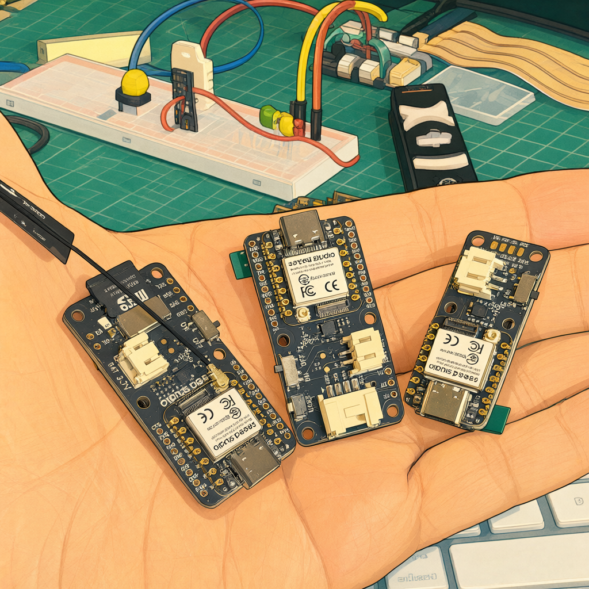

## Part 1: Hardware bring-up

This tutorial walks through a set of short Arduino sketches that test every
feature of the Seeed Studio XIAO IPS Display (ESP32-S3) boards: display, touch,
IMU, microphone, buttons, battery sensing, microSD, and Wi-Fi. A final
self-test sketch checks everything on one screen.

Two later parts use the same boards for TinyML (motion classification and keyword
spotting, Part 2) and for running a very small language model on the device (Part 3).
They have their own pages; see [Parts 2 and 3 at a glance](#parts-2-and-3-at-a-glance).

Source code and photos: <https://github.com/Mjrovai/XIAO-IPS-Display-ESP32S3>

**Status of this draft**

- Tested on one board: the **1.47" IPS Touch Display** (XIAO ESP32-S3 Plus). Part 1
  was run on September 30, 2026, and Parts 2 and 3 on October 5 and 6, 2026.
- The 1.14" and 0.96" versions are not tested yet. Their sections will be added
  when those boards are connected.
- Everything here was measured on one unit. Where a cause is a guess rather
  than a measurement, the text says so.

## Credits

The sketches, the library patch, and this text were generated by Claude
(Sonnet 5.5, Anthropic) under the direction of Marcelo Rovai, who ran each test
on the hardware, photographed the screens, and decided what to investigate.
The measurements come from that board, through `arduino-cli` on a Mac. Parts 2 and 3
have their own credits: the Edge Impulse models were trained by Marcelo Rovai, and
Part 3 uses Andrej Karpathy's llama2.c and tinyllamas (see [Part 3](part3_slm/README.md#credits)).

The cover illustration is not a photograph. It was generated locally on a Mac
with [Qwen-Image-2.1](https://huggingface.co/Qwen/Qwen-Image-2.1) (Qwen team,
Alibaba), using Qwen Image Studio, a macOS app that Marcelo Rovai built with
Claude Opus 5 (Anthropic). The text printed on the boards in the illustration is
garbled and does not match the real boards.

## The family at a glance

| | 1.47" IPS Touch | 1.14" IPS | 0.96" IPS |
|---|---|---|---|
| Resolution | 172 x 320 | 135 x 240 | 80 x 160 |
| Display driver | JD9853A | ST7789 | ST7789 |
| Capacitive touch | Yes | No | No |
| microSD slot | Yes | No | No |
| Grove I2C | No | Yes | No |
| User buttons | 2 | 3 | 2 |
| Shared by all three | XIAO ESP32-S3 Plus (dual-core 240 MHz, 8 MB PSRAM, 16 MB flash, Wi-Fi and BLE), 6-axis IMU, PDM microphone, LiPo connector with voltage sensing | | |

These figures come from Seeed's launch material. For authoritative details, see
the Seeed wiki pages:

- [1.47" getting started](https://wiki.seeedstudio.com/getting_started_1.47_inch_touch_display_esp32s3/)
- [1.14" getting started](https://wiki.seeedstudio.com/getting_started_1.14_inch_display_esp32s3/)
- [0.96" getting started](https://wiki.seeedstudio.com/getting_started_0.96_inch_display_esp32s3/)

The Seeed product pages have a labeled diagram of each board, which we do not
reproduce here:

- [1.47" touch display](https://www.seeedstudio.com/1-47-Inch-Touch-Display-Powered-by-XIAO-ESP32-S3-Plus-p-6996.html)
- [1.14" display](https://www.seeedstudio.com/1-14-Inch-Display-Powered-by-XIAO-ESP32-S3-Plus-p-6991.html)
- [0.96" display](https://www.seeedstudio.com/0-96-Inch-Display-Powered-by-XIAO-ESP32-S3-Plus-p-6993.html)

## What you need

- A XIAO IPS Display (ESP32-S3) board. This draft covers the 1.47" touch version.
- A USB-C cable that carries data.
- **The Wi-Fi antenna, attached** (see [Gotcha 3](#3-without-the-antenna-wi-fi-barely-works)).
- A microSD card formatted FAT or FAT32 (see [Gotcha 4](#4-the-microsd-card-must-have-a-fat-volume)).
- Optional: a 3.7 V LiPo battery, for the battery test.
- A computer with [`arduino-cli`](https://arduino.github.io/arduino-cli/).

## Setup

Versions used: `arduino-cli` with the `esp32:esp32` core **3.3.12**, and the
[Seeed_GFX2](https://github.com/Seeed-Studio/Seeed_GFX2) library **1.0.0**.

```bash
arduino-cli core install esp32:esp32@3.3.12
```

Install Seeed_GFX2 1.0.0 into your Arduino libraries folder (for example
`~/Documents/Arduino/libraries/Seeed_GFX2`). The board string for every command
in this tutorial is:

```
esp32:esp32:XIAO_ESP32S3_Plus
```

**PSRAM is disabled by default** in this board definition. Nothing in Part 1
needs it, but the language-model part will. To enable it, append the option to
the board string: `esp32:esp32:XIAO_ESP32S3_Plus:PSRAM=opi`.

### Build the patched library (recommended)

Seeed_GFX2 1.0.0 is very slow on this board (see
[Gotcha 1](#1-seeed_gfx2-100-is-slow-on-the-esp32-s3)). The folder `tools/`
contains a small patch. This script copies your installed library into
`libs/Seeed_GFX2_fast` and applies the patch there, leaving the installed
library untouched:

```bash
./tools/make_fast_lib.sh
```

Then compile any sketch with the patched copy:

```bash
arduino-cli compile --fqbn esp32:esp32:XIAO_ESP32S3_Plus \
  --library libs/Seeed_GFX2_fast part1_bringup/03_imu
```

And upload (the port name will differ on your machine):

```bash
arduino-cli upload -p /dev/cu.usbmodem101 \
  --fqbn esp32:esp32:XIAO_ESP32S3_Plus part1_bringup/03_imu
```

To compile all sketches at once:

```bash
./tools/build_all.sh
```

If an upload fails with "Failed to connect to ESP32-S3: No serial data
received", put the board in bootloader mode by hand: hold **BOOT**, tap
**RESET**, release **BOOT** (the B and R marks beside the USB-C port, see
[The back of the board](#the-back-of-the-board)), then upload again. This happened once on our
board, right after flashing a sketch that did not use the serial port. Later
uploads worked without it.

## Pin map (1.47" touch version)

| Function | Pins |
|---|---|
| Display (SPI) | CS = D2, DC = D3, SCK = D8, MOSI = D10, RST = GPIO 13, backlight = GPIO 12 |
| Touch (I2C, AXS5106L at 0x63) | SDA = D4, SCL = D5, INT = D7; reset shared with the display |
| IMU (I2C, same bus) | address 0x6A; interrupt = D14 |
| Microphone (PDM) | CLK = D0, DATA = D1 |
| microSD (SPI, shared bus) | CS = D6, SCK = D8, MISO = D9, MOSI = D10 |
| User buttons | USR1 = D19, USR2 = D15 (active low) |
| Battery sense | D16, through a 316 kΩ / 160 kΩ divider |

The display and the microSD card share SCK and MOSI. The display never reads,
so the library creates its SPI without a MISO pin. Test 08 shows how to give
the card a MISO without breaking the display.

### The back of the board

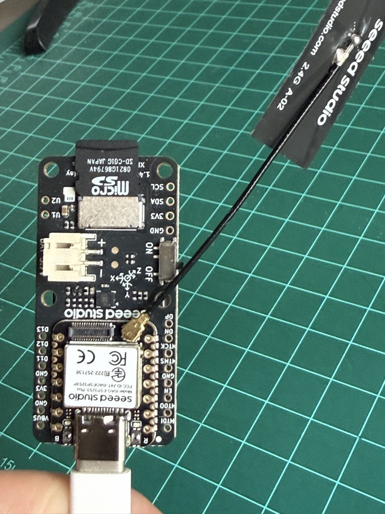

What the photo shows (the board is upside down, with the USB-C port at the
bottom):

- **Antenna.** The flexible 2.4 GHz antenna plugs into the small gold connector
  beside the module, near the "seeed studio" logo. Without it, Wi-Fi barely
  works (see [Gotcha 3](#3-without-the-antenna-wi-fi-barely-works)).
- **microSD slot.** At the top, with a card inserted. Part of the card sticks out
  of the board.
- **Battery connector.** The two-pin connector on the left, marked + and -. It
  is empty in this photo.
- **Power switch.** The slide switch on the right, marked ON and OFF.
- **IMU.** The small square chip below the battery connector, with its X, Y, and
  Z axes printed on the board.
- **Boot and reset.** Marks labeled B and R sit on either side of the USB-C
  port. For the manual bootloader step in the Setup section, hold the boot
  button and tap the reset button.
- **Pads.** Labeled I2C pads (SCL, SDA, 3V3, GND) at the top right; and, along
  the edges, labeled pins for I2S, JTAG, and VBUS.
- **U1 and U2.** Marks for the user buttons, at the left of the microSD slot.

### First light

The first sketch, `xiao_esp32s3_147_hello`, shows "Hello, XIAO" in large green
text. It confirms the whole chain works: compile, upload, and display.

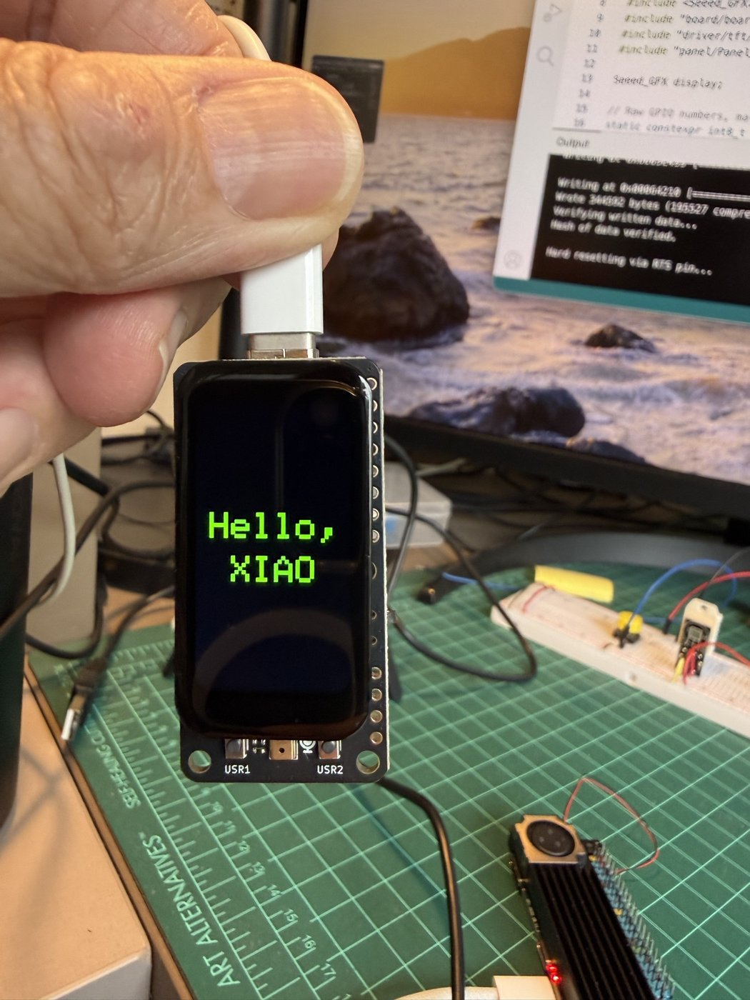

#### Sketch

How it works:

- `display.begin<Board, Config>()` takes two types. The board type lists the pins the LCD uses; the config type names the panel (JD9853A, 172 x 320).
- The reset (GPIO 13) and backlight (GPIO 12) pins are passed as template arguments.
- Text is centered by asking the library for `textWidth()` and `fontHeight()`, so the layout needs no hard-coded pixel positions.

<!-- sketch: xiao_esp32s3_147_hello/xiao_esp32s3_147_hello.ino -->
**Sketch:** [`xiao_esp32s3_147_hello/xiao_esp32s3_147_hello.ino`](https://github.com/Mjrovai/XIAO-IPS-Display-ESP32S3/blob/main/xiao_esp32s3_147_hello/xiao_esp32s3_147_hello.ino)

```cpp
/*
  XIAO ESP32-S3 Plus 1.47-inch Display - Getting Started
  Library: Seeed_GFX2 (header: Seeed_GFX.h)
  Show "Hello, XIAO" in large green text on a black background.
*/

#include <Arduino.h>
#include <Seeed_GFX.h>
#include "board/boards/XIAO_LCD_Board.h"
#include "driver/tft/Driver_JD9853A.h"
#include "panel/Panel_TFT.h"

Seeed_GFX display;

// Raw GPIO numbers, matching the existing ESP32-S3 Plus demos.
static constexpr int8_t LCD_RST_PIN = 13;
static constexpr int8_t LCD_BL_PIN = 12;

void setup() {
  Serial.begin(115200);

  // The board configuration initializes SPI, resets the LCD and turns on
  // its backlight. The panel configuration supplies rotation and colors.
  if (!display.begin<Board_XIAO_1inch47_Touch_Display<LCD_RST_PIN, LCD_BL_PIN>,
                     Config_Seeed_1inch47_Touch_JD9853A>()) {
    Serial.println(display.lastResult().message);
    return;
  }

  display.fillScreen(TFT_BLACK);
  display.setTextColor(TFT_GREEN, TFT_BLACK);
  display.setTextFont(1);
  display.setTextSize(4);
  display.setTextWrap(false);

  // Two centered lines let us use larger text on these narrow displays.
  const char *line1 = "Hello,";
  const char *line2 = "XIAO";
  const int16_t lineHeight = display.fontHeight();
  const int16_t lineGap = lineHeight / 2;
  const int16_t top = (display.height() - 2 * lineHeight - lineGap) / 2;

  display.setCursor((display.width() - display.textWidth(line1)) / 2, top);
  display.print(line1);
  display.setCursor((display.width() - display.textWidth(line2)) / 2,
                    top + lineHeight + lineGap);
  display.print(line2);
}

void loop() {
  // The LCD keeps the greeting visible without redrawing.
  delay(100);
}
```
<!-- /sketch -->

## Tests

Each test is one folder in `part1_bringup/`. Every sketch draws to the screen
and prints to the serial port at 115200 baud.

### 00 · I2C scan (`00_i2c_scan`)

Lists the devices on the I2C bus. **Expected and measured:** `0x63` (touch) and
`0x6A` (IMU). Two devices.

#### Sketch

How it works:

- `Wire.begin(D4, D5)` puts the I2C bus on the board's SDA and SCL pins.
- A device that acknowledges its address makes `endTransmission()` return 0. That is the whole trick.
- The scan repeats every three seconds so a serial monitor opened late still sees the result.

<!-- sketch: part1_bringup/00_i2c_scan/00_i2c_scan.ino -->
**Sketch:** [`part1_bringup/00_i2c_scan/00_i2c_scan.ino`](https://github.com/Mjrovai/XIAO-IPS-Display-ESP32S3/blob/main/part1_bringup/00_i2c_scan/00_i2c_scan.ino)

```cpp
/*
  Test 00 - I2C scan
  Lists every device on the board's I2C bus (SDA=D4, SCL=D5).
  Expected on the 1.47" touch version: touch controller (0x63) and the IMU.
*/

#include <Wire.h>

void setup() {
  Serial.begin(115200);
  // Give the USB serial port time to enumerate before the first print.
  delay(1500);
  // The touch controller and the IMU share this bus: SDA = D4, SCL = D5.
  Wire.begin(D4, D5);
  // 400 kHz fast mode; both devices support it.
  Wire.setClock(400000);
}

void loop() {
  Serial.println("Scanning I2C bus...");
  int found = 0;
  for (uint8_t addr = 1; addr < 127; addr++) {
    // A device that acknowledges its address makes endTransmission() return 0.
    Wire.beginTransmission(addr);
    if (Wire.endTransmission() == 0) {
      Serial.printf("  device at 0x%02X\n", addr);
      found++;
    }
  }
  Serial.printf("Done: %d device(s)\n\n", found);
  // Repeat, so a serial monitor opened late still sees the result.
  delay(3000);
}
```
<!-- /sketch -->

### 01 · Display (`01_display`)

Draws red, green, blue, and white bars, a white frame, and corner markers,
then steps through the four rotations.

**Measured:** colors are in the right order, the frame is complete on all four
edges, and the markers land in the right corners in every rotation. The screen
is 172 x 320 (rotations 0 and 2) or 320 x 172 (rotations 1 and 3).

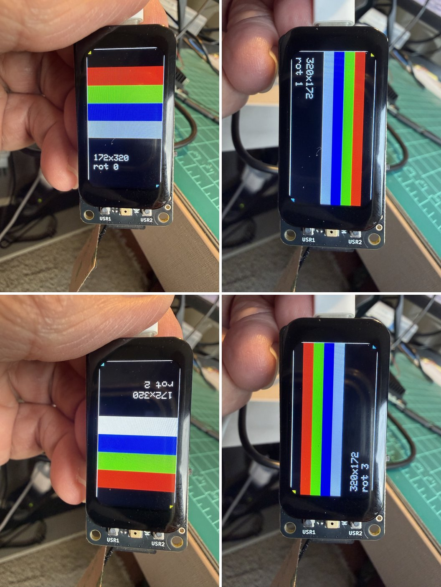

*Rotations 0, 1, 2, and 3, left to right and top to bottom. In every one, the bars run red, green, blue, white, the yellow marker is at the logical top left, and the cyan marker is at the logical bottom right.*


One lesson from this sketch: at text size 2 the font is 12 pixels wide, so only
14 characters fit across 172 pixels. A longer string wraps and drops its last
character onto the left edge. Keep lines short or turn wrapping off.

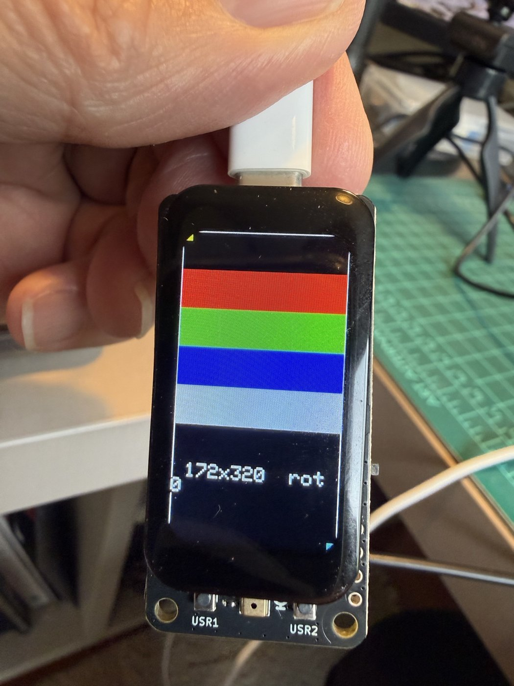

*The first version of the display test. The "0" after "rot" should be on the
same line, but it wrapped to the left edge. The sketch in this repository is
the fixed version.*

#### Sketch

How it works:

- Everything is sized as a fraction of `display.width()` and `display.height()`, so the same drawing works in all four rotations.
- A one-pixel frame on the very edge shows immediately if any edge is clipped.
- `setTextWrap(false)` stops long strings from wrapping onto the next line.

<!-- sketch: part1_bringup/01_display/01_display.ino -->
**Sketch:** [`part1_bringup/01_display/01_display.ino`](https://github.com/Mjrovai/XIAO-IPS-Display-ESP32S3/blob/main/part1_bringup/01_display/01_display.ino)

```cpp
/*
  Test 01 - Display
  XIAO 1.47" IPS Touch Display (ESP32-S3 Plus), JD9853A, 172x320.
  Draws color bars, a white border, and corner markers, then rotates
  through the four orientations every 3 seconds.
  Pass: all bars are the right colors (red, green, blue, white, black)
  and the border is fully visible on every edge.
*/

#include <Arduino.h>
#include <Seeed_GFX.h>
#include "board/boards/XIAO_LCD_Board.h"
#include "driver/tft/Driver_JD9853A.h"
#include "panel/Panel_TFT.h"

Seeed_GFX display;

// GPIO numbers for the display reset and backlight on the XIAO ESP32-S3 Plus.
static constexpr int8_t LCD_RST_PIN = 13;
static constexpr int8_t LCD_BL_PIN = 12;

void drawPattern(uint8_t rotation) {
  // 0 and 2 are portrait (172x320); 1 and 3 are landscape (320x172).
  display.setRotation(rotation);
  const int w = display.width();
  const int h = display.height();

  display.fillScreen(TFT_BLACK);
  const uint16_t colors[] = {TFT_RED, TFT_GREEN, TFT_BLUE, TFT_WHITE};
  // Sizes are fractions of the screen, so the layout works in every rotation.
  const int barH = h / 8;
  for (int i = 0; i < 4; i++) {
    display.fillRect(0, barH * (1 + i), w, barH, colors[i]);
  }
  // A frame on the very edge shows at once if any edge is clipped.
  display.drawRect(0, 0, w, h, TFT_WHITE);
  display.fillRect(0, 0, 10, 10, TFT_YELLOW);          // top-left
  display.fillRect(w - 10, h - 10, 10, 10, TFT_CYAN);  // bottom-right

  display.setTextColor(TFT_WHITE, TFT_BLACK);
  display.setTextSize(2);
  // Without this, a string that is too long wraps onto the next line.
  display.setTextWrap(false);
  char line[24];
  snprintf(line, sizeof(line), "%dx%d", w, h);
  display.setCursor(14, barH * 6);
  display.print(line);
  snprintf(line, sizeof(line), "rot %d", rotation);
  display.setCursor(14, barH * 6 + 22);
  display.print(line);
  Serial.printf("%dx%d rot %d\n", w, h, rotation);
}

void setup() {
  Serial.begin(115200);
  Serial.setTxTimeoutMs(0);  // never block when no host is reading the USB port
  // begin<Board, Config>() takes two types. The Board names the pins the LCD uses;
  // the Config names the panel (JD9853A, 172x320) and its color order.
  if (!display.begin<Board_XIAO_1inch47_Touch_Display<LCD_RST_PIN, LCD_BL_PIN>,
                     Config_Seeed_1inch47_Touch_JD9853A>()) {
    Serial.println(display.lastResult().message);
    return;
  }
}

void loop() {
  for (uint8_t r = 0; r < 4; r++) {
    drawPattern(r);
    delay(3000);
  }
}
```
<!-- /sketch -->

### 01b · Gray ramp (`01b_gray_ramp`) and 01c · Gamma probe (`01c_gamma_probe`)

These two investigate the color cast described in
[Gotcha 5](#5-grays-have-a-blue-cast).

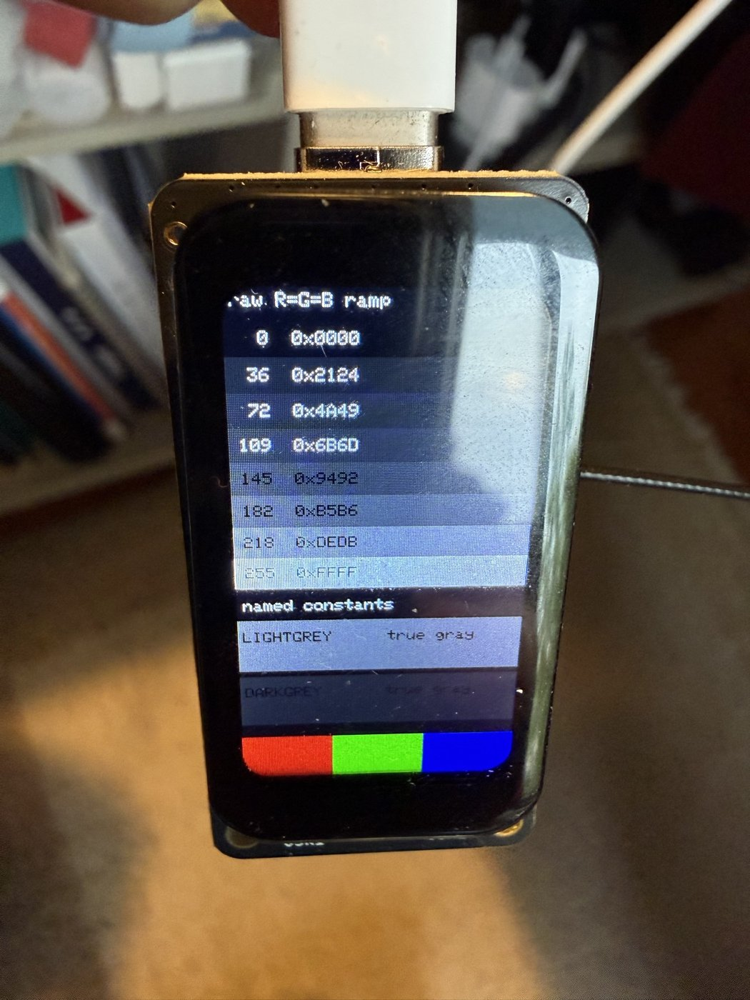

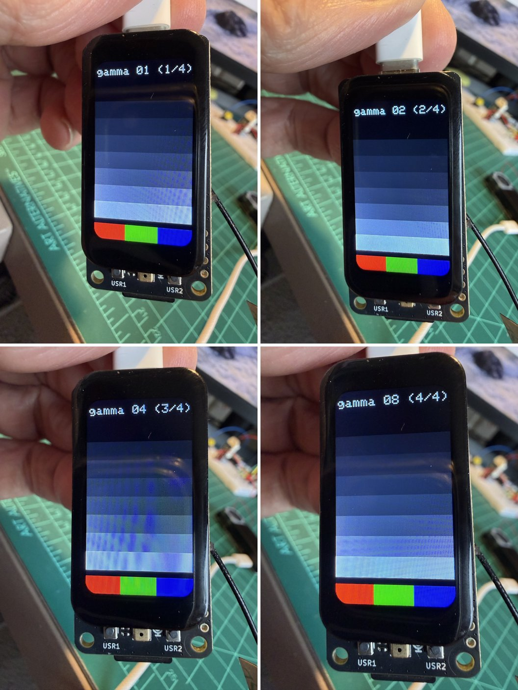

*Gamma curves 01, 02, 04, and 08, left to right and top to bottom, under the same
conditions. The bluish tint is the same in all four. Differences in brightness
between the photos come from the camera's automatic exposure; the blue blotches
in the third photo are glare and moire.*

#### Sketches

How they work:

- `gray565()` packs one 8-bit level into RGB565 (5 bits red, 6 green, 5 blue) with R = G = B, so any tint you see is not in the data.
- The ramp draws into a sprite and sends it with one `pushSprite()`.
- The gamma probe reaches the raw display bus through `display.panel().driver().bus()` to send the standard `GAMSET` command (0x26), which the library does not wrap. USR1 steps to the next curve, USR2 goes back.

<!-- sketch: part1_bringup/01b_gray_ramp/01b_gray_ramp.ino -->
**Sketch:** [`part1_bringup/01b_gray_ramp/01b_gray_ramp.ino`](https://github.com/Mjrovai/XIAO-IPS-Display-ESP32S3/blob/main/part1_bringup/01b_gray_ramp/01b_gray_ramp.ino)

```cpp
/*
  Test 01b - Gray ramp
  Draws 8 gray steps from black to white, built from raw RGB565 values
  where R, G and B are equal, plus the library's named grays.
  On a neutral panel every step looks gray. If the steps look bluish,
  the panel (or its gamma / inversion setting) has a color cast.
  Names are printed next to the library constants so you can compare.
*/

#include <Arduino.h>
#include <Seeed_GFX.h>
#include "board/boards/XIAO_LCD_Board.h"
#include "driver/tft/Driver_JD9853A.h"
#include "panel/Panel_TFT.h"

Seeed_GFX display;
Seeed_Sprite canvas;

static constexpr int8_t LCD_RST_PIN = 13;
static constexpr int8_t LCD_BL_PIN = 12;

// level 0..255 -> RGB565 with R = G = B
static uint16_t gray565(uint8_t v) {
  // RGB565 packs 5 bits of red, 6 of green, and 5 of blue into 16 bits.
  return ((v >> 3) << 11) | ((v >> 2) << 5) | (v >> 3);
}

void setup() {
  Serial.begin(115200);
  Serial.setTxTimeoutMs(0);
  delay(800);
  if (!display.begin<Board_XIAO_1inch47_Touch_Display<LCD_RST_PIN, LCD_BL_PIN>,
                     Config_Seeed_1inch47_Touch_JD9853A>()) {
    Serial.println(display.lastResult().message);
    return;
  }
  // A full-screen off-screen buffer (172 x 320 x 2 bytes = 110 KB). Everything is
  // drawn there and sent to the panel with one pushSprite().
  canvas.createSprite(display, 172, 320);
  canvas.fillScreen(TFT_BLACK);
  canvas.setTextSize(1);
  canvas.setTextColor(TFT_WHITE, TFT_BLACK);
  canvas.setCursor(4, 4);
  canvas.print("raw R=G=B ramp");

  // 8 steps of raw gray
  for (int i = 0; i < 8; i++) {
    // Eight steps: 0, 36, 72, 109, 145, 182, 218, 255.
    uint8_t v = i * 255 / 7;
    canvas.fillRect(0, 18 + i * 20, 172, 20, gray565(v));
    canvas.setTextColor(v > 110 ? TFT_BLACK : TFT_WHITE, gray565(v));
    char t[24];
    snprintf(t, sizeof(t), "%3d  0x%04X", v, gray565(v));
    canvas.setCursor(6, 24 + i * 20);
    canvas.print(t);
  }

  // Library named grays next to a true gray of the same 565 value
  canvas.setTextColor(TFT_WHITE, TFT_BLACK);
  canvas.setCursor(4, 186);
  canvas.print("named constants");
  // Compare the library's named grays with a computed gray of the same average level.
  struct N { const char *name; uint16_t c; } names[] = {
    {"LIGHTGREY", TFT_LIGHTGREY}, {"DARKGREY", TFT_DARKGREY}, {"GREY", TFT_DARKGREY}};
  for (int i = 0; i < 2; i++) {
    uint16_t c = names[i].c;
    uint8_t r = (c >> 11) << 3, g = ((c >> 5) & 0x3F) << 2, b = (c & 0x1F) << 3;
    canvas.fillRect(0, 200 + i * 40, 86, 36, c);
    canvas.fillRect(86, 200 + i * 40, 86, 36, gray565((r + g + b) / 3));
    canvas.setTextColor(TFT_BLACK, c);
    canvas.setCursor(3, 208 + i * 40);
    canvas.print(names[i].name);
    canvas.setTextColor(TFT_BLACK, gray565((r + g + b) / 3));
    canvas.setCursor(90, 208 + i * 40);
    canvas.print("true gray");
    Serial.printf("%s = 0x%04X  (R=%d G=%d B=%d)\n", names[i].name, c, r, g, b);
  }
  // Pure primaries for reference
  canvas.fillRect(0, 286, 57, 34, TFT_RED);
  canvas.fillRect(57, 286, 58, 34, TFT_GREEN);
  canvas.fillRect(115, 286, 57, 34, TFT_BLUE);
  // One transfer to the panel.
  canvas.pushSprite(0, 0);
  Serial.println("ramp drawn");
}

void loop() { delay(3000); Serial.println("ramp drawn"); }
```
<!-- /sketch -->

<!-- sketch: part1_bringup/01c_gamma_probe/01c_gamma_probe.ino -->
**Sketch:** [`part1_bringup/01c_gamma_probe/01c_gamma_probe.ino`](https://github.com/Mjrovai/XIAO-IPS-Display-ESP32S3/blob/main/part1_bringup/01c_gamma_probe/01c_gamma_probe.ino)

```cpp
/*
  Test 01c - Gamma curve probe
  The JD9853A driver in Seeed_GFX2 reuses the ST7789 init table, so the
  grays may carry a blue cast. The standard GAMSET command (0x26) selects
  one of four built-in gamma curves: 0x01, 0x02, 0x04, 0x08.
  This sketch shows an 8-step gray ramp. Press USR1 (D19) to step to the
  next curve; it holds still so you can photograph each one. USR2 (D15)
  goes back one curve. The active curve is printed on screen and on Serial.
*/

#include <Arduino.h>
#include <Seeed_GFX.h>
#include "board/boards/XIAO_LCD_Board.h"
#include "driver/tft/Driver_JD9853A.h"
#include "panel/Panel_TFT.h"

Seeed_GFX display;
Seeed_Sprite canvas;

static constexpr int8_t LCD_RST_PIN = 13;
static constexpr int8_t LCD_BL_PIN = 12;

static uint16_t gray565(uint8_t v) { return ((v >> 3) << 11) | ((v >> 2) << 5) | (v >> 3); }

static void drawRamp(const char *label) {
  canvas.fillScreen(TFT_BLACK);
  for (int i = 0; i < 8; i++) {
    uint8_t v = i * 255 / 7;
    canvas.fillRect(0, 40 + i * 30, 172, 30, gray565(v));
  }
  canvas.setTextSize(2);
  canvas.setTextColor(TFT_WHITE, TFT_BLACK);
  canvas.setCursor(4, 10);
  canvas.print(label);
  canvas.fillRect(0, 290, 57, 30, TFT_RED);
  canvas.fillRect(57, 290, 58, 30, TFT_GREEN);
  canvas.fillRect(115, 290, 57, 30, TFT_BLUE);
  canvas.pushSprite(0, 0);
}

void setup() {
  Serial.begin(115200);
  Serial.setTxTimeoutMs(0);
  delay(800);
  if (!display.begin<Board_XIAO_1inch47_Touch_Display<LCD_RST_PIN, LCD_BL_PIN>,
                     Config_Seeed_1inch47_Touch_JD9853A>()) {
    Serial.println(display.lastResult().message);
    return;
  }
  canvas.createSprite(display, 172, 320);
}

static void applyCurve(int idx) {
  // GAMSET parameter values that select gamma curves 1 to 4.
  static const uint8_t curves[] = {0x01, 0x02, 0x04, 0x08};
  // Reach the raw display bus to send a command the library does not wrap.
  IBus &bus = display.panel().driver().bus();
  bus.writeCommand(0x26);  // GAMSET
  bus.writeData(curves[idx]);
  char label[24];
  snprintf(label, sizeof(label), "gamma %02X (%d/4)", curves[idx], idx + 1);
  drawRamp(label);
  Serial.printf("GAMSET 0x%02X\n", curves[idx]);
}

void loop() {
  static int idx = -1;
  static bool p1 = false, p2 = false;
  if (idx < 0) {
    pinMode(D19, INPUT_PULLUP);
    pinMode(D15, INPUT_PULLUP);
    idx = 0;
    applyCurve(idx);
  }
  bool d1 = digitalRead(D19) == LOW, d2 = digitalRead(D15) == LOW;
  // Edge detection: act once per press, not while the button is held.
  if (d1 && !p1) { idx = (idx + 1) % 4; applyCurve(idx); delay(200); }
  if (d2 && !p2) { idx = (idx + 3) % 4; applyCurve(idx); delay(200); }
  p1 = d1; p2 = d2;
  delay(10);
}
```
<!-- /sketch -->

### 02 · Touch (`02_touch`)

Four yellow targets sit in the corners, and a small CLEAR box sits at the top
center. Touching draws red dots and prints coordinates.

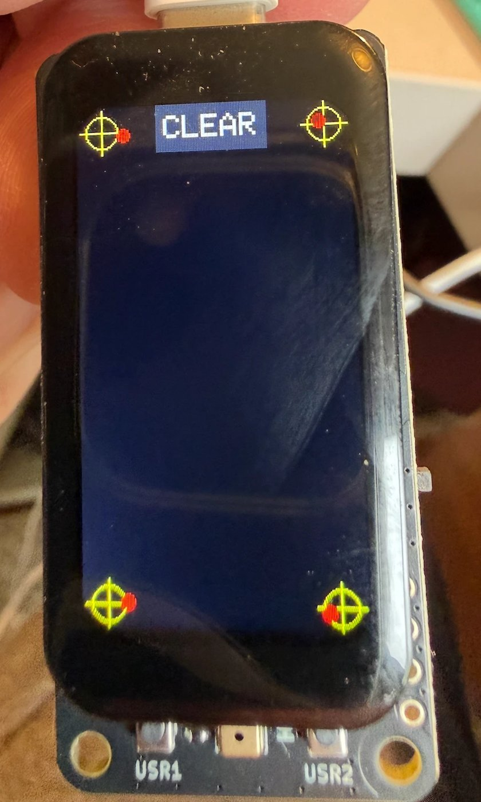

**Measured:** all four corners report coordinates inside the 172 x 320 area,
for example (24, 12) at the top left and (151, 312) at the bottom right. There
is no axis flip. The dots land within about 5 to 10 pixels of a fingertip
aimed at each target, which is finger width, not controller error. With the
patched library the tester reported the response as fast enough; we did not
measure touch latency.

Design note: our first version put CLEAR across the whole top edge, which made
the two top corners impossible to test. Keep controls out of the areas you need
to probe.

#### Sketch

How it works:

- The touch object gets reset pin `-1`: the display and the touch controller share one reset line, and `display.begin()` has already pulsed it. Resetting again would blank the screen.
- `attachTouch()` links the touch controller to the display, so `getTouch()` returns screen pixels.
- The CLEAR box is small and central on purpose: the four corners must stay free to test.

<!-- sketch: part1_bringup/02_touch/02_touch.ino -->
**Sketch:** [`part1_bringup/02_touch/02_touch.ino`](https://github.com/Mjrovai/XIAO-IPS-Display-ESP32S3/blob/main/part1_bringup/02_touch/02_touch.ino)

```cpp
/*
  Test 02 - Touch
  AXS5106L capacitive touch (I2C 0x63, INT=D7). Touch draws red dots and
  prints coordinates on Serial. Touch the four corner targets to verify
  the mapping. A tap on the CLEAR box (top center) wipes the canvas.
  Note: touch RST is shared with the LCD, so the touch object gets RST=-1.
*/

#include <Arduino.h>
#include <Seeed_GFX.h>
#include "board/boards/XIAO_LCD_Board.h"
#include "driver/tft/Driver_JD9853A.h"
#include "panel/Panel_TFT.h"
#include "touch/Touch_AXS5106L.h"

Seeed_GFX display;

static constexpr int8_t LCD_RST_PIN = 13;
static constexpr int8_t LCD_BL_PIN = 12;

// Arguments: reset pin (-1, because the display's begin() already resets the
// shared line), interrupt pin D7, I2C bus, panel width and height.
Touch_AXS5106L touch(-1, D7, Wire, 172, 320);

// The CLEAR box is small and central so the four corners stay free to test.
static constexpr int CLEAR_X = 51, CLEAR_Y = 0, CLEAR_W = 70, CLEAR_H = 30;

void drawTarget(int cx, int cy) {
  display.drawCircle(cx, cy, 10, TFT_YELLOW);
  display.drawFastHLine(cx - 14, cy, 29, TFT_YELLOW);
  display.drawFastVLine(cx, cy - 14, 29, TFT_YELLOW);
}

void drawUi() {
  display.fillScreen(TFT_BLACK);
  display.fillRect(CLEAR_X, CLEAR_Y, CLEAR_W, CLEAR_H, TFT_DARKGREY);
  display.setTextColor(TFT_WHITE, TFT_DARKGREY);
  display.setTextSize(2);
  display.drawCentreString("CLEAR", 86, 7, 1);
  drawTarget(16, 16);
  drawTarget(156, 16);
  drawTarget(16, 304);
  drawTarget(156, 304);
}

void setup() {
  Serial.begin(115200);
  Serial.setTxTimeoutMs(0);  // never block when no host is reading the USB port
  if (!display.begin<Board_XIAO_1inch47_Touch_Display<LCD_RST_PIN, LCD_BL_PIN>,
                     Config_Seeed_1inch47_Touch_JD9853A>()) {
    Serial.println(display.lastResult().message);
    return;
  }
  // Attach the touch controller to the display so getTouch() reports screen pixels.
  if (!display.attachTouch(touch, display.panel().driver().bus())) {
    Serial.println(display.lastResult().message);
    return;
  }
  drawUi();
}

void loop() {
  int32_t x = 0, y = 0;
  // getTouch() is true while a finger is down; x and y are in screen pixels.
  if (display.getTouch(&x, &y)) {
    Serial.printf("touch x=%ld y=%ld\n", (long)x, (long)y);
    if (x >= CLEAR_X && x < CLEAR_X + CLEAR_W && y < CLEAR_H) {
      drawUi();
    } else {
      display.fillCircle(x, y, 4, TFT_RED);
    }
  }
}
```
<!-- /sketch -->

### 03 · IMU (`03_imu`)

Identifies the chip, then shows a bubble level and live acceleration and
rotation values.

**Measured:** the chip is an **LSM6DS3TR-C** at 0x6A (the sketch also handles a
QMI8658). At rest with the screen up: `az = -0.994 g`, `ax` and `ay` near zero
with noise of 0.001 to 0.002 g, and a gyroscope bias of about 1 dps. The
negative `az` means the screen side faces -Z. With the board held upright the
bubble moves toward the raised side, like a real level.

The demo reaches about **22 frames per second** with the patched library.

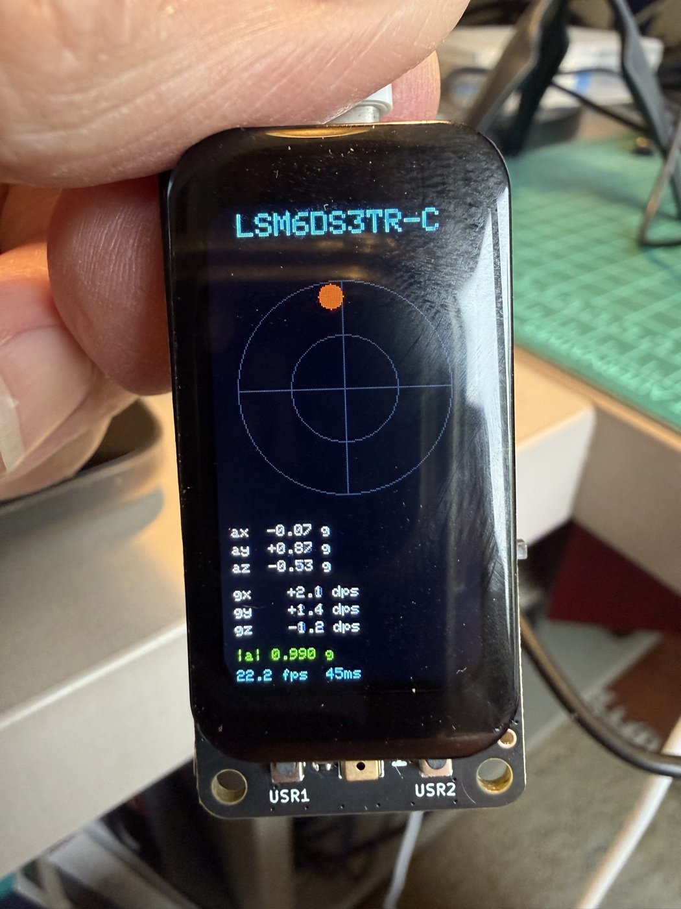

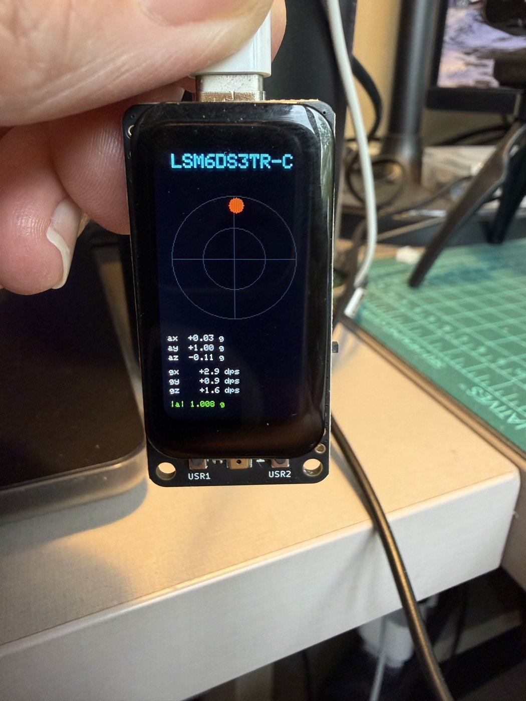

#### Sketch

How it works:

- The IMU is read over raw I2C, with no library. `WHO_AM_I` decides whether the chip is a QMI8658 or an LSM6 family part, and the scale factors follow from that.
- The screen is drawn into a full-screen sprite and sent once per frame. Drawing straight to the panel took 740 ms per frame; the sprite takes 43 ms (see Gotcha 1).
- Serial prints one CSV line per frame (`ax,ay,az,gx,gy,gz`), with timing lines that start with `#`.

<!-- sketch: part1_bringup/03_imu/03_imu.ino -->
**Sketch:** [`part1_bringup/03_imu/03_imu.ino`](https://github.com/Mjrovai/XIAO-IPS-Display-ESP32S3/blob/main/part1_bringup/03_imu/03_imu.ino)

```cpp
/*
  Test 03 - IMU (6-axis accelerometer + gyroscope)
  I2C: SDA=D4, SCL=D5, address 0x6A/0x6B. The board may carry a QMI8658
  or an LSM6-family chip, so the sketch reads WHO_AM_I and adapts.
  Screen: chip name, a bubble level, and live ax/ay/az (g) and gx/gy/gz (dps).
  Serial: one CSV line per frame (ax,ay,az,gx,gy,gz).
  Drawing goes into an off-screen sprite and is pushed in one transfer;
  drawing directly on the panel took 740 ms per frame in our measurement.
  Pass: with the board flat and still, az is about +/-1.00 g, ax and ay
  are near 0, and |a| is between 0.95 and 1.05 g.
*/

#include <Arduino.h>
#include <Wire.h>
#include <Seeed_GFX.h>
#include "board/boards/XIAO_LCD_Board.h"
#include "driver/tft/Driver_JD9853A.h"
#include "panel/Panel_TFT.h"

Seeed_GFX display;
Seeed_Sprite canvas;  // full-screen off-screen buffer, pushed once per frame

static constexpr int8_t LCD_RST_PIN = 13;
static constexpr int8_t LCD_BL_PIN = 12;

enum ImuType { IMU_NONE, IMU_QMI8658, IMU_LSM6 };
static ImuType imuType = IMU_NONE;
static uint8_t imuAddr = 0;
static const char *imuName = "none";
static float accelScale = 1.0f;  // LSB -> g
static float gyroScale = 1.0f;   // LSB -> dps

static bool i2cWrite8(uint8_t addr, uint8_t reg, uint8_t val) {
  Wire.beginTransmission(addr);
  Wire.write(reg);
  Wire.write(val);
  return Wire.endTransmission() == 0;
}

static bool i2cRead(uint8_t addr, uint8_t reg, uint8_t *buf, size_t len) {
  Wire.beginTransmission(addr);
  Wire.write(reg);
  if (Wire.endTransmission(false) != 0) return false;
  if (Wire.requestFrom((int)addr, (int)len) != (int)len) return false;
  for (size_t i = 0; i < len; i++) buf[i] = Wire.read();
  return true;
}

static int16_t le16(const uint8_t *p) {
  return (int16_t)((uint16_t)p[0] | ((uint16_t)p[1] << 8));
}

// QMI8658: WHO_AM_I is register 0x00 and reads 0x05.
static bool initQmi(uint8_t addr) {
  uint8_t who = 0;
  if (!i2cRead(addr, 0x00, &who, 1) || who != 0x05) return false;
  i2cWrite8(addr, 0x02, 0x60);  // CTRL1: address auto-increment
  i2cWrite8(addr, 0x03, 0x03);  // CTRL2: accel +/-2 g
  i2cWrite8(addr, 0x04, 0x53);  // CTRL3: gyro +/-512 dps
  i2cWrite8(addr, 0x08, 0x03);  // CTRL7: enable accel + gyro
  delay(20);
  imuType = IMU_QMI8658;
  imuAddr = addr;
  imuName = "QMI8658";
  accelScale = 1.0f / 16384.0f;
  gyroScale = 1.0f / 64.0f;
  return true;
}

// LSM6 family: WHO_AM_I is register 0x0F (0x6A = LSM6DS3TR-C, 0x69 = LSM6DS3).
static bool initLsm(uint8_t addr) {
  uint8_t who = 0;
  if (!i2cRead(addr, 0x0F, &who, 1)) return false;
  if (who != 0x69 && who != 0x6A && who != 0x6C) return false;
  i2cWrite8(addr, 0x10, 0x60);  // CTRL1_XL: 416 Hz, +/-2 g
  i2cWrite8(addr, 0x11, 0x60);  // CTRL2_G: 416 Hz, 250 dps
  delay(20);
  imuType = IMU_LSM6;
  imuAddr = addr;
  imuName = (who == 0x6A) ? "LSM6DS3TR-C" : (who == 0x69) ? "LSM6DS3" : "LSM6DSx";
  accelScale = 0.000061f;
  gyroScale = 0.00875f;
  return true;
}

// Reads one sample: acceleration in g and rotation in degrees per second.
static bool readImu(float a[3], float g[3]) {
  uint8_t d[12];
  if (imuType == IMU_QMI8658) {
    if (!i2cRead(imuAddr, 0x35, d, 12)) return false;  // accel then gyro
  } else if (imuType == IMU_LSM6) {
    uint8_t gd[6], ad[6];
    if (!i2cRead(imuAddr, 0x22, gd, 6)) return false;  // gyro first
    if (!i2cRead(imuAddr, 0x28, ad, 6)) return false;
    memcpy(d, ad, 6);
    memcpy(d + 6, gd, 6);
  } else {
    return false;
  }
  for (int i = 0; i < 3; i++) {
    a[i] = le16(&d[i * 2]) * accelScale;
    g[i] = le16(&d[6 + i * 2]) * gyroScale;
  }
  return true;
}

static uint32_t fpsFrames = 0, fpsStamp = 0;
static float fpsValue = 0;
static uint32_t lastFrameMs = 0, worstFrameMs = 0;

static constexpr int CX = 86, CY = 120, RING = 70;

static void drawStatic() {
  canvas.fillScreen(TFT_BLACK);
  canvas.setTextSize(2);
  canvas.setTextColor(TFT_CYAN, TFT_BLACK);
  canvas.drawCentreString(imuName, 86, 6, 1);
  canvas.drawCircle(CX, CY, RING, TFT_DARKGREY);
  canvas.drawCircle(CX, CY, RING / 2, TFT_DARKGREY);
  canvas.drawFastHLine(CX - RING, CY, 2 * RING, TFT_DARKGREY);
  canvas.drawFastVLine(CX, CY - RING, 2 * RING, TFT_DARKGREY);
}

static void drawValues(const float a[3], const float g[3]) {
  canvas.setTextSize(1);
  canvas.setTextColor(TFT_WHITE, TFT_BLACK);
  char buf[32];
  const char *an[] = {"ax", "ay", "az"};
  const char *gn[] = {"gx", "gy", "gz"};
  for (int i = 0; i < 3; i++) {
    snprintf(buf, sizeof(buf), "%s %+6.2f g", an[i], a[i]);
    canvas.setCursor(8, 210 + i * 12);
    canvas.print(buf);
    snprintf(buf, sizeof(buf), "%s %+7.1f dps", gn[i], g[i]);
    canvas.setCursor(8, 252 + i * 12);
    canvas.print(buf);
  }
  float mag = sqrtf(a[0] * a[0] + a[1] * a[1] + a[2] * a[2]);
  snprintf(buf, sizeof(buf), "|a| %.3f g", mag);
  canvas.setTextColor(fabsf(mag - 1.0f) < 0.05f ? TFT_GREEN : TFT_YELLOW, TFT_BLACK);
  canvas.setCursor(8, 294);
  canvas.print(buf);
  snprintf(buf, sizeof(buf), "%.1f fps  %lums", fpsValue, (unsigned long)worstFrameMs);
  canvas.setTextColor(TFT_CYAN, TFT_BLACK);
  canvas.setCursor(8, 308);
  canvas.print(buf);
}

void setup() {
  Serial.begin(115200);
  Serial.setTxTimeoutMs(0);  // never block when no host is reading the USB port
  delay(500);
  if (!display.begin<Board_XIAO_1inch47_Touch_Display<LCD_RST_PIN, LCD_BL_PIN>,
                     Config_Seeed_1inch47_Touch_JD9853A>()) {
    Serial.println(display.lastResult().message);
    return;
  }
  Wire.begin(D4, D5);
  Wire.setClock(400000);
  bool ok = initQmi(0x6B) || initQmi(0x6A) || initLsm(0x6A) || initLsm(0x6B);
  Serial.printf("IMU: %s at 0x%02X\n", ok ? imuName : "NOT FOUND", imuAddr);
  if (!canvas.createSprite(display, 172, 320)) {
    Serial.println("sprite allocation failed");
  }
  Serial.println("ax,ay,az,gx,gy,gz");
}

void loop() {
  static uint32_t last = 0;
  if (millis() - last < 20) return;
  last = millis();

  float a[3], g[3];
  if (!readImu(a, g)) {
    Serial.println("read error");
    return;
  }
  Serial.printf("%.3f,%.3f,%.3f,%.1f,%.1f,%.1f\n", a[0], a[1], a[2], g[0], g[1], g[2]);

  uint32_t t0 = millis();
  drawStatic();
  // Bubble: tilt of 0.5 g (about 30 degrees) reaches the outer ring.
  float dx = constrain(a[0] / 0.5f, -1.0f, 1.0f) * (RING - 10);
  float dy = constrain(a[1] / 0.5f, -1.0f, 1.0f) * (RING - 10);
  bool level = fabsf(a[0]) < 0.05f && fabsf(a[1]) < 0.05f;
  canvas.fillCircle(CX + (int)dx, CY - (int)dy, 8, level ? TFT_GREEN : TFT_ORANGE);
  drawValues(a, g);
  canvas.pushSprite(0, 0);
  fpsFrames++;
  uint32_t now = millis();
  if (now - lastFrameMs > worstFrameMs || now - fpsStamp > 1000) worstFrameMs = now - lastFrameMs;
  lastFrameMs = now;
  if (now - fpsStamp >= 1000) { fpsValue = fpsFrames * 1000.0f / (now - fpsStamp); fpsFrames = 0; fpsStamp = now; worstFrameMs = 0; }
  Serial.printf("# draw_ms=%lu\n", (unsigned long)(millis() - t0));
}
```
<!-- /sketch -->

### 04 · Microphone (`04_mic`)

Reads 16 kHz mono audio through the ESP-IDF 5 PDM driver and shows the level
in dBFS as a number, a bar with peak hold, and a scrolling history.

**Measured (50-second run, three phases identified by level):**

| Phase | RMS (dBFS) | Peak (dBFS) |
|---|---|---|
| Silence | about -73 to -69 (lowest -80) | -60 to -54 |
| Speech | up to -41 to -31 | -36 to -23 |
| Clap and taps | up to -15 to -13 | -3.4 to -0.6 |

That is roughly 60 dB between the noise floor and a clap. A loud clap close to
the board almost reaches full scale, so expect clipping for very loud sounds.

The PDM filter needs about half a second to settle. The DC offset starts
near +13000 and falls to a few hundred. **Discard the first half second** before
measuring or recording.

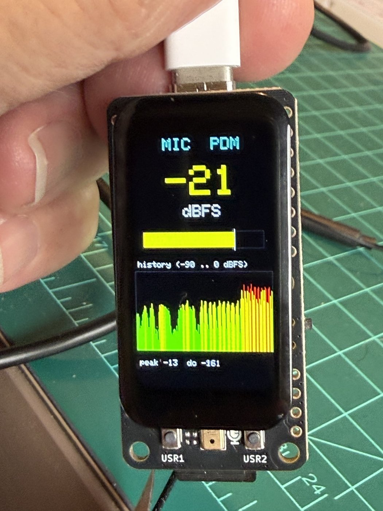

*While speaking close to the board: the RMS level is -21 dBFS, the peak is -13
dBFS, and the DC offset reads -161. The history shows the last 172 blocks
(about 11 seconds); columns turn yellow above -40 dBFS and red above -20.*

#### Sketch

How it works:

- The PDM microphone needs two wires: a clock the ESP32 drives (D0, GPIO 1) and a one-bit data stream back (D1, GPIO 2).
- The DMA buffers hold 128 ms of audio, so a slow screen update does not drop samples.
- The DC offset is subtracted before the level is computed, and the result is converted to dBFS (0 dBFS is full scale).

<!-- sketch: part1_bringup/04_mic/04_mic.ino -->
**Sketch:** [`part1_bringup/04_mic/04_mic.ino`](https://github.com/Mjrovai/XIAO-IPS-Display-ESP32S3/blob/main/part1_bringup/04_mic/04_mic.ino)

```cpp
/*
  Test 04 - PDM microphone
  The on-board digital MEMS microphone is PDM: CLK=D0, DATA=D1.
  Captures 16 kHz mono 16-bit audio with the ESP-IDF 5 I2S PDM driver,
  and shows the level in dBFS: a big number, a bar with peak hold, and a
  scrolling history.
  Serial: "rms_dBFS,peak_dBFS,dc_offset" once per frame.
  Pass: in a quiet room the level sits steady (roughly -70 to -50 dBFS);
  speech, a clap, or a tap on the board pushes it up by 20 dB or more.
*/

#include <Arduino.h>
#include <driver/i2s_pdm.h>
#include <Seeed_GFX.h>
#include "board/boards/XIAO_LCD_Board.h"
#include "driver/tft/Driver_JD9853A.h"
#include "panel/Panel_TFT.h"

Seeed_GFX display;
Seeed_Sprite canvas;

static constexpr int8_t LCD_RST_PIN = 13;
static constexpr int8_t LCD_BL_PIN = 12;

static constexpr gpio_num_t MIC_CLK = GPIO_NUM_1;   // D0
static constexpr gpio_num_t MIC_DATA = GPIO_NUM_2;  // D1
static constexpr uint32_t SAMPLE_RATE = 16000;
static constexpr size_t BLOCK = 1024;                // 64 ms per read

static i2s_chan_handle_t rx = nullptr;
static int16_t buf[BLOCK];

static constexpr int HIST_W = 172;
static float hist[HIST_W];
static float peakHold = -90.0f;
static uint32_t peakStamp = 0;

static bool micBegin() {
  i2s_chan_config_t ch = I2S_CHANNEL_DEFAULT_CONFIG(I2S_NUM_AUTO, I2S_ROLE_MASTER);
  ch.dma_desc_num = 8;      // 8 x 256 frames = 128 ms of buffering, so a slow
  ch.dma_frame_num = 256;   // screen frame does not drop samples
  if (i2s_new_channel(&ch, nullptr, &rx) != ESP_OK) return false;

  i2s_pdm_rx_config_t cfg = {};
  cfg.clk_cfg = I2S_PDM_RX_CLK_DEFAULT_CONFIG(SAMPLE_RATE);
  cfg.slot_cfg = I2S_PDM_RX_SLOT_DEFAULT_CONFIG(I2S_DATA_BIT_WIDTH_16BIT, I2S_SLOT_MODE_MONO);
  // PDM needs only two wires: a clock the ESP32 drives and a one-bit data stream back.
  cfg.gpio_cfg.clk = MIC_CLK;
  cfg.gpio_cfg.din = MIC_DATA;
  if (i2s_channel_init_pdm_rx_mode(rx, &cfg) != ESP_OK) return false;
  return i2s_channel_enable(rx) == ESP_OK;
}

// 16-bit full scale is 32768, so 0 dBFS is a full-scale signal.
static float toDb(float x) {
  if (x < 1.0f) x = 1.0f;
  return 20.0f * log10f(x / 32768.0f);
}

void setup() {
  Serial.begin(115200);
  Serial.setTxTimeoutMs(0);
  delay(500);
  if (!display.begin<Board_XIAO_1inch47_Touch_Display<LCD_RST_PIN, LCD_BL_PIN>,
                     Config_Seeed_1inch47_Touch_JD9853A>()) {
    Serial.println(display.lastResult().message);
    return;
  }
  canvas.createSprite(display, 172, 320);
  for (int i = 0; i < HIST_W; i++) hist[i] = -90.0f;
  Serial.println(micBegin() ? "mic: PDM RX ok" : "mic: init FAILED");
}

static uint16_t levelColor(float db) {
  if (db > -20) return TFT_RED;
  if (db > -40) return TFT_YELLOW;
  return TFT_GREEN;
}

void loop() {
  size_t got = 0;
  // Blocks until 1024 samples (64 ms at 16 kHz) have arrived, which paces the loop.
  if (i2s_channel_read(rx, buf, sizeof(buf), &got, 500) != ESP_OK || got == 0) {
    Serial.println("mic: read timeout");
    return;
  }
  size_t n = got / sizeof(int16_t);

  // Remove the DC offset before measuring level.
  float mean = 0;
  for (size_t i = 0; i < n; i++) mean += buf[i];
  mean /= n;
  float sq = 0;
  int peak = 0;
  for (size_t i = 0; i < n; i++) {
    float v = buf[i] - mean;
    sq += v * v;
    if (fabsf(v) > peak) peak = (int)fabsf(v);
  }
  float rmsDb = toDb(sqrtf(sq / n));
  float peakDb = toDb((float)peak);
  Serial.printf("%.1f,%.1f,%.0f\n", rmsDb, peakDb, mean);

  if (rmsDb > peakHold || millis() - peakStamp > 1500) { peakHold = rmsDb; peakStamp = millis(); }
  memmove(hist, hist + 1, sizeof(float) * (HIST_W - 1));
  hist[HIST_W - 1] = rmsDb;

  // Map -90..0 dBFS to 0..1
  auto frac = [](float db) { return constrain((db + 90.0f) / 90.0f, 0.0f, 1.0f); };

  canvas.fillScreen(TFT_BLACK);
  canvas.setTextColor(TFT_CYAN, TFT_BLACK);
  canvas.setTextSize(2);
  canvas.drawCentreString("MIC  PDM", 86, 6, 1);

  char t[24];
  snprintf(t, sizeof(t), "%.0f", rmsDb);
  canvas.setTextColor(levelColor(rmsDb), TFT_BLACK);
  canvas.setTextSize(5);
  canvas.drawCentreString(t, 86, 40, 1);
  canvas.setTextSize(2);
  canvas.setTextColor(TFT_WHITE, TFT_BLACK);
  canvas.drawCentreString("dBFS", 86, 88, 1);

  // Level bar with peak-hold marker
  canvas.drawRect(10, 120, 152, 22, TFT_DARKGREY);
  canvas.fillRect(12, 122, (int)(148 * frac(rmsDb)), 18, levelColor(rmsDb));
  int px = 12 + (int)(148 * frac(peakHold));
  canvas.drawFastVLine(px, 118, 26, TFT_WHITE);

  // Scrolling history, 100 px tall
  canvas.setTextSize(1);
  canvas.setTextColor(TFT_WHITE, TFT_BLACK);
  canvas.setCursor(4, 158);
  canvas.print("history (-90 .. 0 dBFS)");
  for (int i = 0; i < HIST_W; i++) {
    int h = (int)(100 * frac(hist[i]));
    canvas.drawFastVLine(i, 270 - h, h, levelColor(hist[i]));
  }
  canvas.drawRect(0, 170, 172, 101, TFT_DARKGREY);

  snprintf(t, sizeof(t), "peak %.0f  dc %.0f", peakDb, mean);
  canvas.setCursor(4, 282);
  canvas.print(t);
  canvas.pushSprite(0, 0);
}
```
<!-- /sketch -->

### 05 · Buttons (`05_buttons`)

Shows USR1 and USR2 as boxes that light up, with press counters. Debounce is
20 ms.

**Measured:** both buttons work independently, and every `DOWN` was followed by
a clean `UP`.

**Contact bounce.** The debounce in this sketch hides short bounce, so we
checked the raw signal with a separate probe, `extras/button_bounce_probe`. It
records every edge in an interrupt with a microsecond timestamp and no
filtering. In one 60-second capture with 12 presses per button, all 24 presses
produced exactly one falling edge. Of the 24 releases, 23 produced exactly one
rising edge. The other release (USR1) produced three edges: up, down 6 us later,
and up again 108 us after that, a bounce of 114 us in total. That is about 175
times shorter than the 20 ms debounce window. A program that counted every
falling edge without debouncing would have counted that bounce as an extra
press. The limits: one 60-second run, 12 presses per button, and every press was
short (held for 79 to 256 ms). We did not capture slow or hard presses, which
are the ones most likely to bounce.

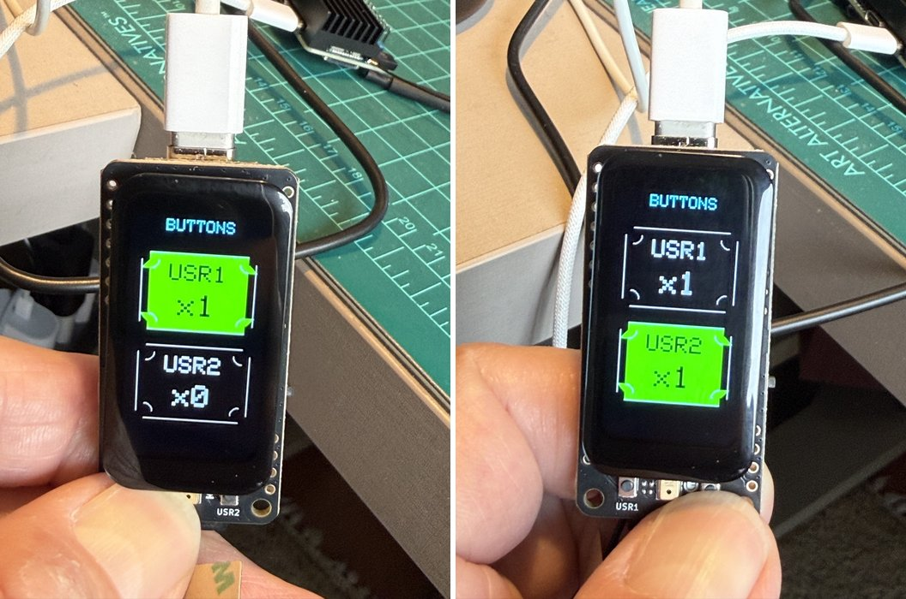

*Left: USR1 held down. Right: USR2 held down. Each button lights only its own
box, and each press adds exactly one to its own counter.*

#### Sketch

How it works:

- A pressed button pulls its pin to ground, so the pins use `INPUT_PULLUP` and `LOW` means pressed.
- Debounce works by time: a new level is accepted only after it has been stable for 20 ms.
- Each event is printed with `millis()`, so contact bounce would show up as events a few milliseconds apart.

<!-- sketch: part1_bringup/05_buttons/05_buttons.ino -->
**Sketch:** [`part1_bringup/05_buttons/05_buttons.ino`](https://github.com/Mjrovai/XIAO-IPS-Display-ESP32S3/blob/main/part1_bringup/05_buttons/05_buttons.ino)

```cpp
/*
  Test 05 - User buttons
  USR1 = D19, USR2 = D15, both active-low with the internal pull-up.
  Shows each button as a lit box while pressed, plus a press counter,
  and prints every change on Serial.
  Pass: each press lights only its own box and adds exactly 1 to its counter.
*/

#include <Arduino.h>
#include <Seeed_GFX.h>
#include "board/boards/XIAO_LCD_Board.h"
#include "driver/tft/Driver_JD9853A.h"
#include "panel/Panel_TFT.h"

Seeed_GFX display;
Seeed_Sprite canvas;

static constexpr int8_t LCD_RST_PIN = 13;
static constexpr int8_t LCD_BL_PIN = 12;

static constexpr uint8_t BTN_USR1 = D19;
static constexpr uint8_t BTN_USR2 = D15;

// Per-button state: debounced level, last raw level and when it changed, press count.
struct Button {
  uint8_t pin;
  const char *name;
  bool down = false;
  bool lastRaw = false;
  uint32_t changeMs = 0;
  uint32_t presses = 0;
};
Button btn[2] = {{BTN_USR1, "USR1"}, {BTN_USR2, "USR2"}};

// Draw everything into the sprite, then send it to the panel once.
static void draw() {
  canvas.fillScreen(TFT_BLACK);
  canvas.setTextSize(2);
  canvas.setTextColor(TFT_CYAN, TFT_BLACK);
  canvas.drawCentreString("BUTTONS", 86, 8, 1);
  for (int i = 0; i < 2; i++) {
    int y = 50 + i * 120;
    uint16_t fill = btn[i].down ? TFT_GREEN : TFT_BLACK;
    canvas.fillRoundRect(16, y, 140, 100, 10, fill);
    canvas.drawRoundRect(16, y, 140, 100, 10, TFT_WHITE);
    canvas.setTextColor(btn[i].down ? TFT_BLACK : TFT_WHITE, fill);
    canvas.setTextSize(3);
    canvas.drawCentreString(btn[i].name, 86, y + 14, 1);
    char t[16];
    snprintf(t, sizeof(t), "x%lu", (unsigned long)btn[i].presses);
    canvas.setTextSize(4);
    canvas.drawCentreString(t, 86, y + 52, 1);
  }
  canvas.pushSprite(0, 0);
}

void setup() {
  Serial.begin(115200);
  Serial.setTxTimeoutMs(0);
  delay(500);
  if (!display.begin<Board_XIAO_1inch47_Touch_Display<LCD_RST_PIN, LCD_BL_PIN>,
                     Config_Seeed_1inch47_Touch_JD9853A>()) {
    Serial.println(display.lastResult().message);
    return;
  }
  canvas.createSprite(display, 172, 320);
  // A pressed button pulls its pin to ground, so enable the internal pull-up.
  for (auto &b : btn) pinMode(b.pin, INPUT_PULLUP);
  draw();
}

void loop() {
  bool dirty = false;
  for (auto &b : btn) {
    // LOW means pressed (active low).
    bool raw = digitalRead(b.pin) == LOW;
    // Restart the stability timer whenever the raw level changes.
    if (raw != b.lastRaw) { b.lastRaw = raw; b.changeMs = millis(); }
    // 20 ms debounce: accept the new state once it has been stable
    if (raw != b.down && millis() - b.changeMs > 20) {
      b.down = raw;
      if (raw) b.presses++;
      Serial.printf("%8lu ms  %s %s (count %lu)\n", (unsigned long)millis(), b.name, raw ? "DOWN" : "UP", (unsigned long)b.presses);
      dirty = true;
    }
  }
  if (dirty) draw();
  delay(2);
}
```
<!-- /sketch -->

#### Bounce probe

How it works:

- Each button has an interrupt on `CHANGE` that stores `micros()` and the pin level in a small ring buffer. Nothing is filtered, so bounce is recorded.
- `loop()` drains the buffer and prints one line per edge, with the time since the previous edge on that button.
- No display is used, so nothing else competes for the processor.

<!-- sketch: part1_bringup/extras/button_bounce_probe/button_bounce_probe.ino -->
**Sketch:** [`part1_bringup/extras/button_bounce_probe/button_bounce_probe.ino`](https://github.com/Mjrovai/XIAO-IPS-Display-ESP32S3/blob/main/part1_bringup/extras/button_bounce_probe/button_bounce_probe.ino)

```cpp
/*
  Extra - Button bounce probe
  Records every raw edge on USR1 (D19) and USR2 (D15) with a microsecond
  timestamp, with no debouncing at all, so contact bounce is visible.
  Each press should be one falling edge (DOWN) and, on release, one rising
  edge (UP). Extra edges close together are bounce.

  Serial output, one line per edge:
    <micros>,<button>,<DOWN|UP>,<microseconds since the previous edge on this button>

  Edges are captured in interrupts, so even bounce shorter than a millisecond
  is recorded. No display is used, so nothing else competes for time.
*/

#include <Arduino.h>

static constexpr uint8_t PIN_USR1 = D19;
static constexpr uint8_t PIN_USR2 = D15;

struct Edge {
  uint32_t t;      // micros() at the edge
  uint8_t button;  // 1 or 2
  uint8_t level;   // 0 = pressed (LOW), 1 = released (HIGH)
};

static constexpr size_t QSIZE = 512;
static volatile Edge queue[QSIZE];
static volatile uint16_t head = 0;  // written by the interrupts
static uint16_t tail = 0;           // read by loop()

// One interrupt handler per button; both just store the time and the level.
static void IRAM_ATTR record(uint8_t button, uint8_t pin) {
  uint16_t h = head;
  queue[h].t = micros();
  queue[h].button = button;
  queue[h].level = digitalRead(pin);
  head = (h + 1) % QSIZE;
}
static void IRAM_ATTR isrUsr1() { record(1, PIN_USR1); }
static void IRAM_ATTR isrUsr2() { record(2, PIN_USR2); }

void setup() {
  Serial.begin(115200);
  Serial.setTxTimeoutMs(0);
  delay(1500);
  pinMode(PIN_USR1, INPUT_PULLUP);
  pinMode(PIN_USR2, INPUT_PULLUP);
  attachInterrupt(digitalPinToInterrupt(PIN_USR1), isrUsr1, CHANGE);
  attachInterrupt(digitalPinToInterrupt(PIN_USR2), isrUsr2, CHANGE);
  Serial.println("micros,button,edge,us_since_previous_edge");
}

void loop() {
  static uint32_t last[3] = {0, 0, 0};
  while (tail != head) {
    Edge e;
    e.t = queue[tail].t;
    e.button = queue[tail].button;
    e.level = queue[tail].level;
    tail = (tail + 1) % QSIZE;
    uint32_t dt = last[e.button] ? e.t - last[e.button] : 0;
    last[e.button] = e.t;
    Serial.printf("%lu,USR%u,%s,%lu\n", (unsigned long)e.t, e.button,
                  e.level ? "UP" : "DOWN", (unsigned long)dt);
  }
  delay(1);
}
```
<!-- /sketch -->

### 06 · Battery (`06_battery`)

Reads the voltage on D16, applies the divider ratio (2.975), and shows volts,
millivolts, an estimated percentage, and a history graph.

**Result: not validated.** With **no battery connected and the power switch
off**, the board reads a steady **3.97 V**, and it did not change when we
toggled the switch. So that number is not a battery voltage. We do not know
where it comes from; a likely explanation is that the sense divider sits on a
node that the USB charging path holds up, but we did not check the schematic.

This test needs a LiPo connected. Until it has been run that way, treat the
battery reading and the percentage as unverified. The percentage is also only a
straight line from 3.30 V to 4.20 V, and a real LiPo curve is not straight.
The ESP32-S3 version can read voltage only; it cannot detect charging status.

#### Sketch

How it works:

- The battery sits behind a 316 k / 160 k divider, so the pin sees 160/476 of the battery voltage. The sketch multiplies by 2.975 to undo that.
- It averages 16 ADC readings and uses `analogReadMilliVolts()`, which applies the chip's calibration.
- The percentage is a straight line from 3.30 V to 4.20 V. A real LiPo curve is not straight, so treat it as a rough guide.

<!-- sketch: part1_bringup/06_battery/06_battery.ino -->
**Sketch:** [`part1_bringup/06_battery/06_battery.ino`](https://github.com/Mjrovai/XIAO-IPS-Display-ESP32S3/blob/main/part1_bringup/06_battery/06_battery.ino)

```cpp
/*
  Test 06 - Battery voltage
  The battery is sensed on D16 through a 316k / 160k divider, so
  VBAT = ADC_mV * (316 + 160) / 160 = ADC_mV * 2.975.
  Do not trust the number without a LiPo connected: on our unit it read
  about 3.97 V with no battery and the power switch off, so a reading alone
  does not prove a battery is present.
  Shows volts, millivolts, a rough percentage (3.30 V empty .. 4.20 V full
  for a LiPo, a coarse estimate only), and a history graph.
  Note: the ESP32-S3 version cannot detect charge status, only voltage.
*/

#include <Arduino.h>
#include <Seeed_GFX.h>
#include "board/boards/XIAO_LCD_Board.h"
#include "driver/tft/Driver_JD9853A.h"
#include "panel/Panel_TFT.h"

Seeed_GFX display;
Seeed_Sprite canvas;

static constexpr int8_t LCD_RST_PIN = 13;
static constexpr int8_t LCD_BL_PIN = 12;

static constexpr uint8_t BAT_ADC_PIN = D16;
// VBAT -- 316k -- D16 -- 160k -- GND: the pin sees only 160/476 of VBAT.
static constexpr float DIVIDER = (316.0f + 160.0f) / 160.0f;

static constexpr int HIST_W = 172;
static float hist[HIST_W];

static uint32_t readBatteryMv() {
  uint32_t sum = 0;
  // Average 16 readings to smooth the ADC noise.
  for (int i = 0; i < 16; i++) { sum += analogReadMilliVolts(BAT_ADC_PIN); delay(2); }
  return (uint32_t)((sum / 16.0f) * DIVIDER);
}

void setup() {
  Serial.begin(115200);
  Serial.setTxTimeoutMs(0);
  delay(500);
  analogReadResolution(12);
  // 11 dB attenuation gives the widest input range.
  analogSetPinAttenuation(BAT_ADC_PIN, ADC_11db);
  if (!display.begin<Board_XIAO_1inch47_Touch_Display<LCD_RST_PIN, LCD_BL_PIN>,
                     Config_Seeed_1inch47_Touch_JD9853A>()) {
    Serial.println(display.lastResult().message);
    return;
  }
  canvas.createSprite(display, 172, 320);
  for (int i = 0; i < HIST_W; i++) hist[i] = 0;
}

void loop() {
  static uint32_t last = 0;
  if (millis() - last < 500) return;
  last = millis();

  uint32_t mv = readBatteryMv();
  float v = mv / 1000.0f;
  // A straight line from 3.30 V (empty) to 4.20 V (full). A real LiPo curve is
  // not straight, so this is only a rough guide.
  int pct = constrain((int)((v - 3.30f) / (4.20f - 3.30f) * 100.0f), 0, 100);
  Serial.printf("battery_mV=%lu  V=%.3f  est=%d%%\n", (unsigned long)mv, v, pct);

  memmove(hist, hist + 1, sizeof(float) * (HIST_W - 1));
  hist[HIST_W - 1] = v;

  // Red below 3.4 V, yellow below 3.7 V, green above.
  uint16_t col = v < 3.4f ? TFT_RED : (v < 3.7f ? TFT_YELLOW : TFT_GREEN);
  canvas.fillScreen(TFT_BLACK);
  canvas.setTextColor(TFT_CYAN, TFT_BLACK);
  canvas.setTextSize(2);
  canvas.drawCentreString("BATTERY", 86, 8, 1);
  char t[24];
  snprintf(t, sizeof(t), "%.3f V", v);
  canvas.setTextColor(col, TFT_BLACK);
  canvas.setTextSize(3);
  canvas.drawCentreString(t, 86, 50, 1);
  canvas.setTextColor(TFT_WHITE, TFT_BLACK);
  canvas.setTextSize(2);
  snprintf(t, sizeof(t), "%lu mV", (unsigned long)mv);
  canvas.drawCentreString(t, 86, 92, 1);
  snprintf(t, sizeof(t), "~%d %%", pct);
  canvas.drawCentreString(t, 86, 118, 1);

  canvas.drawRect(10, 150, 152, 26, TFT_WHITE);
  canvas.fillRect(12, 152, (148 * pct) / 100, 22, col);

  canvas.setTextSize(1);
  canvas.setCursor(4, 190);
  canvas.print("history 0 .. 4.5 V");
  canvas.drawRect(0, 202, 172, 101, TFT_DARKGREY);
  for (int i = 0; i < HIST_W; i++) {
    int h = (int)(100 * constrain(hist[i] / 4.5f, 0.0f, 1.0f));
    canvas.drawFastVLine(i, 302 - h, h, col);
  }
  canvas.pushSprite(0, 0);
}
```
<!-- /sketch -->

### 07 · Wi-Fi scan (`07_wifi_scan`)

Scans for 2.4 GHz networks every six seconds and lists them with signal
strength, channel, and security type. No credentials are needed.

**Measured:** a scan takes about 2.4 to 2.8 seconds. See
[Gotcha 3](#3-without-the-antenna-wi-fi-barely-works) for the antenna result.
Network names from neighbors are not shown in this document.

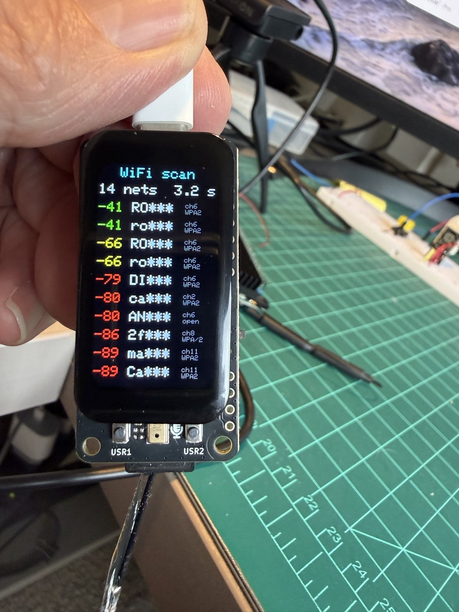

*The header counts all 14 networks found; the screen lists the 10 strongest.
Names are masked by `MASK_SSIDS 1`. Green is stronger than -60 dBm, yellow down
to -75 dBm, and red weaker.*

#### Sketch

How it works:

- Station mode with no connection: a scan needs no password.
- `WiFi.scanNetworks()` returns the list sorted by signal strength, strongest first.
- `MASK_SSIDS` shows only the first two characters of each name, so photos and logs do not expose your neighbors.

<!-- sketch: part1_bringup/07_wifi_scan/07_wifi_scan.ino -->
**Sketch:** [`part1_bringup/07_wifi_scan/07_wifi_scan.ino`](https://github.com/Mjrovai/XIAO-IPS-Display-ESP32S3/blob/main/part1_bringup/07_wifi_scan/07_wifi_scan.ino)

```cpp
/*
  Test 07 - Wi-Fi scan
  Scans for 2.4 GHz networks every 6 seconds and lists the strongest ones
  with their RSSI (dBm), channel, and security type. No credentials needed.
  Pass: your own router shows up, and the RSSI gets stronger (closer to 0)
  when you bring the board nearer to it.
  If every RSSI is weaker than about -80 dBm next to a router you know is
  close, check that the antenna is attached and seated.
*/

#include <Arduino.h>
#include <WiFi.h>
#include <Seeed_GFX.h>
#include "board/boards/XIAO_LCD_Board.h"
#include "driver/tft/Driver_JD9853A.h"
#include "panel/Panel_TFT.h"

Seeed_GFX display;
Seeed_Sprite canvas;

// Set to 1 to show only the first 2 characters of each network name, so a
// photo or a pasted log does not expose your neighbors' networks.
#define MASK_SSIDS 1

static constexpr int8_t LCD_RST_PIN = 13;
static constexpr int8_t LCD_BL_PIN = 12;

static String shownName(int i) {
  String n = WiFi.SSID(i);
  if (n.length() == 0) return "(hidden)";
#if MASK_SSIDS
  return n.substring(0, 2) + "***";
#else
  return n;
#endif
}

static const char *authName(wifi_auth_mode_t a) {
  switch (a) {
    case WIFI_AUTH_OPEN: return "open";
    case WIFI_AUTH_WEP: return "WEP";
    case WIFI_AUTH_WPA_PSK: return "WPA";
    case WIFI_AUTH_WPA2_PSK: return "WPA2";
    case WIFI_AUTH_WPA_WPA2_PSK: return "WPA/2";
    case WIFI_AUTH_WPA3_PSK: return "WPA3";
    case WIFI_AUTH_WPA2_WPA3_PSK: return "WPA2/3";
    default: return "other";
  }
}

void setup() {
  Serial.begin(115200);
  Serial.setTxTimeoutMs(0);
  delay(500);
  if (!display.begin<Board_XIAO_1inch47_Touch_Display<LCD_RST_PIN, LCD_BL_PIN>,
                     Config_Seeed_1inch47_Touch_JD9853A>()) {
    Serial.println(display.lastResult().message);
    return;
  }
  canvas.createSprite(display, 172, 320);
  // Station mode and not connected to anything: scanning needs no password.
  WiFi.mode(WIFI_STA);
  WiFi.disconnect();
}

void loop() {
  canvas.fillScreen(TFT_BLACK);
  canvas.setTextSize(2);
  canvas.setTextColor(TFT_CYAN, TFT_BLACK);
  canvas.drawCentreString("WiFi scan", 86, 8, 1);
  canvas.setTextSize(1);
  canvas.setTextColor(TFT_WHITE, TFT_BLACK);
  canvas.drawCentreString("scanning...", 86, 150, 1);
  canvas.pushSprite(0, 0);

  uint32_t t0 = millis();
  // A blocking scan of all 2.4 GHz channels; it takes about 2.5 to 3 seconds.
  int n = WiFi.scanNetworks();
  uint32_t dt = millis() - t0;
  Serial.printf("scan: %d networks in %lu ms\n", n, (unsigned long)dt);

  canvas.fillScreen(TFT_BLACK);
  canvas.setTextSize(2);
  canvas.setTextColor(TFT_CYAN, TFT_BLACK);
  canvas.drawCentreString("WiFi scan", 86, 6, 1);
  canvas.setTextColor(TFT_WHITE, TFT_BLACK);
  char t[40];
  snprintf(t, sizeof(t), "%d nets  %.1f s", n, dt / 1000.0f);
  canvas.drawCentreString(t, 86, 30, 1);

  // WiFi.scanNetworks() returns the list sorted by RSSI, strongest first.
  // One row per network: signal (colored) and name at size 2, channel and
  // security at size 1 on the right. Row pitch 26 px, 10 rows fit.
  int shown = n < 10 ? n : 10;
  for (int i = 0; i < shown; i++) {
    int rssi = WiFi.RSSI(i);
    Serial.printf("%2d  %4d dBm  ch%-2d  %-6s  %s\n", i + 1, rssi, WiFi.channel(i),
                  authName(WiFi.encryptionType(i)), shownName(i).c_str());
    uint16_t col = rssi > -60 ? TFT_GREEN : (rssi > -75 ? TFT_YELLOW : TFT_RED);
    int y = 56 + i * 26;
    canvas.setTextSize(2);
    canvas.setTextColor(col, TFT_BLACK);
    snprintf(t, sizeof(t), "%d", rssi);
    canvas.setCursor(2, y);
    canvas.print(t);
    canvas.setTextColor(TFT_WHITE, TFT_BLACK);
    String name = shownName(i);
    if (name.length() > 6) name = name.substring(0, 6);
    canvas.setCursor(50, y);
    canvas.print(name);
    canvas.setTextSize(1);
    canvas.setTextColor(TFT_LIGHTGREY, TFT_BLACK);
    canvas.setCursor(126, y);
    snprintf(t, sizeof(t), "ch%d", WiFi.channel(i));
    canvas.print(t);
    canvas.setCursor(126, y + 9);
    canvas.print(authName(WiFi.encryptionType(i)));
  }
  canvas.pushSprite(0, 0);
  WiFi.scanDelete();
  delay(6000);
}
```
<!-- /sketch -->

### 08 · microSD (`08_sd`)

Mounts the card, lists the root folder, writes 64 KB of a known pattern, reads
it back, and compares every byte.

**Measured (947 MB card):** mount passes at **20 MHz**; write 368 to 407 KB/s;
read 1422 KB/s; zero mismatched bytes. The four colored bars drawn afterward
were clean, which shows the card traffic did not corrupt the display.

The sketch only writes and deletes its own test file.

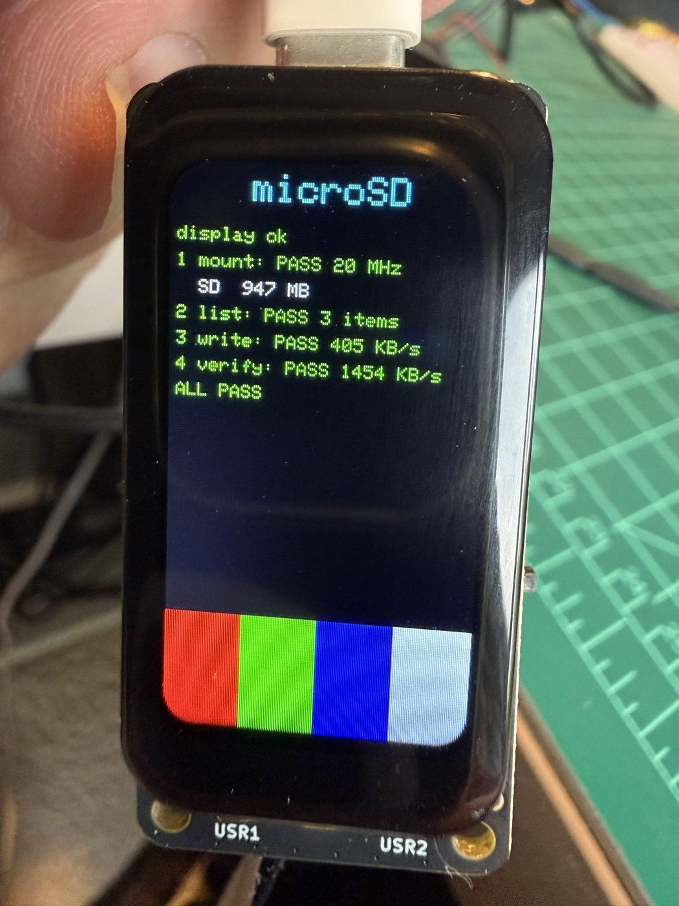

#### Sketch

How it works:

- The card shares the SPI bus with the display, so the sketch reuses the display's own `SPIClass` and attaches the MISO pin to it. A second SPI object would stop the display's bus (Gotcha 2).
- The mount tries 20 MHz first and falls back to slower clocks.
- The test writes a known pattern and compares every byte on read-back, so any corruption shows as a mismatch.
- The summary repeats in `loop()` so a serial monitor opened late still sees it.

<!-- sketch: part1_bringup/08_sd/08_sd.ino -->
**Sketch:** [`part1_bringup/08_sd/08_sd.ino`](https://github.com/Mjrovai/XIAO-IPS-Display-ESP32S3/blob/main/part1_bringup/08_sd/08_sd.ino)

```cpp
/*
  Test 08 - microSD card
  The card shares SCK=D8 / MOSI=D10 / MISO=D9 with the display; its chip
  select is D6 and the display's is D2. The display is started first, and
  the card is mounted through the display's own SPIClass, with MISO (D9)
  attached to it. Do NOT create a second SPIClass(HSPI): with arduino-esp32
  3.3.x it stops the bus the display is using and SD.begin never returns.
  Steps: mount, list the root folder, write 64 KB of a known pattern,
  read it back and compare byte by byte, report speeds, then redraw the
  screen to prove the display still works after card traffic.
  Pass: all four lines are PASS and the color bars at the bottom are clean.
*/

#include <Arduino.h>
#include <SPI.h>
#include <SD.h>
#include <Seeed_GFX.h>
#include "board/boards/XIAO_LCD_Board.h"
#include "driver/tft/Driver_JD9853A.h"
#include "panel/Panel_TFT.h"
#include "bus/Bus_SPI.h"

Seeed_GFX display;
Seeed_Sprite canvas;

static constexpr int8_t LCD_RST_PIN = 13;
static constexpr int8_t LCD_BL_PIN = 12;
static constexpr uint8_t SD_CS = D6;
static constexpr uint8_t SPI_MISO = D9;

static constexpr size_t TEST_BYTES = 64 * 1024;
static const char *TEST_PATH = "/xiao_test.bin";

struct Line { String text; uint16_t color; };
static Line lines[10];
static int nLines = 0;

static void say(const String &s, uint16_t color = TFT_WHITE) {
  Serial.println(s);
  if (nLines < 10) lines[nLines++] = {s, color};
  canvas.fillScreen(TFT_BLACK);
  canvas.setTextSize(2);
  canvas.setTextColor(TFT_CYAN, TFT_BLACK);
  canvas.drawCentreString("microSD", 86, 6, 1);
  canvas.setTextSize(1);
  for (int i = 0; i < nLines; i++) {
    canvas.setTextColor(lines[i].color, TFT_BLACK);
    canvas.setCursor(4, 34 + i * 14);
    canvas.print(lines[i].text);
  }
  canvas.pushSprite(0, 0);
}

// A known pattern, so any mismatch on read-back means the data was corrupted.
static uint8_t patternByte(size_t i) { return (uint8_t)((i * 31 + (i >> 8)) & 0xFF); }

void setup() {
  Serial.begin(115200);
  Serial.setTxTimeoutMs(0);
  delay(1500);

  pinMode(SD_CS, OUTPUT);
  digitalWrite(SD_CS, HIGH);  // keep the card deselected while the display starts
  if (!display.begin<Board_XIAO_1inch47_Touch_Display<LCD_RST_PIN, LCD_BL_PIN>,
                     Config_Seeed_1inch47_Touch_JD9853A>()) {
    Serial.println(display.lastResult().message);
    return;
  }
  canvas.createSprite(display, 172, 320);
  say("display ok", TFT_GREEN);

  // 1. mount
  SPIClass *sdSpi = static_cast<Bus_SPI &>(display.panel().driver().bus()).spiInstance();
  if (!sdSpi || !spiAttachMISO(sdSpi->bus(), SPI_MISO)) {
    say("1 mount: FAIL (SPI setup)", TFT_RED);
    return;
  }
  // Try the fastest SPI clock first, and fall back if the card does not mount.
  const uint32_t freqs[] = {20000000, 10000000, 4000000, 1000000, 400000};
  uint32_t usedFreq = 0;
  for (uint32_t f : freqs) {
    digitalWrite(SD_CS, HIGH);
    if (SD.begin(SD_CS, *sdSpi, f)) { usedFreq = f; break; }
  }
  if (!usedFreq) {
    say("1 mount: FAIL", TFT_RED);
    say("card inserted? FAT32?", TFT_YELLOW);
    return;
  }
  const char *type = SD.cardType() == CARD_SDHC ? "SDHC" : SD.cardType() == CARD_SD ? "SD" : SD.cardType() == CARD_MMC ? "MMC" : "?";
  say(String("1 mount: PASS ") + (usedFreq / 1000000) + " MHz", TFT_GREEN);
  say(String("  ") + type + "  " + (uint32_t)(SD.cardSize() / (1024ULL * 1024ULL)) + " MB", TFT_WHITE);

  // 2. list root
  File root = SD.open("/");
  int entries = 0;
  Serial.println("root folder:");
  for (File f = root.openNextFile(); f && entries < 50; f = root.openNextFile()) {
    Serial.printf("  %s%s  %u\n", f.name(), f.isDirectory() ? "/" : "", (unsigned)f.size());
    entries++;
  }
  root.close();
  say(String("2 list: PASS ") + entries + " items", TFT_GREEN);

  // 3. write
  static uint8_t buf[4096];
  SD.remove(TEST_PATH);
  File w = SD.open(TEST_PATH, FILE_WRITE);
  if (!w) { say("3 write: FAIL (open)", TFT_RED); return; }
  uint32_t t0 = millis();
  size_t done = 0;
  while (done < TEST_BYTES) {
    for (size_t i = 0; i < sizeof(buf); i++) buf[i] = patternByte(done + i);
    if (w.write(buf, sizeof(buf)) != sizeof(buf)) break;
    done += sizeof(buf);
  }
  w.close();
  uint32_t wms = millis() - t0;
  if (done != TEST_BYTES) { say("3 write: FAIL (short)", TFT_RED); return; }
  say(String("3 write: PASS ") + (int)((TEST_BYTES / 1024.0f) / (wms / 1000.0f)) + " KB/s", TFT_GREEN);

  // 4. read back and compare
  File r = SD.open(TEST_PATH);
  if (!r) { say("4 verify: FAIL (open)", TFT_RED); return; }
  size_t pos = 0, bad = 0;
  t0 = millis();
  while (pos < TEST_BYTES) {
    int got = r.read(buf, sizeof(buf));
    if (got <= 0) break;
    for (int i = 0; i < got; i++) if (buf[i] != patternByte(pos + i)) bad++;
    pos += got;
  }
  r.close();
  uint32_t rms = millis() - t0;
  SD.remove(TEST_PATH);
  if (pos != TEST_BYTES || bad) {
    say(String("4 verify: FAIL read=") + pos + " bad=" + bad, TFT_RED);
    return;
  }
  say(String("4 verify: PASS ") + (int)((TEST_BYTES / 1024.0f) / (rms / 1000.0f)) + " KB/s", TFT_GREEN);
  say("ALL PASS", TFT_GREEN);

  // Display still healthy after card traffic? Draw bars below the text.
  const uint16_t bars[] = {TFT_RED, TFT_GREEN, TFT_BLUE, TFT_WHITE};
  for (int i = 0; i < 4; i++) canvas.fillRect(i * 43, 250, 43, 70, bars[i]);
  canvas.pushSprite(0, 0);
}

void loop() {
  // Repeat the summary so a serial monitor opened late still sees the result.
  delay(3000);
  Serial.println("--- summary ---");
  for (int i = 0; i < nLines; i++) Serial.println(lines[i].text);
}
```
<!-- /sketch -->

### 09 · Self-test (`09_selftest`)

Runs I2C, IMU, microphone, microSD, Wi-Fi, and battery checks automatically,
then waits for you to press USR1, press USR2, and touch the screen.

**Measured:** the six automatic checks gave PASS (battery shows N/A on purpose,
because a reading alone cannot prove a battery is present). After pressing both
buttons and touching the screen, the three manual lines also passed: the photo
below shows 8 PASS, 0 FAIL, and 0 waiting, with the touch line reporting the
last touch at x=159, y=312.

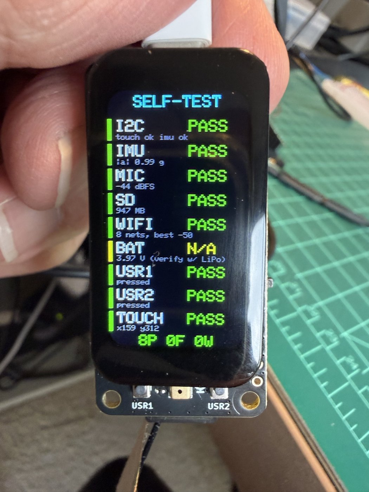

#### Sketch

How it works:

- Every check is one function that fills a `Check` entry with PASS, FAIL, or N/A and a short note; the screen is redrawn after each one.
- The microphone check discards the first blocks while the PDM filter settles, then measures one block.
- The battery line is N/A on purpose: a reading alone cannot prove a battery is connected (see test 06).
- The three manual checks live in `loop()` and turn PASS the first time their event is seen.

<!-- sketch: part1_bringup/09_selftest/09_selftest.ino -->
**Sketch:** [`part1_bringup/09_selftest/09_selftest.ino`](https://github.com/Mjrovai/XIAO-IPS-Display-ESP32S3/blob/main/part1_bringup/09_selftest/09_selftest.ino)

```cpp
/*
  Test 09 - Self-test (XIAO 1.47" IPS Touch Display, ESP32-S3 Plus)
  Runs every check on one screen:
    I2C   touch controller (0x63) and IMU (0x6A/0x6B) answer
    IMU   |a| is 1 g +/- 0.15 while you hold the board still
    MIC   PDM microphone delivers samples and the level moves
    SD    card mounts, 4 KB written and read back identically
    WIFI  at least one 2.4 GHz network found
    BAT   voltage readable (marked N/A below 2.5 V: no LiPo connected)
    USR1  press USR1
    USR2  press USR2
    TOUCH touch the screen
  Each line shows PASS / FAIL / WAIT. The three WAIT lines need you.
*/

#include <Arduino.h>
#include <Wire.h>
#include <WiFi.h>
#include <SPI.h>
#include <SD.h>
#include <driver/i2s_pdm.h>
#include <Seeed_GFX.h>
#include "board/boards/XIAO_LCD_Board.h"
#include "driver/tft/Driver_JD9853A.h"
#include "panel/Panel_TFT.h"
#include "bus/Bus_SPI.h"
#include "touch/Touch_AXS5106L.h"

Seeed_GFX display;
Seeed_Sprite canvas;
Touch_AXS5106L touch(-1, D7, Wire, 172, 320);

static constexpr int8_t LCD_RST_PIN = 13;
static constexpr int8_t LCD_BL_PIN = 12;

enum State { ST_WAIT, ST_PASS, ST_FAIL, ST_NA };
// One entry per check: name, state, and a short note shown under the name.
struct Check { const char *name; State st; char note[24]; };
Check checks[] = {
  {"I2C", ST_WAIT, ""}, {"IMU", ST_WAIT, ""}, {"MIC", ST_WAIT, ""}, {"SD", ST_WAIT, ""},
  {"WIFI", ST_WAIT, ""}, {"BAT", ST_WAIT, ""}, {"USR1", ST_WAIT, "press"}, {"USR2", ST_WAIT, "press"},
  {"TOUCH", ST_WAIT, "touch"},
};
enum { C_I2C, C_IMU, C_MIC, C_SD, C_WIFI, C_BAT, C_USR1, C_USR2, C_TOUCH, C_COUNT };

static void set(int i, State s, const char *fmt = "", ...) {
  checks[i].st = s;
  va_list ap; va_start(ap, fmt);
  vsnprintf(checks[i].note, sizeof(checks[i].note), fmt, ap);
  va_end(ap);
}

static void draw() {
  canvas.fillScreen(TFT_BLACK);
  canvas.setTextSize(2);
  canvas.setTextColor(TFT_CYAN, TFT_BLACK);
  canvas.drawCentreString("SELF-TEST", 86, 6, 1);
  int pass = 0, fail = 0, wait = 0;
  for (int i = 0; i < C_COUNT; i++) {
    int y = 34 + i * 30;
    uint16_t col = checks[i].st == ST_PASS ? TFT_GREEN : checks[i].st == ST_FAIL ? TFT_RED
                   : checks[i].st == ST_NA ? TFT_YELLOW : TFT_DARKGREY;
    const char *tag = checks[i].st == ST_PASS ? "PASS" : checks[i].st == ST_FAIL ? "FAIL"
                      : checks[i].st == ST_NA ? "N/A" : "WAIT";
    if (checks[i].st == ST_PASS) pass++; else if (checks[i].st == ST_FAIL) fail++; else if (checks[i].st == ST_WAIT) wait++;
    canvas.fillRect(0, y, 4, 26, col);
    canvas.setTextSize(2);
    canvas.setTextColor(TFT_WHITE, TFT_BLACK);
    canvas.setCursor(10, y + 1);
    canvas.print(checks[i].name);
    canvas.setTextColor(col, TFT_BLACK);
    canvas.setCursor(100, y + 1);
    canvas.print(tag);
    canvas.setTextSize(1);
    canvas.setTextColor(TFT_LIGHTGREY, TFT_BLACK);
    canvas.setCursor(10, y + 18);
    canvas.print(checks[i].note);
  }
  canvas.setTextSize(2);
  canvas.setTextColor(fail ? TFT_RED : (wait ? TFT_YELLOW : TFT_GREEN), TFT_BLACK);
  char t[32];
  snprintf(t, sizeof(t), "%dP %dF %dW", pass, fail, wait);
  canvas.drawCentreString(t, 86, 304, 1);
  canvas.pushSprite(0, 0);
}

static bool i2cRead(uint8_t addr, uint8_t reg, uint8_t *buf, size_t len) {
  Wire.beginTransmission(addr);
  Wire.write(reg);
  if (Wire.endTransmission(false) != 0) return false;
  if (Wire.requestFrom((int)addr, (int)len) != (int)len) return false;
  for (size_t i = 0; i < len; i++) buf[i] = Wire.read();
  return true;
}
static int16_t le16(const uint8_t *p) { return (int16_t)((uint16_t)p[0] | ((uint16_t)p[1] << 8)); }

static uint8_t imuAddr = 0;
static bool imuIsQmi = false;

static void checkI2c() {
  bool t = false, i = false;
  Wire.beginTransmission(0x63); t = Wire.endTransmission() == 0;
  for (uint8_t a : {0x6A, 0x6B}) { Wire.beginTransmission(a); if (Wire.endTransmission() == 0) { imuAddr = a; i = true; break; } }
  set(C_I2C, (t && i) ? ST_PASS : ST_FAIL, "touch %s imu %s", t ? "ok" : "--", i ? "ok" : "--");
}

// Same IMU setup as test 03 (QMI8658 or LSM6 family).
static bool imuInit() {
  uint8_t who = 0;
  if (!imuAddr) return false;
  if (i2cRead(imuAddr, 0x00, &who, 1) && who == 0x05) {
    Wire.beginTransmission(imuAddr); Wire.write(0x02); Wire.write(0x60); Wire.endTransmission();
    Wire.beginTransmission(imuAddr); Wire.write(0x03); Wire.write(0x03); Wire.endTransmission();
    Wire.beginTransmission(imuAddr); Wire.write(0x04); Wire.write(0x53); Wire.endTransmission();
    Wire.beginTransmission(imuAddr); Wire.write(0x08); Wire.write(0x03); Wire.endTransmission();
    imuIsQmi = true; delay(20); return true;
  }
  if (i2cRead(imuAddr, 0x0F, &who, 1) && (who == 0x69 || who == 0x6A || who == 0x6C)) {
    Wire.beginTransmission(imuAddr); Wire.write(0x10); Wire.write(0x60); Wire.endTransmission();
    Wire.beginTransmission(imuAddr); Wire.write(0x11); Wire.write(0x60); Wire.endTransmission();
    imuIsQmi = false; delay(20); return true;
  }
  return false;
}

static void checkImu() {
  if (!imuInit()) { set(C_IMU, ST_FAIL, "no chip"); return; }
  float best = 99;
  for (int n = 0; n < 20; n++) {
    uint8_t d[6];
    if (!i2cRead(imuAddr, imuIsQmi ? 0x35 : 0x28, d, 6)) continue;
    float s = imuIsQmi ? 1.0f / 16384.0f : 0.000061f;
    float x = le16(d) * s, y = le16(d + 2) * s, z = le16(d + 4) * s;
    float m = sqrtf(x * x + y * y + z * z);
    if (fabsf(m - 1.0f) < fabsf(best - 1.0f)) best = m;
    delay(20);
  }
  set(C_IMU, fabsf(best - 1.0f) < 0.15f ? ST_PASS : ST_FAIL, "|a| %.2f g", best);
}

// Start the PDM microphone, discard the first blocks while its filter settles,
// then measure one block.
static void checkMic() {
  i2s_chan_handle_t rx = nullptr;
  i2s_chan_config_t ch = I2S_CHANNEL_DEFAULT_CONFIG(I2S_NUM_AUTO, I2S_ROLE_MASTER);
  if (i2s_new_channel(&ch, nullptr, &rx) != ESP_OK) { set(C_MIC, ST_FAIL, "channel"); return; }
  i2s_pdm_rx_config_t cfg = {};
  cfg.clk_cfg = I2S_PDM_RX_CLK_DEFAULT_CONFIG(16000);
  cfg.slot_cfg = I2S_PDM_RX_SLOT_DEFAULT_CONFIG(I2S_DATA_BIT_WIDTH_16BIT, I2S_SLOT_MODE_MONO);
  cfg.gpio_cfg.clk = GPIO_NUM_1; cfg.gpio_cfg.din = GPIO_NUM_2;
  if (i2s_channel_init_pdm_rx_mode(rx, &cfg) != ESP_OK || i2s_channel_enable(rx) != ESP_OK) {
    set(C_MIC, ST_FAIL, "init"); return;
  }
  static int16_t buf[1024];
  size_t got = 0;
  for (int i = 0; i < 4; i++) i2s_channel_read(rx, buf, sizeof(buf), &got, 500);  // settle
  float rmsDb = -99;
  if (i2s_channel_read(rx, buf, sizeof(buf), &got, 500) == ESP_OK && got > 0) {
    size_t n = got / 2; float mean = 0, sq = 0;
    for (size_t i = 0; i < n; i++) mean += buf[i];
    mean /= n;
    for (size_t i = 0; i < n; i++) { float v = buf[i] - mean; sq += v * v; }
    rmsDb = 20.0f * log10f(fmaxf(sqrtf(sq / n), 1.0f) / 32768.0f);
  }
  i2s_channel_disable(rx); i2s_del_channel(rx);
  // A live PDM mic has a noise floor well above digital silence (-90 dBFS).
  set(C_MIC, (rmsDb > -85 && rmsDb < -5) ? ST_PASS : ST_FAIL, "%.0f dBFS", rmsDb);
}

static void checkSd() {
  pinMode(D6, OUTPUT); digitalWrite(D6, HIGH);
  SPIClass *spi = static_cast<Bus_SPI &>(display.panel().driver().bus()).spiInstance();
  if (!spi || !spiAttachMISO(spi->bus(), D9)) { set(C_SD, ST_FAIL, "spi"); return; }
  if (!SD.begin(D6, *spi, 20000000) && !SD.begin(D6, *spi, 4000000)) { set(C_SD, ST_FAIL, "no card/FAT"); return; }
  static uint8_t w[4096], r[4096];
  for (int i = 0; i < 4096; i++) w[i] = (uint8_t)(i * 7 + 3);
  SD.remove("/selftest.bin");
  File f = SD.open("/selftest.bin", FILE_WRITE);
  bool ok = f && f.write(w, sizeof(w)) == sizeof(w);
  if (f) f.close();
  if (ok) {
    f = SD.open("/selftest.bin");
    ok = f && f.read(r, sizeof(r)) == (int)sizeof(r) && memcmp(w, r, sizeof(w)) == 0;
    if (f) f.close();
  }
  SD.remove("/selftest.bin");
  set(C_SD, ok ? ST_PASS : ST_FAIL, "%u MB", (unsigned)(SD.cardSize() / (1024ULL * 1024ULL)));
}

static void checkWifi() {
  WiFi.mode(WIFI_STA); WiFi.disconnect();
  int n = WiFi.scanNetworks();
  int best = -100;
  for (int i = 0; i < n; i++) best = max(best, (int)WiFi.RSSI(i));
  set(C_WIFI, n > 0 ? ST_PASS : ST_FAIL, "%d nets, best %d", n, best);
  WiFi.scanDelete();
}

static void checkBat() {
  analogReadResolution(12);
  analogSetPinAttenuation(D16, ADC_11db);
  uint32_t sum = 0;
  for (int i = 0; i < 16; i++) { sum += analogReadMilliVolts(D16); delay(2); }
  float v = (sum / 16.0f) * (316.0f + 160.0f) / 160.0f / 1000.0f;
  // Measured on our unit: about 3.97 V with NO battery (see tutorial), so a
  // reading alone cannot prove a LiPo is present.
  set(C_BAT, ST_NA, "%.2f V (verify w/ LiPo)", v);
}

void setup() {
  Serial.begin(115200);
  Serial.setTxTimeoutMs(0);
  delay(800);
  pinMode(D6, OUTPUT); digitalWrite(D6, HIGH);
  if (!display.begin<Board_XIAO_1inch47_Touch_Display<LCD_RST_PIN, LCD_BL_PIN>,
                     Config_Seeed_1inch47_Touch_JD9853A>()) {
    Serial.println(display.lastResult().message);
    return;
  }
  canvas.createSprite(display, 172, 320);
  bool t = display.attachTouch(touch, display.panel().driver().bus());
  Serial.printf("touch attach: %d\n", t);
  pinMode(D19, INPUT_PULLUP);
  pinMode(D15, INPUT_PULLUP);
  Wire.begin(D4, D5);
  Wire.setClock(400000);
  draw();

  checkI2c();  draw();
  checkImu();  draw();
  checkMic();  draw();
  checkSd();   draw();
  checkWifi(); draw();
  checkBat();  draw();
  for (int i = 0; i < C_COUNT; i++) Serial.printf("%-6s %s %s\n", checks[i].name,
      checks[i].st == ST_PASS ? "PASS" : checks[i].st == ST_FAIL ? "FAIL" : checks[i].st == ST_NA ? "N/A" : "WAIT", checks[i].note);
}

// The three manual checks: each turns PASS the first time its event is seen.
void loop() {
  bool dirty = false;
  if (checks[C_USR1].st == ST_WAIT && digitalRead(D19) == LOW) { set(C_USR1, ST_PASS, "pressed"); dirty = true; }
  if (checks[C_USR2].st == ST_WAIT && digitalRead(D15) == LOW) { set(C_USR2, ST_PASS, "pressed"); dirty = true; }
  int32_t x, y;
  if (checks[C_TOUCH].st == ST_WAIT && display.getTouch(&x, &y)) { set(C_TOUCH, ST_PASS, "x%ld y%ld", (long)x, (long)y); dirty = true; }
  if (dirty) {
    draw();
    for (int i = C_USR1; i < C_COUNT; i++) Serial.printf("%-6s %s %s\n", checks[i].name, checks[i].st == ST_PASS ? "PASS" : "WAIT", checks[i].note);
  }
  delay(10);
}
```
<!-- /sketch -->

## Gotchas

### 1. Seeed_GFX2 1.0.0 is slow on the ESP32-S3

**Symptom:** the IMU demo ran at about one frame per second, and touch drawing
felt sluggish.

**Cause, from reading the library source:** the ESP32 SPI path writes pixels one
at a time and never uses a bulk transfer or DMA. `Seeed_Sprite` also fills and
pushes pixel by pixel or row by row.

**Measured (1.47" board, before and after the patch):**

| Operation | Original | Patched |
|---|---|---|
| `fillScreen` on the panel | 161 ms | 33 ms |
| `fillRect` 50 x 50 | 7.5 ms | 1.6 ms |
| `fillScreen` in a sprite | 41 ms | 1.1 ms |
| `pushSprite`, full screen | 147 ms | 32 ms |
| IMU demo, time per frame | 740 ms | 43 ms |

Drawing text, circles, and single pixels straight to the panel stays slow
(12 characters took 84 ms). **The rule that works: draw into a `Seeed_Sprite`,
then push it once.** The patch (`tools/seeed_gfx2_speedup.patch`, three files)
uses the ESP32 `SPIClass::writePixels` and `writePattern` calls, adds a fast
row fill to the sprite, and sets the address window once in `pushImage`.

The patch is a workaround. It would be better for the fix to go upstream to
Seeed.

### 2. Do not create a second SPI object for the microSD card

**Symptom:** `SD.begin()` never returns when the display is already running.

**Cause:** creating a second `SPIClass(HSPI)`, as Seeed's own
`0519_MicSD_147_ESP32` example does, makes arduino-esp32 **3.3.12** stop the SPI
bus the display is using. The log shows `spiDetachBus(): Stopping SPI bus`. The
unmodified Seeed example hangs the same way on our board.

**Fix that worked:** reuse the display's own SPI object and attach the MISO pin
to it:

```cpp
SPIClass *spi = static_cast<Bus_SPI &>(display.panel().driver().bus()).spiInstance();
spiAttachMISO(spi->bus(), D9);
SD.begin(D6, *spi, 20000000);
```

### 3. Without the antenna, Wi-Fi barely works

With no antenna attached, a scan found **2 networks at about -80 dBm**. After
attaching the antenna, the same room showed **7 to 8 networks**, and the
strongest moved to **-39 dBm**, about 40 dB better. If your scan shows few
networks that are all weaker than -80 dBm, check the antenna first.

### 4. The microSD card must have a FAT volume

A 32 GB card that probably held a Raspberry Pi OS image answered the SPI reset
commands correctly but failed to mount:
`f_mount failed: (13) There is no valid FAT volume`. A 1 GB FAT card worked
at once. If mounting fails, a direct test helps: send CMD0 and CMD8 by hand
(see `part1_bringup/extras/sd_spi_probe`). A card that replies but will not
mount has a filesystem problem, not a wiring problem.

### 5. Grays have a blue cast

In the gray ramp, `R = G = B` values from black to white look bluish, most
clearly in the middle steps. The named constants (`TFT_DARKGREY` is
`0x7BEF`, which is neutral) look the same as a true gray next to them, so the
constants are not the cause. The red, green, and blue primaries look correct.

What we tried: the standard `GAMSET` command (0x26) with all four gamma curves.
The command was accepted, and the screen did not visibly change. To check that
by numbers, we photographed the ramp under the same conditions with each curve
selected and measured the brightness of each step relative to the white step.
At the mid-tone step (level 109) it was 0.33, 0.28, 0.36, and 0.33 for curves 01,
02, 04, and 08; at level 182 it was 0.55, 0.51, 0.56, and 0.52. The differences
follow no order and are within what the camera's automatic exposure, the viewing
angle, and glare produce between photos. The mean blue to red ratio over levels
72 to 255 was 2.4 to 2.6 for all four curves. (These blue to red values are not
comparable with the table below: the method and the exposure differ.)

What the JD9853 datasheet (Preliminary V0.00) suggests: the gamma registers
feed the red, green, and blue converters together, so gamma adjustment cannot
correct a difference between channels. Our best guess is that the cast is
optical (a cool-white backlight), which is common on IPS panels. We have not
confirmed that cause.

**Is it the panel or the camera?** To check, we photographed the same kind of
ramp on a Mac screen (`tools/gray_ramp_reference.png`, the same eight levels,
True Tone and Night Shift off) with the same phone, in the same room. We
sampled the middle of each step from levels 72 to 255 and averaged the blue to
red ratio of the camera's output (1.00 would be neutral):

| Photo | Blue / red |
|---|---|
| Mac reference ramp | 0.96 |
| Board ramp, photo 1 | 1.86 |
| Board ramp, photo 2, other time and scene | 1.4 to 1.65, depending on where we sampled (reflections in the glass) |
| Same photo, Mac ramp | 0.95 |
| Same photo, board ramp (four wide bands) | 1.5 to 2.2 |

So the camera rendered the Mac's neutral ramp as neutral and the board's ramp as
clearly blue, in separate photos and in one photo that has both screens in the
frame (the last two rows). This points at the panel. It is still not proof: the
board's screen is small in the same-frame photo, we picked the sample points by
hand, and the phone's processing is not linear. That photo is not published,
because the Mac screen behind it shows unrelated text. A colorimeter would also
give a number for the size of the shift. Repeat the comparison with the
reference image and see.

### 6. Serial output and startup

- Call `Serial.setTxTimeoutMs(0)` right after `Serial.begin()`. Without it, a
  write to the USB serial port can block when nothing is reading it. We added
  this in the same change that made the sketches feel responsive, so we have
  not proved it was the cause of the lag.
- With that setting, messages printed while no program is listening are lost.
  Sketches that run once in `setup()` should print a summary again in
  `loop()`, as `08_sd` does.

### 7. A small FAT16 card fills up after about 165 files

A card under 2 GB is usually FAT16, whose root folder holds a fixed number of
entries (typically 512), and a long file name uses several of them. A card that
is 99% free can still refuse to create a file once the root holds about 165
long-named files. The error looks like "no space left on device", and a sketch
sees a failed write. Keep files in subfolders. Part 2 hit this while recording
audio clips; see
[the details](part2_tinyml/README.md#a-limit-we-hit-the-root-folder-of-a-small-fat16-card).

## Results for the 1.47" touch version

| Test | Result |
|---|---|
| 00 I2C scan | Pass |
| 01 Display | Pass (blue cast in grays noted) |
| 02 Touch | Pass |
| 03 IMU | Pass (LSM6DS3TR-C) |
| 04 Microphone | Pass |
| 05 Buttons | Pass (bounce measured: at most 114 us in 24 presses and 24 releases) |
| 06 Battery | **Not validated**: needs a connected LiPo |
| 07 Wi-Fi scan | Pass, with the antenna attached |
| 08 microSD | Pass, with a FAT card and the shared-SPI fix |
| 09 Self-test | Pass (battery N/A) |

## Parts 2 and 3 at a glance

These were run on the same board after Part 1. Each has its own page with the details,
the code, and what we did not measure.

| Part | What it does | Headline result |
|---|---|---|
| [Part 2, keyword spotting](part2_tinyml/README.md#keyword-spotting) | Recognizes YES and NO on the microphone, with an Edge Impulse model | Offline, on the author's own test clips: 85.3% correct. Live, with beep cues: YES 7 of 11, NO 9 of 9, other words 8 of 10 (few cues, wide intervals). Needs ESP-NN turned off on core 3.3.12 |
| [Part 2, motion](part2_tinyml/README.md#motion-classification) | Classifies four movements on the IMU, with an Edge Impulse model | 98.48% on the Studio's test set (8 files); all four movements right in one live trial each; not a blind test |
| [Part 3, a tiny language model](part3_slm/README.md) | A 260,000-parameter model writes short stories on the board | 12.5 to 30 tokens per second; the first 64 tokens match an independent Python implementation for five prompts. A 4-million-parameter character GRU also runs, at 4.6 characters per second |

## What comes next

- **Part 1, other boards:** repeat the tests on the 1.14" and 0.96" versions. Their
  panels are ST7789, they have no touch or microSD, and the 1.14" adds a Grove
  connector and a third button.
- **Battery:** the battery test needs a connected LiPo (test 06).
- **Part 2:** a blind test of the motion model, and finding out why live YES is lower than
  offline (see the next steps in that page).
- **Part 3:** make the model faster (the second core, internal RAM, 8-bit weights).

## License

The code and text in this repository are released under the MIT License (see
`LICENSE`). The patch in `tools/` modifies the Seeed_GFX2 library, which is also
MIT licensed; its copyright stays with Seeed Studio. Seeed's launch materials,
product photos, and the JD9853 datasheet are not included here: follow the links
to the originals.

## Photos still to take

The figures above come from the test sessions. These are still missing:

1. **Battery.** The screen with a LiPo connected, once you have one. Optionally,
   also the no-battery reading of 3.97 V.
2. **A clean photo of the board next to the Mac reference.** Show `tools/gray_ramp_reference.png` full screen on
   the Mac (in Preview: View, then Enter Full Screen) so no other text is visible, and hold the board
   closer so its screen is large. We measured a same-frame photo (Gotcha 5), but it shows unrelated
   text and the board is small, so it is not published.

An optional extra: the front of the board, with the display off, showing USR1, USR2, and
the microphone. The back is already in the text.

For all of them: use a plain background. The IMU landscape photo in `images/`
shows a monitor with readable window titles behind the board, so it is not used
in the text yet.

## Repository layout

```
README.md
LICENSE
images/               photos from the test sessions (metadata removed)
part1_bringup/        one folder per test (00 to 09), plus extras/
  extras/gfx_bench    times individual drawing operations
  extras/sd_spi_probe the small probe used to debug the SD mount
  extras/button_bounce_probe  records raw button edges with microsecond timestamps
tools/
  seeed_gfx2_speedup.patch
  make_fast_lib.sh    builds libs/Seeed_GFX2_fast from your installed library
  build_all.sh        compiles every sketch
  serial_read.py      prints a serial port for N seconds (standard library only)
  update_listings.py  refreshes the code listings in the READMEs from the sketches
  gray_ramp_reference.png  the same eight gray levels, to open on a Mac for the color comparison
  kws_dataset_check.py  checks a keyword dataset folder (formats, lengths, levels)
  motion_dataset_check.py  checks the motion CSV files from the IMU logger (rows, timing, per-class motion)
  motion_replay.py  sends windows from the motion CSV files to the board and scores its answers
  slm_reference.py  runs stories260K in numpy, to check the sketch token by token
  verne_gru.py      the VerneBot GRU in numpy: checks it, exports its 8-bit weights for the board, and checks 8 bits against float16
  kws_clip_review.py  reviews your own keyword clips and flags suspicious ones
  kws_prepare_upload.py  gathers your clips into train/test/review folders
  kws_replay.py       sends clips to the board (or a Mac build) and scores the answers
  kws_stream_eval.py  scores the keyword model in continuous mode, on the board or the Mac
  kws_cued_test.py    live keyword test with beep cues, so every word spoken is known
  ei_host_test/       builds an Edge Impulse library as a program for the Mac
part2_tinyml/         Part 2: TinyML with Edge Impulse (in progress)
part3_slm/            Part 3: a tiny language model (stories260K)
xiao_esp32s3_147_hello/   the first "Hello, XIAO" sketch
```
