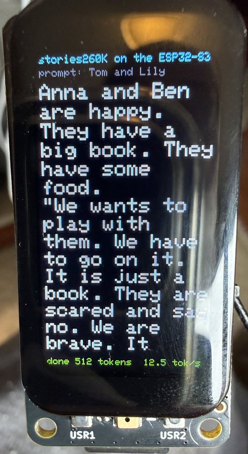
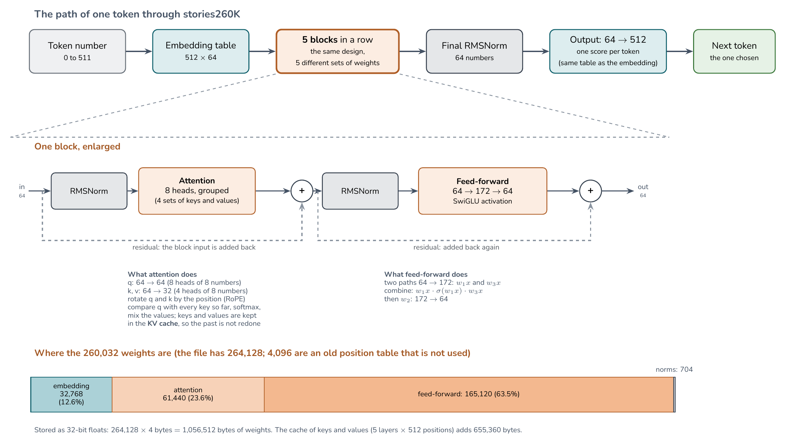
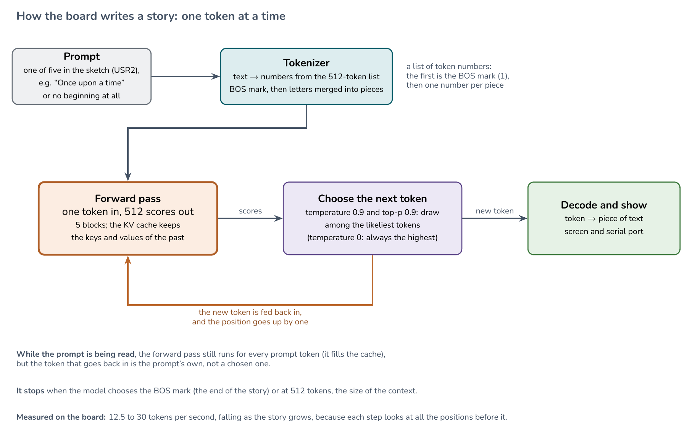
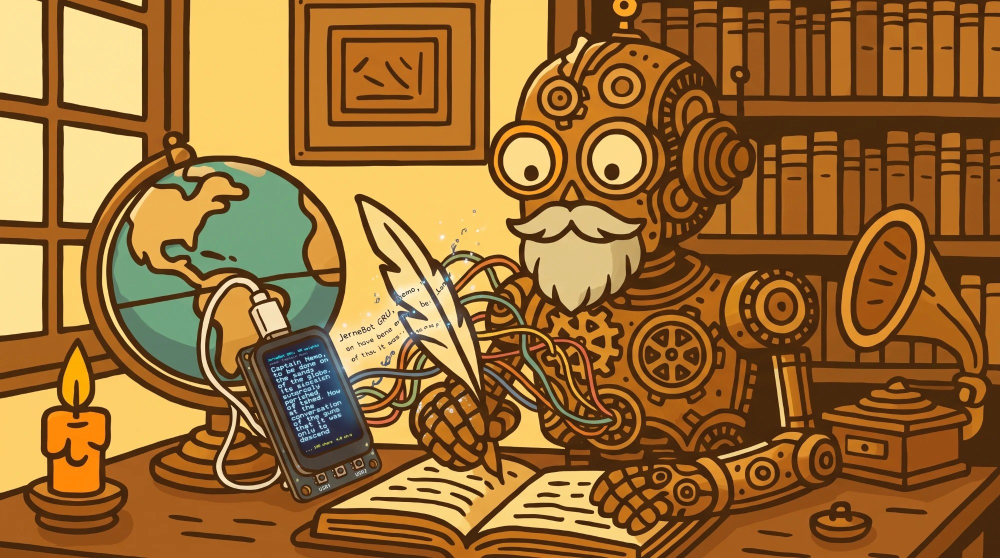
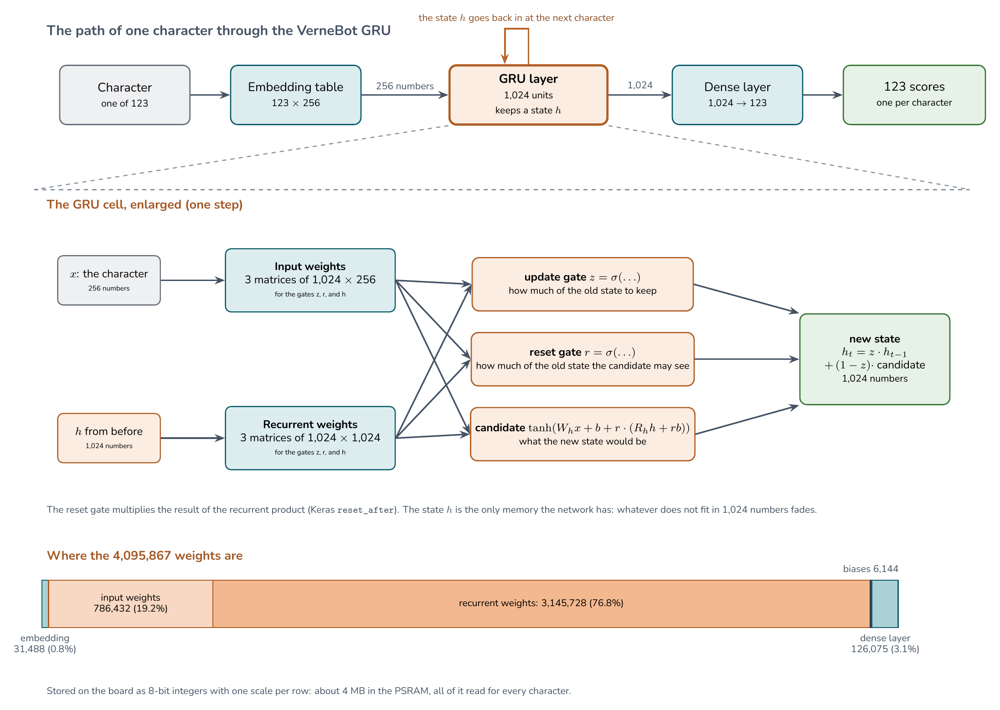
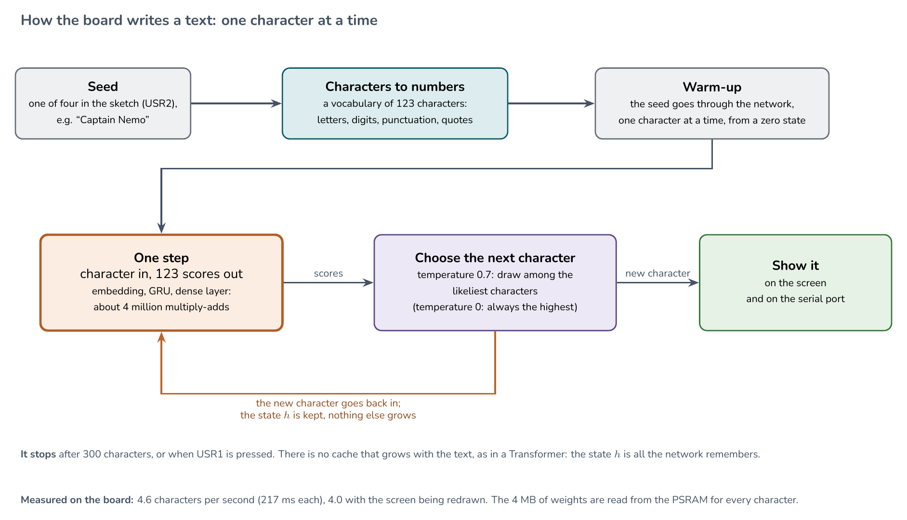
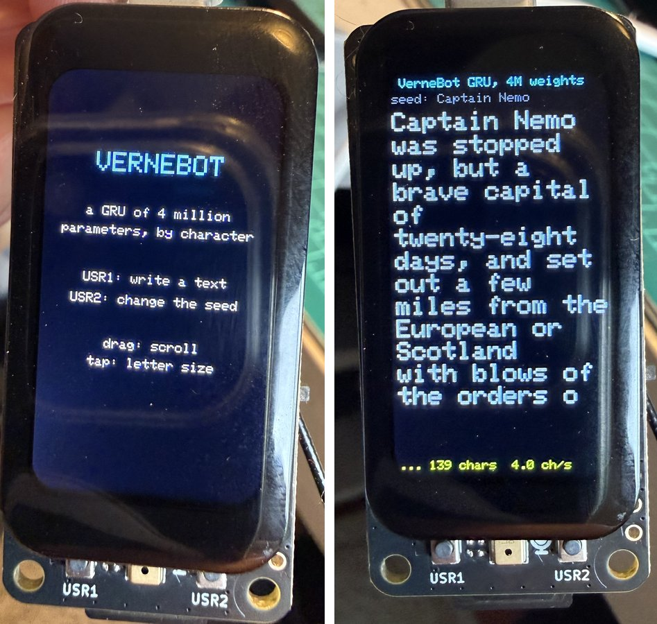

# Part 3: a tiny language model on the board

A language model with 260,000 parameters generates short children's stories on the
ESP32-S3, one token at a time, and the text appears on the 1.47" screen as it is
written. It is far too small to be useful, and that is the point of the lesson: it
shows, in a few hundred lines of C++, everything a large language model does, with a model
small enough to read, run, and check by hand.



*The screen after a story of 512 tokens. The last line shows the speed measured while
the model was running.*

## What you need

- The 1.47" touch board, with **PSRAM turned on**: in the Arduino IDE, Tools, PSRAM,
  OPI PSRAM (with `arduino-cli`, the board string ends in `:PSRAM=opi`). The default is
  *Disabled*, and then the sketch stops with a message, because the weights do not fit
  in the internal RAM.
- A microSD card (FAT) with a folder `slm` holding two files, in the root of the card:
  `/slm/stories260K.bin` (the weights) and `/slm/tok512.bin` (the tokenizer).

The two files are Andrej Karpathy's, from
[huggingface.co/karpathy/tinyllamas](https://huggingface.co/karpathy/tinyllamas), folder
`stories260K`. They are not in this repository; download them from there. The copies used
for the measurements below had these sizes and SHA-256 sums:

| File | Bytes | SHA-256 |
|---|---|---|
| `stories260K.bin` | 1,056,540 | `b0a507e7ad0f626624f17112325e66691f9076d622e1d3274d103d00299f2696` |
| `tok512.bin` | 6,227 | `037cb335abb25d1fa9e8ecae30ed2a3a8ace9302862ebcdc05d51a6bbb10c312` |

## Credits

The model, the tokenizer, and the file format come from Andrej Karpathy's
[llama2.c](https://github.com/karpathy/llama2.c) project (MIT license) and its
[tinyllamas](https://huggingface.co/karpathy/tinyllamas) models, trained on the
TinyStories data set. The sketch in this repository is a port of llama2.c's inference code
to the Arduino environment, and the Python check in `tools/slm_reference.py` is a second,
independent implementation of the same model. Both were written by Claude Sonnet 5.5
(Anthropic) under the author's direction, and the author ran, checked, and photographed
them on the board.

## The model

Read from the header of the file:

| | |
|---|---|
| Embedding size (`dim`) | 64 |
| Layers | 5 |
| Attention heads | 8 (4 for the keys and values) |
| Feed-forward size | 172 |
| Vocabulary | 512 tokens |
| Context | 512 tokens |
| Parameters | 264,128, stored as 32-bit floats |

The file is 1,056,540 bytes: 28 bytes of header and 1,056,512 bytes of weights, which
is exactly 264,128 values of 4 bytes. The match with the count we computed from the header
is how we know the file format was read correctly.

**Memory.** After loading, 1,824,316 bytes of the PSRAM are in use (6.44 MB of the 8.26 MB
that the board reports are still free). The weights are 1.06 MB; the cache of the attention
layers (the keys and values of every position, 5 layers by 512 positions) is 655,360 bytes;
the rest is the tokenizer and the working buffers. The sketch leaves most of the internal heap free (about 340 KB at the benchmark).



*The model on one page. Every token goes through the same five blocks, each with its own weights. The numbers come from the file header and from counting the weights of each part: the feed-forward layers hold almost two thirds of them, and the attention layers hold about a quarter. The two small position tables that the old file format still carries (4,096 values together) are not used by this code.*

## Test 07: tell a story

The sketch loads the weights from the card into PSRAM and generates a story. The first
token is the "beginning of text" mark; then each step runs the whole network once to get
a score for each of the 512 tokens, picks one, and feeds it back in.

**Controls**

- **USR1** tells a new story, or stops the one being told.
- **USR2** changes the beginning of the story (the *prompt*): none, "Once upon a time",
  "One day, a little girl", "Tom and Lily", or "The big dog". The new beginning appears in
  big letters; press USR1 to continue it.
- **Touch:** drag up or down to scroll, and tap to switch between big letters (14 per
  line) and small letters (28 per line). While a story is being written the screen follows
  the newest text; scroll up to read, and scroll back to the end to follow again.
- **Serial** (115200): the story as text, then a line with the speed. Two commands: `b`
  runs a benchmark, and `g <text>` decodes greedily and prints the token numbers (used for
  the check below).

The words are chosen with a temperature of 0.9 and top-p of 0.9: the model draws among the
most likely tokens, so every story is different.

<!-- sketch: part3_slm/07_slm_stories/07_slm_stories.ino -->
**Sketch:** [`part3_slm/07_slm_stories/07_slm_stories.ino`](https://github.com/Mjrovai/XIAO-IPS-Display-ESP32S3/blob/main/part3_slm/07_slm_stories/07_slm_stories.ino)

```cpp
/*
  Part 3, Test 07 - A tiny language model on the board (stories260K)

  Runs Andrej Karpathy's stories260K model: 260 thousand parameters, 5 layers, trained on
  very short children's stories, with a 512-token vocabulary. The weights (1 MB, float32)
  are read from the microSD card into PSRAM, and the story is generated one token at a
  time on the ESP32-S3 itself. The inference code is a port of llama2.c (Andrej Karpathy,
  MIT license, https://github.com/karpathy/llama2.c) to the Arduino environment.

  Files on the card, in the folder /slm:  stories260K.bin  and  tok512.bin
  (from https://huggingface.co/karpathy/tinyllamas, folder stories260K).

  Build with PSRAM = OPI PSRAM (the FQBN ends in :PSRAM=opi). The weights and the cache
  of the attention layers take about 1.7 MB, far more than the internal RAM.

  Use it:
    USR1  start a new story (or stop the one being told)
    USR2  change the beginning of the story (the prompt), then press USR1
    Touch drag up or down: scroll the story. Tap: switch between big and small letters.
  Serial (115200): the story as text, then a line with tokens per second.
    b          benchmark: 200 tokens, fixed seed, nothing drawn on the screen
    g <text>   greedy decoding (temperature 0) of 64 tokens from <text>, printing the
               token numbers; used to compare with tools/slm_reference.py
*/

#include <Arduino.h>
#include <SPI.h>
#include <SD.h>
#include <math.h>
#include <Seeed_GFX.h>
#include "board/boards/XIAO_LCD_Board.h"
#include "driver/tft/Driver_JD9853A.h"
#include "panel/Panel_TFT.h"
#include "bus/Bus_SPI.h"
#include "touch/Touch_AXS5106L.h"

static constexpr int8_t LCD_RST_PIN = 13;
static constexpr int8_t LCD_BL_PIN = 12;
static constexpr uint8_t SD_CS = D6;
static constexpr uint8_t SD_MISO = D9;
static constexpr uint8_t BTN_USR1 = D19;
static constexpr uint8_t BTN_USR2 = D15;

Seeed_GFX display;
Seeed_Sprite canvas;
Touch_AXS5106L touch(-1, D7, Wire, 172, 320);

// Declared here, before the functions, so that the Arduino build can place its prototypes after them.
struct Stats { int tokens; float tokPerSec; uint32_t forwardUs; };
typedef bool (*TickFn)(const char *piece, int tokensSoFar);  // return false to stop
struct ProbIndex { float prob; int index; };

// ---- The model (checkpoint format of llama2.c) -------------------------------------------------
struct Config { int dim, hidden_dim, n_layers, n_heads, n_kv_heads, vocab_size, seq_len; };
static Config cfg;
static float *weightsBlock = nullptr;
static size_t weightsBytes = 0;
static float *tokEmb, *rmsAtt, *wq, *wk, *wv, *wo, *rmsFfn, *w1, *w2, *w3, *rmsFinal, *wcls;

// Run state: the activations and the cache of keys and values of every layer.
static float *x, *xb, *xb2, *hb, *hb2, *q, *att, *logits, *keyCache, *valueCache;

// ---- Tokenizer ---------------------------------------------------------------------------------
static char **vocab = nullptr;
static float *vocabScores = nullptr;
static int maxTokenLength = 0;

static bool readAll(File &f, void *dst, size_t n) { return f.read((uint8_t *)dst, n) == (int)n; }

static bool loadTokenizer(const char *path) {
  File f = SD.open(path, FILE_READ);
  if (!f) return false;
  if (!readAll(f, &maxTokenLength, 4)) return false;
  vocab = (char **)ps_malloc(cfg.vocab_size * sizeof(char *));
  vocabScores = (float *)ps_malloc(cfg.vocab_size * sizeof(float));
  for (int i = 0; i < cfg.vocab_size; i++) {
    int len;
    if (!readAll(f, &vocabScores[i], 4) || !readAll(f, &len, 4)) return false;
    vocab[i] = (char *)ps_malloc(len + 1);
    if (!readAll(f, vocab[i], len)) return false;
    vocab[i][len] = 0;
  }
  f.close();
  return true;
}

static int strLookup(const char *s) {
  for (int i = 0; i < cfg.vocab_size; i++)
    if (!strcmp(vocab[i], s)) return i;
  return -1;
}

// Text to tokens: BOS, then the letters, then the best pairs merged until none is left.
static int encode(const char *text, int *tokens) {
  int n = 0;
  tokens[n++] = 1;  // BOS
  if (text[0]) tokens[n++] = strLookup(" ");
  char buf[8];
  int len = 0;
  for (const char *c = text; *c; c++) {
    if ((*c & 0xC0) != 0x80) len = 0;
    buf[len++] = *c;
    buf[len] = 0;
    if (*(c + 1) && (*(c + 1) & 0xC0) == 0x80 && len < 4) continue;
    int id = strLookup(buf);
    if (id != -1) tokens[n++] = id;
    else for (int i = 0; i < len; i++) tokens[n++] = (unsigned char)buf[i] + 3;  // byte fallback
    len = 0;
  }
  char pair[64];
  for (;;) {
    float best = -1e10f;
    int bestId = -1, bestIdx = -1;
    for (int i = 0; i < n - 1; i++) {
      snprintf(pair, sizeof(pair), "%s%s", vocab[tokens[i]], vocab[tokens[i + 1]]);
      int id = strLookup(pair);
      if (id != -1 && vocabScores[id] > best) { best = vocabScores[id]; bestId = id; bestIdx = i; }
    }
    if (bestIdx == -1) break;
    tokens[bestIdx] = bestId;
    for (int i = bestIdx + 1; i < n - 1; i++) tokens[i] = tokens[i + 1];
    n--;
  }
  return n;
}

// Token to text. Returns the piece to print (a one-character string for a raw byte).
static const char *decode(int prev, int token) {
  static char one[2];
  const char *piece = vocab[token];
  if (prev == 1 && piece[0] == ' ') piece++;  // no space after the start of the text
  unsigned int byteVal;
  if (sscanf(piece, "<0x%02X>", &byteVal) == 1) { one[0] = (char)byteVal; one[1] = 0; return one; }
  return piece;
}

// ---- The transformer -----------------------------------------------------------------------------
static void rmsnorm(float *o, const float *in, const float *weight, int size) {
  float ss = 0;
  for (int j = 0; j < size; j++) ss += in[j] * in[j];
  ss = 1.0f / sqrtf(ss / size + 1e-5f);
  for (int j = 0; j < size; j++) o[j] = weight[j] * (ss * in[j]);
}

static void softmax(float *v, int size) {
  float m = v[0];
  for (int i = 1; i < size; i++) if (v[i] > m) m = v[i];
  float sum = 0;
  for (int i = 0; i < size; i++) { v[i] = expf(v[i] - m); sum += v[i]; }
  for (int i = 0; i < size; i++) v[i] /= sum;
}

// out (d) = w (d, n) times in (n)
static void matmul(float *out, const float *in, const float *w, int n, int d) {
  for (int i = 0; i < d; i++) {
    float val = 0;
    const float *row = w + (size_t)i * n;
    for (int j = 0; j < n; j++) val += row[j] * in[j];
    out[i] = val;
  }
}

static float *forward(int token, int pos) {
  const int dim = cfg.dim, hidden = cfg.hidden_dim, hs = dim / cfg.n_heads;
  const int kvDim = (dim * cfg.n_kv_heads) / cfg.n_heads, kvMul = cfg.n_heads / cfg.n_kv_heads;
  memcpy(x, tokEmb + (size_t)token * dim, dim * sizeof(float));
  for (int l = 0; l < cfg.n_layers; l++) {
    rmsnorm(xb, x, rmsAtt + l * dim, dim);
    size_t loff = (size_t)l * cfg.seq_len * kvDim;
    float *k = keyCache + loff + (size_t)pos * kvDim;
    float *v = valueCache + loff + (size_t)pos * kvDim;
    matmul(q, xb, wq + (size_t)l * dim * dim, dim, dim);
    matmul(k, xb, wk + (size_t)l * dim * kvDim, dim, kvDim);
    matmul(v, xb, wv + (size_t)l * dim * kvDim, dim, kvDim);
    // Rotary position encoding: rotate each pair of values of q (and of k) by an angle that grows with pos.
    for (int i = 0; i < dim; i += 2) {
      int headDim = i % hs;
      float freq = 1.0f / powf(10000.0f, headDim / (float)hs);
      float val = pos * freq, fcr = cosf(val), fci = sinf(val);
      int rotn = i < kvDim ? 2 : 1;
      for (int r = 0; r < rotn; r++) {
        float *vec = r == 0 ? q : k;
        float v0 = vec[i], v1 = vec[i + 1];
        vec[i] = v0 * fcr - v1 * fci;
        vec[i + 1] = v0 * fci + v1 * fcr;
      }
    }
    // Attention, head by head: compare q with every key so far, then mix the values.
    for (int h = 0; h < cfg.n_heads; h++) {
      float *qh = q + h * hs;
      float *a = att + h * cfg.seq_len;
      for (int t = 0; t <= pos; t++) {
        float *kt = keyCache + loff + (size_t)t * kvDim + (h / kvMul) * hs;
        float score = 0;
        for (int i = 0; i < hs; i++) score += qh[i] * kt[i];
        a[t] = score / sqrtf((float)hs);
      }
      softmax(a, pos + 1);
      float *xbh = xb + h * hs;
      memset(xbh, 0, hs * sizeof(float));
      for (int t = 0; t <= pos; t++) {
        float *vt = valueCache + loff + (size_t)t * kvDim + (h / kvMul) * hs;
        for (int i = 0; i < hs; i++) xbh[i] += a[t] * vt[i];
      }
    }
    matmul(xb2, xb, wo + (size_t)l * dim * dim, dim, dim);
    for (int i = 0; i < dim; i++) x[i] += xb2[i];
    // Feed-forward block with the SwiGLU activation.
    rmsnorm(xb, x, rmsFfn + l * dim, dim);
    matmul(hb, xb, w1 + (size_t)l * dim * hidden, dim, hidden);
    matmul(hb2, xb, w3 + (size_t)l * dim * hidden, dim, hidden);
    for (int i = 0; i < hidden; i++) hb[i] = hb[i] * (1.0f / (1.0f + expf(-hb[i]))) * hb2[i];
    matmul(xb, hb, w2 + (size_t)l * dim * hidden, hidden, dim);
    for (int i = 0; i < dim; i++) x[i] += xb[i];
  }
  rmsnorm(x, x, rmsFinal, dim);
  matmul(logits, x, wcls, dim, cfg.vocab_size);
  return logits;
}

// ---- Choosing the next token -----------------------------------------------------------------------
static uint64_t rngState = 1;
static uint32_t randU32() {
  rngState ^= rngState >> 12; rngState ^= rngState << 25; rngState ^= rngState >> 27;
  return (rngState * 0x2545F4914F6CDD1DULL) >> 32;
}
static float randF32() { return (randU32() >> 8) / 16777216.0f; }

static float lastTokPerSec = 0;
static ProbIndex *probIndex = nullptr;
static int cmpProb(const void *a, const void *b) {
  float pa = ((const ProbIndex *)a)->prob, pb = ((const ProbIndex *)b)->prob;
  return pa > pb ? -1 : (pa < pb ? 1 : 0);
}

static int sampleToken(float *lg, float temperature, float topp) {
  const int n = cfg.vocab_size;
  if (temperature == 0.0f) {
    int best = 0;
    for (int i = 1; i < n; i++) if (lg[i] > lg[best]) best = i;
    return best;
  }
  for (int i = 0; i < n; i++) lg[i] /= temperature;
  softmax(lg, n);
  float coin = randF32();
  if (topp <= 0 || topp >= 1) {  // plain sampling
    float cdf = 0;
    for (int i = 0; i < n; i++) { cdf += lg[i]; if (coin < cdf) return i; }
    return n - 1;
  }
  int n0 = 0;
  const float cutoff = (1.0f - topp) / (n - 1);
  for (int i = 0; i < n; i++) if (lg[i] >= cutoff) { probIndex[n0].index = i; probIndex[n0].prob = lg[i]; n0++; }
  qsort(probIndex, n0, sizeof(ProbIndex), cmpProb);
  float cum = 0;
  int last = n0 - 1;
  for (int i = 0; i < n0; i++) { cum += probIndex[i].prob; if (cum > topp) { last = i; break; } }
  float r = coin * cum, cdf = 0;
  for (int i = 0; i <= last; i++) { cdf += probIndex[i].prob; if (r < cdf) return probIndex[i].index; }
  return probIndex[last].index;
}

// ---- Loading --------------------------------------------------------------------------------------------
static bool initSd() {
  pinMode(SD_CS, OUTPUT);
  digitalWrite(SD_CS, HIGH);
  // The card shares the display's SPI bus: reuse its SPI object and attach MISO (Part 1, test 08).
  SPIClass *spi = static_cast<Bus_SPI &>(display.panel().driver().bus()).spiInstance();
  if (!spi || !spiAttachMISO(spi->bus(), SD_MISO)) return false;
  const uint32_t clocks[] = {20000000, 10000000, 4000000};
  for (uint32_t f : clocks) if (SD.begin(SD_CS, *spi, f)) return true;
  return false;
}

// Print the folders in the root of the card and the files of /slm, to see what is there when the model is not found.
static void listCard() {
  File d = SD.open("/");
  if (d && d.isDirectory())
    for (File e = d.openNextFile(); e; e = d.openNextFile()) Serial.printf("  /%s%s\n", e.name(), e.isDirectory() ? "/" : "");
  File m = SD.open("/slm");
  if (m && m.isDirectory())
    for (File e = m.openNextFile(); e; e = m.openNextFile()) Serial.printf("  /slm/%s  %u\n", e.name(), (unsigned)e.size());
}

static const char *loadModel() {
  File f = SD.open("/slm/stories260K.bin", FILE_READ);
  if (!f) return "no /slm/stories260K.bin";
  if (!readAll(f, &cfg, sizeof(cfg))) return "bad header";
  const bool shared = cfg.vocab_size > 0;
  cfg.vocab_size = abs(cfg.vocab_size);
  weightsBytes = f.size() - sizeof(cfg);
  weightsBlock = (float *)ps_malloc(weightsBytes);
  if (!weightsBlock) return "no PSRAM (use PSRAM=opi)";
  size_t got = 0;
  while (got < weightsBytes) {  // read in pieces so the watchdog is fed
    int n = f.read((uint8_t *)weightsBlock + got, min((size_t)16384, weightsBytes - got));
    if (n <= 0) return "read failed";
    got += n;
  }
  f.close();
  const int dim = cfg.dim, hidden = cfg.hidden_dim, L = cfg.n_layers, hs = dim / cfg.n_heads;
  const int kvDim = (dim * cfg.n_kv_heads) / cfg.n_heads;
  float *p = weightsBlock;
  tokEmb = p; p += (size_t)cfg.vocab_size * dim;
  rmsAtt = p; p += (size_t)L * dim;
  wq = p; p += (size_t)L * dim * dim;
  wk = p; p += (size_t)L * dim * kvDim;
  wv = p; p += (size_t)L * dim * kvDim;
  wo = p; p += (size_t)L * dim * dim;
  rmsFfn = p; p += (size_t)L * dim;
  w1 = p; p += (size_t)L * dim * hidden;
  w2 = p; p += (size_t)L * hidden * dim;
  w3 = p; p += (size_t)L * dim * hidden;
  rmsFinal = p; p += dim;
  p += (size_t)cfg.seq_len * hs;  // the two tables of the old position encoding, not used
  wcls = shared ? tokEmb : p;
  // Run state (the keys and values of every position and layer are what the cache keeps).
  x = (float *)ps_malloc(dim * 4); xb = (float *)ps_malloc(dim * 4); xb2 = (float *)ps_malloc(dim * 4);
  hb = (float *)ps_malloc(hidden * 4); hb2 = (float *)ps_malloc(hidden * 4); q = (float *)ps_malloc(dim * 4);
  att = (float *)ps_malloc((size_t)cfg.n_heads * cfg.seq_len * 4);
  logits = (float *)ps_malloc(cfg.vocab_size * 4);
  keyCache = (float *)ps_malloc((size_t)L * cfg.seq_len * kvDim * 4);
  valueCache = (float *)ps_malloc((size_t)L * cfg.seq_len * kvDim * 4);
  probIndex = (ProbIndex *)ps_malloc(cfg.vocab_size * sizeof(ProbIndex));
  if (!keyCache || !valueCache || !att || !probIndex || !logits) return "out of memory";
  if (!loadTokenizer("/slm/tok512.bin")) return "no /slm/tok512.bin";
  return nullptr;
}

// ---- Telling a story ------------------------------------------------------------------------------------
static Stats generate(const char *prompt, int steps, float temperature, float topp, uint64_t seed,
                      TickFn tick, bool printIds) {
  rngState = seed;
  int *promptTokens = (int *)ps_malloc((strlen(prompt) + 4) * sizeof(int));
  int nPrompt = encode(prompt, promptTokens);
  if (steps > cfg.seq_len) steps = cfg.seq_len;
  int token = promptTokens[0], prev = 0, pos = 0, produced = 0;
  uint32_t forwardUs = 0;
  while (pos < steps) {
    uint32_t t0 = micros();
    float *lg = forward(token, pos);
    int next = pos < nPrompt - 1 ? promptTokens[pos + 1] : sampleToken(lg, temperature, topp);
    forwardUs += micros() - t0;
    pos++;
    if (next == 1 && pos >= nPrompt) break;  // BOS after the prompt: the story ended
    produced++;
    lastTokPerSec = forwardUs ? produced * 1e6f / forwardUs : 0.0f;  // the running speed, shown on the screen
    if (printIds) Serial.printf("%d ", next);
    const char *piece = decode(token, next);
    if (tick && !tick(piece, produced)) break;
    prev = token;
    token = next;
  }
  free(promptTokens);
  (void)prev;
  return {produced, forwardUs ? produced * 1e6f / forwardUs : 0.0f, forwardUs};
}

// ---- Screen and buttons ----------------------------------------------------------------------------------
static const char *PROMPTS[] = {"", "Once upon a time", "One day, a little girl", "Tom and Lily", "The big dog"};
static constexpr int NUM_PROMPTS = 5;
static int promptIndex = 0;
static char story[4096];
static int storyLen = 0;
static uint32_t lastDrawMs = 0;
static bool wasPressed1 = false, wasPressed2 = false;

// What is on the screen: the story, wrapped to the width of the screen, and the part of it that is visible.
static int textSize = 2;          // 2 = big letters (14 per line), 1 = small (28 per line)
static bool followEnd = true;     // keep the newest text in view, until the user scrolls
static int scrollTop = 0;         // first visible line
static int curTokens = 0;
static bool curFinished = true;
static char (*lines)[30] = nullptr;
static constexpr int MAX_LINES = 450;

static int wrapStory(int cols) {
  int nl = 0, col = 0, wl = 0;
  char word[32];
  auto flushWord = [&]() {
    if (!wl) return;
    if (col + wl > cols && col > 0) { lines[nl][col] = 0; if (nl < MAX_LINES - 1) nl++; col = 0; }
    for (int i = 0; i < wl; i++) lines[nl][col++] = word[i];
    wl = 0;
  };
  for (int i = 0; i < storyLen && nl < MAX_LINES - 1; i++) {
    char c = story[i];
    if (c == ' ' || c == '\n') {
      flushWord();
      if (c == '\n') { lines[nl][col] = 0; nl++; col = 0; }
      else if (col > 0 && col < cols) lines[nl][col++] = ' ';
    } else if (wl < cols) word[wl++] = c;
  }
  flushWord();
  lines[nl][col] = 0;
  return nl + 1;
}

static void drawStory() {
  canvas.fillScreen(TFT_BLACK);
  canvas.setTextSize(1);
  canvas.setTextColor(TFT_CYAN, TFT_BLACK);
  canvas.setCursor(4, 4);
  canvas.print("stories260K on the ESP32-S3");
  canvas.setTextColor(TFT_LIGHTGREY, TFT_BLACK);
  char hdr[48];
  snprintf(hdr, sizeof(hdr), "prompt: %s", PROMPTS[promptIndex][0] ? PROMPTS[promptIndex] : "(none)");
  canvas.setCursor(4, 16);
  canvas.print(hdr);
  const int cols = textSize == 2 ? 14 : 28, lineH = textSize == 2 ? 18 : 9, top = 30, area = 270;
  const int maxLines = area / lineH;
  int total = wrapStory(cols);
  int lastTop = total > maxLines ? total - maxLines : 0;
  if (followEnd) scrollTop = lastTop;
  if (scrollTop >= lastTop) { scrollTop = lastTop; followEnd = true; }  // scrolled back to the end
  if (scrollTop < 0) scrollTop = 0;
  canvas.setTextSize(textSize);
  canvas.setTextColor(TFT_WHITE, TFT_BLACK);
  for (int i = 0; i < maxLines && scrollTop + i < total; i++) {
    canvas.setCursor(4, top + i * lineH);
    canvas.print(lines[scrollTop + i]);
  }
  if (total > maxLines) {  // a thin bar on the right edge shows where we are in the story
    int barH = max(8, area * maxLines / total), barY = top + (area - barH) * scrollTop / max(1, lastTop);
    canvas.fillRect(169, barY, 3, barH, TFT_DARKGREY);
  }
  canvas.setTextSize(1);
  canvas.setTextColor(curFinished ? TFT_GREEN : TFT_YELLOW, TFT_BLACK);
  if (curFinished && curTokens == 0) snprintf(hdr, sizeof(hdr), "USR1: tell the story");
  else snprintf(hdr, sizeof(hdr), "%s %d tokens  %.1f tok/s", curFinished ? "done" : "...", curTokens, lastTokPerSec);
  canvas.setCursor(4, 306);
  canvas.print(hdr);
  canvas.pushSprite(0, 0);
}

static void showStory(bool finished, int tokens) { curFinished = finished; curTokens = tokens; drawStory(); }

// Touch: drag to scroll, tap to change the size of the letters. Returns true if the screen changed.
static bool pollTouch() {
  static bool down = false, moved = false;
  static int32_t y0 = 0, lastY = 0;
  static uint32_t t0 = 0;
  int32_t x, y;
  bool now = display.getTouch(&x, &y);
  bool redraw = false;
  const int lineH = textSize == 2 ? 18 : 9;
  if (now && !down) { y0 = lastY = y; moved = false; t0 = millis(); }
  else if (now && down) {
    if (abs(y - y0) > 8) moved = true;
    int steps = (y - lastY) / lineH;  // a drag down moves the text down: show earlier lines
    if (steps) { scrollTop -= steps; lastY += steps * lineH; followEnd = false; redraw = true; }
  } else if (!now && down && !moved && millis() - t0 < 500) {
    textSize = 3 - textSize;
    followEnd = true;
    redraw = true;
  }
  down = now;
  return redraw;
}

static bool pressed(uint8_t pin) { return digitalRead(pin) == LOW; }

// Called after every token: collect the text, redraw about four times a second, watch USR1 to stop.
static int tokensShown = 0;
static bool liveTick(const char *piece, int tokens) {
  size_t n = strlen(piece);
  if (storyLen + (int)n < (int)sizeof(story) - 1) { memcpy(story + storyLen, piece, n); storyLen += n; story[storyLen] = 0; }
  Serial.print(piece);
  tokensShown = tokens;
  bool touched = pollTouch();
  if (touched || millis() - lastDrawMs > 250) { showStory(false, tokens); lastDrawMs = millis(); }
  bool b1 = pressed(BTN_USR1);
  if (b1 && !wasPressed1) { wasPressed1 = true; return false; }
  if (!b1) wasPressed1 = false;
  return true;
}

static bool quietTick(const char *, int) { return true; }

static void tellStory() {
  storyLen = 0; story[0] = 0;
  followEnd = true;
  const char *prompt = PROMPTS[promptIndex];
  strncpy(story, prompt, sizeof(story) - 1);
  storyLen = strlen(story);
  Serial.printf("\n--- story, prompt \"%s\" ---\n", prompt);
  Stats s = generate(prompt, cfg.seq_len, 0.9f, 0.9f, (uint64_t)esp_random() << 16 ^ millis(), liveTick, false);
  lastTokPerSec = s.tokPerSec;
  Serial.printf("\n--- %d tokens, %.1f tok/s ---\n", s.tokens, s.tokPerSec);
  followEnd = false;  // when it is done, stay where the reader is
  showStory(true, s.tokens);
}

static void benchmark() {
  Stats s = generate("", 200, 0.9f, 0.9f, 1, quietTick, false);
  Serial.printf("BENCH tokens %d forward %lu ms  %.2f tok/s  free PSRAM %u  free heap %u\n", s.tokens,
                (unsigned long)(s.forwardUs / 1000), s.tokPerSec, (unsigned)heap_caps_get_free_size(MALLOC_CAP_SPIRAM),
                (unsigned)ESP.getFreeHeap());
}

static void handleSerial() {
  static char line[160];
  static int len = 0;
  while (Serial.available()) {
    char c = Serial.read();
    if (c != '\n' && c != '\r') { if (len < (int)sizeof(line) - 1) line[len++] = c; continue; }
    line[len] = 0;
    if (line[0] == 'b') benchmark();
    else if (line[0] == 'g') {
      Serial.print("IDS ");
      Stats s = generate(line[1] == ' ' ? line + 2 : line + 1, 64 + 0, 0.0f, 0.0f, 1, quietTick, true);
      Serial.printf("\nGREEDY tokens %d %.2f tok/s\n", s.tokens, s.tokPerSec);
    }
    len = 0;
  }
}

void setup() {
  Serial.begin(115200);
  Serial.setTxTimeoutMs(0);
  delay(800);
  pinMode(BTN_USR1, INPUT_PULLUP);
  pinMode(BTN_USR2, INPUT_PULLUP);
  if (!display.begin<Board_XIAO_1inch47_Touch_Display<LCD_RST_PIN, LCD_BL_PIN>,
                     Config_Seeed_1inch47_Touch_JD9853A>()) { Serial.println(display.lastResult().message); return; }
  canvas.createSprite(display, 172, 320);
  display.attachTouch(touch, display.panel().driver().bus());
  lines = (char (*)[30])ps_malloc(MAX_LINES * 30);
  Serial.printf("PSRAM: %u bytes free\n", (unsigned)heap_caps_get_free_size(MALLOC_CAP_SPIRAM));
  const char *err = nullptr;
  if (!initSd()) err = "no SD card";
  else err = loadModel();
  if (err) {
    Serial.printf("ERROR: %s\n", err);
    Serial.println("on the card:");
    listCard();
    canvas.fillScreen(TFT_BLACK);
    canvas.setTextColor(TFT_RED, TFT_BLACK);
    canvas.setTextSize(2);
    canvas.drawCentreString("SLM ERROR", 86, 40, 1);
    canvas.setTextSize(1);
    canvas.setTextColor(TFT_WHITE, TFT_BLACK);
    canvas.drawCentreString(err, 86, 90, 1);
    canvas.drawCentreString("Needs PSRAM=opi and", 86, 120, 1);
    canvas.drawCentreString("/slm/stories260K.bin", 86, 134, 1);
    canvas.drawCentreString("/slm/tok512.bin on the card", 86, 148, 1);
    canvas.pushSprite(0, 0);
    for (;;) delay(1000);
  }
  Serial.printf("model: dim %d, hidden %d, layers %d, heads %d, kv heads %d, vocab %d, context %d; weights %u bytes\n",
                cfg.dim, cfg.hidden_dim, cfg.n_layers, cfg.n_heads, cfg.n_kv_heads, cfg.vocab_size, cfg.seq_len,
                (unsigned)weightsBytes);
  Serial.printf("PSRAM after loading: %u bytes free\n", (unsigned)heap_caps_get_free_size(MALLOC_CAP_SPIRAM));
  canvas.fillScreen(TFT_BLACK);
  canvas.setTextColor(TFT_CYAN, TFT_BLACK);
  canvas.setTextSize(2);
  canvas.drawCentreString("STORIES", 86, 60, 1);
  canvas.setTextSize(1);
  canvas.setTextColor(TFT_WHITE, TFT_BLACK);
  canvas.drawCentreString("260K parameters", 86, 100, 1);
  canvas.drawCentreString("USR1: tell a story", 86, 140, 1);
  canvas.drawCentreString("USR2: change the start", 86, 156, 1);
  canvas.drawCentreString("drag: scroll", 86, 190, 1);
  canvas.drawCentreString("tap: letter size", 86, 204, 1);
  canvas.pushSprite(0, 0);
}

void loop() {
  handleSerial();
  bool b1 = pressed(BTN_USR1), b2 = pressed(BTN_USR2);
  if (b2 && !wasPressed2) {
    promptIndex = (promptIndex + 1) % NUM_PROMPTS;
    // Show the new beginning in big letters, where the story will appear.
    snprintf(story, sizeof(story), "%s", PROMPTS[promptIndex][0] ? PROMPTS[promptIndex] : "(no beginning: the model makes it up)");
    storyLen = strlen(story);
    followEnd = true;
    showStory(true, 0);
  }
  wasPressed2 = b2;
  if (pollTouch()) showStory(curFinished, curTokens);
  if (b1 && !wasPressed1) { wasPressed1 = true; tellStory(); }
  if (!b1) wasPressed1 = false;
  delay(20);
}
```
<!-- /sketch -->

#### How it works



*The loop that writes a story. The prompt is read first, token by token, and then the model's own choices are fed back in, one per step, until it chooses the end mark or the context of 512 tokens is full.*

- **The tokenizer** turns text into numbers. The 512 tokens are letters and common pieces
  of words (the file `tok512.bin` has them with a score each). The text is cut into letters
  and then the best-scoring pairs are merged until none is left. The reverse is a table
  lookup. A token such as `<0x0A>` is a raw byte (here, a new line).
- **One step of the network** (`forward`): look up the embedding of the token (64 numbers),
  then for each of the 5 layers: normalize; compute the query, key, and value; rotate them by
  an angle that depends on the position (RoPE); store the key and value in the cache; let
  each of the 8 heads compare its query with all the keys so far and mix the values by
  those scores (attention); add the result back; then a feed-forward block with the SwiGLU
  activation, added back too. At the end, the 64 numbers are multiplied by the embedding
  table to give 512 scores.
- **The cache** is why a step does not recompute the past: the keys and values of earlier
  positions are kept. It is also why a step takes longer the further the story goes, as
  the attention has more positions to look at.
- **Choosing** the token: with a temperature of 0 it is always the highest score; with a
  higher temperature it is drawn from the softmax of the scores, cutting off the unlikely
  tail (top-p).
- **Everything is plain float code**, no libraries and no optimization of the inner loops,
  to be readable.

## Is it right? A check against a second implementation

A port can run and still be wrong, and a 260K-parameter model would write odd stories
either way. So the check does not look at the text. `tools/slm_reference.py` runs the same
model in Python (numpy), written separately, with greedy decoding (always the highest
score). The command `g ` on the board does the same.

For each of the five beginnings of the sketch (none, "Once upon a time", "One day, a
little girl", "Tom and Lily", and "The big dog"), the first 64 tokens were **the same on the
board and in numpy, 64 of 64 in every case**. This checks the whole path (file format,
tokenizer, attention, the cache, and the feed-forward block) for those five prompts. It does
not check the sampling (temperature and top-p), since greedy decoding does not use it, and
it does not look past 64 tokens.

Greedy decoding also shows a known weakness of small models: with "The big dog" it falls
into a loop and repeats "He liked to play with his ball." This is why the sketch draws the
words at random instead.

```bash
python3 tools/slm_reference.py ~/datasets/slm/stories260K.bin ~/datasets/slm/tok512.bin "" --steps 64
```

## Speed

All numbers are the time spent in the network only, not drawing on the screen.

| What | Tokens per second |
|---|---|
| Greedy, the first 64 tokens | 30.5 |
| Benchmark (`b`): 200 tokens, fixed seed | 21.7 |
| A full story of 512 tokens | 12.5 to 12.6 |

The speed falls as the story grows, because each step attends to all the positions before
it. The first token needs only one position; the 512th needs 512. We did not try to make it
faster: the weights are read from PSRAM, which is slower than the internal RAM; the code does
not use the second core; and the weights are 32-bit floats, where 8-bit weights would be
four times smaller. These are the places to look.

## What the stories are like

A model this small writes grammatical sentences in the style of a children's story and
loses the thread within a paragraph. This is a story the board wrote from the empty
prompt (the model's own words, with an ordinary run of the sketch):

> Once upon a time, there was a little girl named Lily. She loved to jump, but it was her
> favorite ice cream. One day, Lily was very impressive and decided to clean up her room.
> She asked her mommy, "Why are you sad?"

The first sentence is a typical opening for this kind of story. After that
the sentences are fine one by one, but they do not follow from each other ("it was her
favorite ice cream"; "very impressive"). Larger models with the same design do much better;
this one shows the machinery and its limits. The training data set is TinyStories, made of
very simple stories, which is why such a small model can write anything readable at all.

## Larger models: the VerneBot character models



*A robot writes like Jules Verne, with a board at its side. This illustration was generated with an AI image model; the text on the screen of the board is garbled and does not match the real screen.*

The author's VerneBot project trained two character-level models on ten Jules Verne novels (5.8 million characters, 123 different characters): a **GRU network** and a **Transformer**, with about 4 million parameters each. They are described in the chapter on text generation of the book *Edge AI Engineering* (Raspberry Pi), and the code and a live demo are in [github.com/Mjrovai/Jules_Verne](https://github.com/Mjrovai/Jules_Verne) and [mjrovai.github.io/Jules_Verne](https://mjrovai.github.io/Jules_Verne/). They are fifteen times bigger than stories260K. Would they run on this board?

| | stories260K | VerneBot GRU | VerneBot Transformer |
|---|---|---|---|
| Parameters | 264,128 | 4,095,867 | 4,011,520 (window 120) or 4,046,336 (window 256) |
| Unit of text | a token (one of 512 pieces) | a character (one of 123) | a character (one of 123) |
| Size as 32-bit floats | 1.06 MB | 16.4 MB | 16.0 to 16.2 MB |

In 32-bit floats the VerneBot models do not fit in the 8 MB of PSRAM, and in 16 bits (8.2 MB) they do not either. As **8-bit integers (about 4 MB)** they do. Both tests below use that.

### Test 08: how fast would they run?

Before exporting anything, we measured the speed with **random weights**. The speed of a network depends on the shapes of its matrices and not on their values, so a network with random 8-bit weights of exactly the same shapes runs at exactly the same speed. The shapes reproduce the parameter counts of the chapter to the digit: the GRU has an embedding of 123 x 256, a GRU layer of 1,024 units in the Keras layout, and a dense layer; the Transformer has 5 blocks, 4 heads, width 256, a feed-forward layer of 1,024, learned positions, LayerNorm, GELU, and the output tied to the embedding. The text that these networks "write" is meaningless; only the times matter.

Two ways of doing the arithmetic were timed. *Float*: 8-bit weights times floating-point activations. *Int8*: 8-bit weights times 8-bit activations, summed in 32-bit integers, four bytes per load. Each model is built alone, because the two together do not fit in the PSRAM.

| Model | Arithmetic | Time per character | Characters per second |
|---|---|---|---|
| GRU | float | 216 ms | 4.62 |
| GRU | int8 | 182 ms | 5.49 |
| Transformer, window 120 | float | 218 to 243 ms | 4.33 |
| Transformer, window 120 | int8 | 189 to 214 ms | 4.95 |
| Transformer, window 256 | float | 218 to 275 ms | 4.05 |
| Transformer, window 256 | int8 | 189 to 247 ms | 4.58 |

- **The GRU costs the same at every position.** The Transformer slows down as the text grows (the two times in each row are the first and the last 16 positions of the window), because the attention looks at every earlier position.
- **The limit is the arithmetic, not the memory.** Reading the PSRAM with 32-bit loads and nothing else gives 55.1 MB/s, which would allow 13.8 characters per second with 4 MB of weights per character. We are at 4 to 5.5, so the loop is the bottleneck. The int8 loop is only 14 to 19% faster, because it still does one multiplication at a time. The vector instructions of the ESP32-S3 could do better; we did not try them.
- **Memory.** After building the weights, the GRU leaves 4.04 MB of PSRAM free, and the Transformer (weights plus a 2.6 MB cache of keys and values) leaves 1.19 MB.
- **An estimate that was wrong.** Before measuring, we guessed 1 to 3 characters per second. The board did better than that.
- **What is not included:** the sampling (negligible for 123 characters), and what happens when a Transformer text goes past the window, which needs the whole window to be computed again (about a minute for 256 characters).

<!-- sketch: part3_slm/08_verne_speed/08_verne_speed.ino -->
**Sketch:** [`part3_slm/08_verne_speed/08_verne_speed.ino`](https://github.com/Mjrovai/XIAO-IPS-Display-ESP32S3/blob/main/part3_slm/08_verne_speed/08_verne_speed.ino)

```cpp
/*
  Part 3, Test 08 - How fast would a 4-million-parameter character model run on the board?

  The VerneBot models of the book "Edge AI Engineering" (a GRU network and a Transformer, about 4
  million parameters each, 123 characters) are too big for the stories260K sketch: 16 MB as 32-bit
  floats. This sketch measures the speed they would have WITHOUT any trained weights: it builds
  random 8-bit weights with exactly the shapes of the two models, and times the generation of one
  character at a time. The speed of a network does not depend on the values of its weights, only
  on its shapes, so the numbers are the real speed; the text it "writes" is meaningless.

  Shapes (they reproduce the parameter counts of the chapter exactly):
    GRU:          embedding 123 x 256, a GRU layer of 1024 units (Keras layout, reset_after),
                  a dense layer 1024 -> 123.                                   4,095,867 weights
    Transformer:  5 blocks, 4 heads of 64, width 256, feed-forward 1024, learned positions,
                  LayerNorm, GELU, output tied to the embedding, window 256.   4,046,336 weights

  Two ways of doing the arithmetic are timed:
    float:  8-bit weights times floating-point activations
    int8:   8-bit weights times 8-bit activations, summed in 32-bit integers, four bytes per load
  and a third test reads the 4 MB of weights from the PSRAM and does nothing else, which is the
  ceiling set by the memory.

  Build with PSRAM = OPI PSRAM. No display, no card: the results go to the serial port (115200)
  at start-up and each time you send a character.
*/

#include <Arduino.h>
#include <math.h>

static constexpr int V = 123, D = 256, H = 4, HD = 64, L = 5, FF = 1024, WIN = 256, U = 1024;

// Declared before the functions so that the Arduino build places its prototypes after it.
struct Mat { int8_t *w; float *s; int rows, cols; };   // out[i] = s[i] * sum_j w[i][j] * x[j]

// ---- Random 8-bit weights ---------------------------------------------------------------------------------
static uint32_t rngS = 2463534242u;
static inline uint32_t rnd() { rngS ^= rngS << 13; rngS ^= rngS >> 17; rngS ^= rngS << 5; return rngS; }


static Mat makeMat(int rows, int cols) {
  Mat m; m.rows = rows; m.cols = cols;
  size_t n = (size_t)rows * cols;
  m.w = (int8_t *)ps_malloc(n);
  m.s = (float *)ps_malloc(rows * sizeof(float));
  if (!m.w || !m.s) { Serial.println("out of PSRAM"); for (;;) delay(1000); }
  uint32_t *p = (uint32_t *)m.w;
  for (size_t i = 0; i < n / 4; i++) p[i] = rnd();
  for (int i = 0; i < rows; i++) m.s[i] = 1.0f / (127.0f * sqrtf((float)cols)) * 2.0f;  // keeps activations tame
  return m;
}

// ---- The two kinds of matrix-vector product -----------------------------------------------------------
static void mvFloat(float *out, const Mat &m, const float *x) {
  for (int i = 0; i < m.rows; i++) {
    const int8_t *w = m.w + (size_t)i * m.cols;
    float a0 = 0, a1 = 0;
    int j = 0;
    for (; j + 1 < m.cols; j += 2) { a0 += (float)w[j] * x[j]; a1 += (float)w[j + 1] * x[j + 1]; }
    out[i] = (a0 + a1) * m.s[i];
  }
}

static float quantize(int8_t *q, const float *x, int n) {   // returns the scale of x
  float mx = 1e-9f;
  for (int j = 0; j < n; j++) { float a = fabsf(x[j]); if (a > mx) mx = a; }
  float sc = mx / 127.0f, inv = 127.0f / mx;
  for (int j = 0; j < n; j++) q[j] = (int8_t)lrintf(x[j] * inv);
  return sc;
}

static void mvInt8(float *out, const Mat &m, const int8_t *xq, float sx) {
  const uint32_t *xq4 = (const uint32_t *)xq;
  for (int i = 0; i < m.rows; i++) {
    const uint32_t *w4 = (const uint32_t *)(m.w + (size_t)i * m.cols);
    int32_t acc = 0;
    for (int j = 0; j < m.cols / 4; j++) {
      uint32_t a = w4[j], b = xq4[j];
      acc += (int8_t)a * (int8_t)b + (int8_t)(a >> 8) * (int8_t)(b >> 8)
           + (int8_t)(a >> 16) * (int8_t)(b >> 16) + (int8_t)(a >> 24) * (int8_t)(b >> 24);
    }
    out[i] = (float)acc * m.s[i] * sx;
  }
}

// One entry point for both: mode 0 = float, mode 1 = int8. scratch is an int8 buffer for the quantized input.
static int mode = 0;
static int8_t xqBuf[U + 16] __attribute__((aligned(4)));
static void mv(float *out, const Mat &m, const float *x) {
  if (mode == 0) mvFloat(out, m, x);
  else { float sx = quantize(xqBuf, x, m.cols); mvInt8(out, m, xqBuf, sx); }
}

// ---- The GRU model ------------------------------------------------------------------------------------
static void freeMat(Mat &m) { free(m.w); free(m.s); m.w = nullptr; m.s = nullptr; }

static Mat gWx, gWh, gWd;
static float *gEmb, *gBx, *gBh, *gBd, *gH, *gGx, *gGh, *gLog;

static void gruInit() {
  gWx = makeMat(3 * U, D); gWh = makeMat(3 * U, U); gWd = makeMat(V, U);
  gEmb = (float *)ps_malloc(V * D * 4); gBx = (float *)ps_malloc(3 * U * 4); gBh = (float *)ps_malloc(3 * U * 4);
  gBd = (float *)ps_malloc(V * 4); gH = (float *)ps_malloc(U * 4); gGx = (float *)ps_malloc(3 * U * 4);
  gGh = (float *)ps_malloc(3 * U * 4); gLog = (float *)ps_malloc(V * 4);
  for (int i = 0; i < V * D; i++) gEmb[i] = ((int32_t)rnd() >> 8) / 8388608.0f * 0.5f;
  for (int i = 0; i < 3 * U; i++) { gBx[i] = 0.01f; gBh[i] = 0.01f; }
  for (int i = 0; i < V; i++) gBd[i] = 0;
  for (int i = 0; i < U; i++) gH[i] = 0;
}

static void gruFree() {
  freeMat(gWx); freeMat(gWh); freeMat(gWd);
  free(gEmb); free(gBx); free(gBh); free(gBd); free(gH); free(gGx); free(gGh); free(gLog);
}

static inline float sigm(float x) { return 1.0f / (1.0f + expf(-x)); }

static int gruStep(int c) {     // one character in, the most likely next character out
  mv(gGx, gWx, gEmb + c * D);
  mv(gGh, gWh, gH);
  for (int k = 0; k < U; k++) {
    float r = sigm(gGx[k] + gBx[k] + gGh[k] + gBh[k]);
    float z = sigm(gGx[U + k] + gBx[U + k] + gGh[U + k] + gBh[U + k]);
    float hh = tanhf(gGx[2 * U + k] + gBx[2 * U + k] + r * (gGh[2 * U + k] + gBh[2 * U + k]));
    gH[k] = z * gH[k] + (1.0f - z) * hh;
  }
  mv(gLog, gWd, gH);
  int best = 0;
  for (int i = 0; i < V; i++) { gLog[i] += gBd[i]; if (gLog[i] > gLog[best]) best = i; }
  return best;
}

// ---- The Transformer model ----------------------------------------------------------------------------
static Mat tQkv[L], tPrj[L], tFc1[L], tFc2[L];
static float *tTok, *tPos, *tKc, *tVc, *tX, *tN, *tQkvO, *tAtt, *tAo, *tF1, *tF2, *tLog, *tLnW, *tLnB;

static void trfInit() {
  for (int l = 0; l < L; l++) {
    tQkv[l] = makeMat(3 * D, D); tPrj[l] = makeMat(D, D); tFc1[l] = makeMat(FF, D); tFc2[l] = makeMat(D, FF);
  }
  tTok = (float *)ps_malloc(V * D * 4); tPos = (float *)ps_malloc(WIN * D * 4);
  tKc = (float *)ps_malloc((size_t)L * WIN * D * 4); tVc = (float *)ps_malloc((size_t)L * WIN * D * 4);
  tX = (float *)ps_malloc(D * 4); tN = (float *)ps_malloc(FF * 4); tQkvO = (float *)ps_malloc(3 * D * 4);
  tAtt = (float *)ps_malloc(H * WIN * 4); tAo = (float *)ps_malloc(D * 4); tF1 = (float *)ps_malloc(FF * 4);
  tF2 = (float *)ps_malloc(D * 4); tLog = (float *)ps_malloc(V * 4);
  if (!tKc || !tVc || !tTok) { Serial.println("out of PSRAM"); for (;;) delay(1000); }
  for (int i = 0; i < V * D; i++) tTok[i] = ((int32_t)rnd() >> 8) / 8388608.0f * 0.5f;
  for (int i = 0; i < WIN * D; i++) tPos[i] = ((int32_t)rnd() >> 8) / 8388608.0f * 0.1f;
}

static void trfFree() {
  for (int l = 0; l < L; l++) { freeMat(tQkv[l]); freeMat(tPrj[l]); freeMat(tFc1[l]); freeMat(tFc2[l]); }
  free(tTok); free(tPos); free(tKc); free(tVc); free(tX); free(tN); free(tQkvO); free(tAtt); free(tAo); free(tF1); free(tF2); free(tLog);
}

static void layerNorm(float *o, const float *x) {
  float m = 0, v = 0;
  for (int i = 0; i < D; i++) m += x[i];
  m /= D;
  for (int i = 0; i < D; i++) { float d = x[i] - m; v += d * d; }
  float inv = 1.0f / sqrtf(v / D + 1e-5f);
  for (int i = 0; i < D; i++) o[i] = (x[i] - m) * inv;     // scale 1 and shift 0: the cost is the same
}

static inline float gelu(float x) { return 0.5f * x * (1.0f + tanhf(0.7978845608f * (x + 0.044715f * x * x * x))); }

static int trfStep(int c, int p) {   // character c at position p (0..WIN-1)
  for (int i = 0; i < D; i++) tX[i] = tTok[c * D + i] + tPos[p * D + i];
  for (int l = 0; l < L; l++) {
    layerNorm(tN, tX);
    mv(tQkvO, tQkv[l], tN);
    float *q = tQkvO, *k = tQkvO + D, *v = tQkvO + 2 * D;
    memcpy(tKc + ((size_t)l * WIN + p) * D, k, D * 4);
    memcpy(tVc + ((size_t)l * WIN + p) * D, v, D * 4);
    for (int h = 0; h < H; h++) {
      float *a = tAtt + h * WIN, mx = -1e30f;
      for (int t = 0; t <= p; t++) {
        const float *kt = tKc + ((size_t)l * WIN + t) * D + h * HD;
        float s = 0;
        for (int i = 0; i < HD; i++) s += q[h * HD + i] * kt[i];
        s *= 0.125f; a[t] = s; if (s > mx) mx = s;
      }
      float sum = 0;
      for (int t = 0; t <= p; t++) { a[t] = expf(a[t] - mx); sum += a[t]; }
      float inv = 1.0f / sum;
      for (int i = 0; i < HD; i++) tAo[h * HD + i] = 0;
      for (int t = 0; t <= p; t++) {
        const float *vt = tVc + ((size_t)l * WIN + t) * D + h * HD;
        float w = a[t] * inv;
        for (int i = 0; i < HD; i++) tAo[h * HD + i] += w * vt[i];
      }
    }
    mv(tF2, tPrj[l], tAo);
    for (int i = 0; i < D; i++) tX[i] += tF2[i];
    layerNorm(tN, tX);
    mv(tF1, tFc1[l], tN);
    for (int i = 0; i < FF; i++) tF1[i] = gelu(tF1[i]);
    mv(tF2, tFc2[l], tF1);
    for (int i = 0; i < D; i++) tX[i] += tF2[i];
  }
  layerNorm(tN, tX);
  int best = 0;
  for (int i = 0; i < V; i++) {                         // output tied to the embedding table
    float s = 0; const float *e = tTok + i * D;
    for (int j = 0; j < D; j++) s += e[j] * tN[j];
    tLog[i] = s; if (s > tLog[best]) best = i;
  }
  return best;
}

// ---- Measurements -------------------------------------------------------------------------------------
static volatile int sink = 0;

static void benchRnn(const char *name) {
  gruStep(5);                                            // warm up
  const int N = 200;
  uint32_t t0 = micros(); int c = 5;
  for (int i = 0; i < N; i++) c = gruStep(c);
  uint32_t dt = micros() - t0; sink = c;
  Serial.printf("RESULT GRU          %-5s %8.1f ms per character  %6.2f characters per second\n", name, dt / 1000.0f / N, N * 1e6f / dt);
}

static void benchTrf(const char *name, int window) {
  int c = 5;
  uint32_t tEarly = 0, tLate = 0, tAll = 0;
  for (int p = 0; p < window; p++) {
    uint32_t t0 = micros(); c = trfStep(c, p); uint32_t d = micros() - t0;
    tAll += d;
    if (p < 16) tEarly += d;
    if (p >= window - 16) tLate += d;
  }
  sink = c;
  Serial.printf("RESULT Transformer  %-5s window %3d: first 16 positions %6.1f ms, last 16 %6.1f ms, whole window %6.2f characters per second\n",
                name, window, tEarly / 16000.0f, tLate / 16000.0f, window * 1e6f / tAll);
}

static void benchMemory() {
  size_t n = 4 * 1024 * 1024;
  uint32_t *buf = (uint32_t *)ps_malloc(n);
  for (size_t i = 0; i < n / 4; i++) buf[i] = rnd();
  uint32_t acc = 0, t0 = micros();
  for (int rep = 0; rep < 2; rep++) for (size_t i = 0; i < n / 4; i++) acc += buf[i];
  uint32_t dt = micros() - t0; sink = acc;
  float mbs = 2.0f * n / 1048576.0f / (dt / 1e6f);
  Serial.printf("RESULT memory ceiling: reading the PSRAM with 32-bit loads gives %.1f MB/s; 4 MB of weights per character would allow at most %.1f characters per second\n",
                mbs, mbs / 4.0f);
  free(buf);
}

static void runAll() {
  Serial.printf("\nRESULT --- start, free PSRAM %u bytes, CPU %u MHz ---\n", (unsigned)heap_caps_get_free_size(MALLOC_CAP_SPIRAM), (unsigned)getCpuFrequencyMhz());
  // The two models do not fit in the PSRAM together (about 4 MB of weights each), so one at a time.
  gruInit();
  Serial.printf("RESULT GRU weights built, PSRAM free %u bytes\n", (unsigned)heap_caps_get_free_size(MALLOC_CAP_SPIRAM));
  mode = 0; benchRnn("float"); mode = 1; benchRnn("int8");
  gruFree();
  trfInit();
  Serial.printf("RESULT Transformer weights and cache built, PSRAM free %u bytes\n", (unsigned)heap_caps_get_free_size(MALLOC_CAP_SPIRAM));
  mode = 0; benchTrf("float", 120); benchTrf("float", 256);
  mode = 1; benchTrf("int8", 120);  benchTrf("int8", 256);
  trfFree();
  benchMemory();
  Serial.println("RESULT --- done ---");
}

void setup() {
  Serial.begin(115200);
  Serial.setTxTimeoutMs(0);
  delay(1500);
  Serial.printf("PSRAM free at start: %u bytes\n", (unsigned)heap_caps_get_free_size(MALLOC_CAP_SPIRAM));
  runAll();
}

void loop() {
  if (Serial.available()) { while (Serial.available()) Serial.read(); runAll(); }
  delay(50);
}
```
<!-- /sketch -->

### Test 09: the VerneBot GRU on the board

The GRU is the easier of the two to run: its memory is one vector of 1,024 numbers, it can write text of any length, and each character costs the same. The sketch reads the real, trained weights from the card and writes text.



*The model on one page. A character becomes 256 numbers, the GRU layer mixes them with its state (1,024 numbers) to make a new state, and the dense layer turns the new state into one score for each of the 123 characters. The recurrent weights, which carry the state from one step to the next, hold three quarters of all the weights.*

**The weights file.** `tools/verne_gru.py export` reads the project's float16 export (`rnn.bin` and `manifest.json`) and writes `verne_rnn_int8.bin`, 4,234,520 bytes: a header, the 123 characters of the vocabulary, the embedding and the biases as 32-bit floats, and the three matrices (the input weights of the three gates, the recurrent weights of the three gates, and the dense layer) as 8-bit integers with **one scale per row**. The file is not in this repository, but it is attached to the [v1.1 release of the book](https://github.com/Mjrovai/TinyML_Made_Easy_XIAO_ESP32S3_ebook/releases/tag/v1.1) (`verne_rnn_int8.bin`, SHA-256 `68dcd480d55fc8234ec8aed7a092eb3256697e2219a1813f0367922822bda8ca`), and you can make it yourself with the command above. Put it in the folder `/slm` of the card, next to the story files.

**How the text is written.** The seed goes through the network one character at a time, from a zero state, and the last scores are those of the first new character. Then the loop begins: choose a character from the scores, show it, and feed it back in.



*The loop that writes a text. The only thing that carries the past is the state of the GRU. There is no cache that grows with the text, unlike a Transformer, so the cost and the memory of each character are the same at the beginning and at the end.*

**What we checked:**

- **The reference is right.** `tools/verne_gru.py check` runs the model in numpy, from the float16 weights, on the seed "THE FLYING SUBMARINE" of the project's `tests/reference.json`. The scores differ from the reference (made with Keras) by at most 0.002, and the eight most likely next characters are the same, in the same order.
- **8 bits cost almost nothing.** On 1,500 characters of one of the novels, the loss of the float16 model is 1.1164 and that of the 8-bit model 1.1170; the most likely next character is the same at 99.0% of the positions; and the greedy text of 120 characters is identical. This text is part of the training data, so the absolute loss says nothing about the model; the point is the difference between the two.
- **The board matches the reference.** Greedy writing of the first 64 characters, on four seeds ("THE FLYING SUBMARINE", "Captain Nemo", "The balloon rose", and "It was a dark night"), gave **the same 64 characters on the board and in numpy with 8-bit weights, 64 of 64 in every case**. The command `t` prints the eight most likely characters after a seed; after "THE FLYING SUBMARINE" they are the same as in the reference.
- **Speed.** 4.61 characters per second in greedy writing, the same as the 4.62 of the test with random weights. With the screen being redrawn while it writes, the screen showed 4.0. After loading, 3.88 MB of PSRAM are free.



*Left: the start screen. Right: a text being written.* A text written by the board from the seed "Captain Nemo", as it appeared on the screen:

> Captain Nemo was stopped up, but a brave capital of twenty-eight days, and set out a few miles from the European or Scotland with blows of the orders o

It is made of words and phrases of the novels, and it reads like English, but the sentences do not follow from each other. That is what a model with four million parameters that reads one character at a time does. At 4 to 5 characters per second, a paragraph of 500 characters takes about two minutes, and the letters appear one by one on the screen.

**What was not done.** The Transformer was measured with random weights (test 08) but was not ported with its trained weights. It would need its own forward pass (the parameter counts say that it uses LayerNorm and learned positions; the other details must be read from the project's code), and the same check against the reference.

<!-- sketch: part3_slm/09_verne_rnn/09_verne_rnn.ino -->
**Sketch:** [`part3_slm/09_verne_rnn/09_verne_rnn.ino`](https://github.com/Mjrovai/XIAO-IPS-Display-ESP32S3/blob/main/part3_slm/09_verne_rnn/09_verne_rnn.ino)

```cpp
/*
  Part 3, Test 09 - The VerneBot GRU on the board

  Runs the character-level GRU of the VerneBot project (4,095,867 parameters, 123 characters,
  trained on ten Jules Verne novels) and writes text with it, one character at a time. The weights
  are read from the microSD card into PSRAM as 8-bit integers with one scale per row (4.2 MB),
  made by tools/verne_gru.py from the project's float16 export. The arithmetic is the GRU of the
  project's JavaScript demo (Keras with reset_after = True): the weights are 8-bit, the numbers
  that flow through the network are 32-bit floats.

  File on the card, in the folder /slm:   verne_rnn_int8.bin
  Build with PSRAM = OPI PSRAM.

  Use it:
    USR1  write a new text (or stop the one being written)
    USR2  change the beginning of the text (the seed), then press USR1
    Touch: drag up or down to scroll, tap to switch between big and small letters.
  Serial (115200): the text as it is written, then a line with the speed. Commands:
    g <seed>   greedy writing of 64 characters (the most likely character every time); used to compare
               with tools/verne_gru.py greedy --int8
    t <seed>   the 8 most likely next characters after the seed; compare with tests/reference.json
*/

#include <Arduino.h>
#include <SPI.h>
#include <SD.h>
#include <math.h>
#include <Seeed_GFX.h>
#include "board/boards/XIAO_LCD_Board.h"
#include "driver/tft/Driver_JD9853A.h"
#include "panel/Panel_TFT.h"
#include "bus/Bus_SPI.h"
#include "touch/Touch_AXS5106L.h"

static constexpr int8_t LCD_RST_PIN = 13;
static constexpr int8_t LCD_BL_PIN = 12;
static constexpr uint8_t SD_CS = D6;
static constexpr uint8_t SD_MISO = D9;
static constexpr uint8_t BTN_USR1 = D19;
static constexpr uint8_t BTN_USR2 = D15;

Seeed_GFX display;
Seeed_Sprite canvas;
Touch_AXS5106L touch(-1, D7, Wire, 172, 320);

static constexpr int V = 123, D = 256, U = 1024, CONTEXT = 120;
static constexpr int WRITE_CHARS = 300;          // how many characters one press of USR1 writes

// Declared before the functions, so that the Arduino build places its prototypes after it.
struct Mat { int8_t *w; float *s; int rows, cols; };   // out[i] = s[i] * sum_j w[i][j] * x[j]
typedef bool (*TickFn)(const char *piece, int count);   // return false to stop

// ---- The model in memory ------------------------------------------------------------------------------
static char vocab[V][5];                         // each character of the vocabulary, as UTF-8
static uint8_t vocabLen[V];
static float *wte, *biasIn, *biasRec, *denseB;   // biasIn, biasRec: 3 x 1024 each, gates in the order z, r, h
static Mat Wx, Wh, Wd;                           // Wx, Wh: 3072 rows (z, r, h)
static float *h, *gx, *gh, *logits;
static float lastCharsPerSec = 0;

static bool readAll(File &f, void *dst, size_t n) {
  uint8_t *p = (uint8_t *)dst;
  while (n) {
    int got = f.read(p, min(n, (size_t)16384));
    if (got <= 0) return false;
    p += got; n -= got;
  }
  return true;
}

static bool readMat(File &f, Mat &m, int rows, int cols) {
  m.rows = rows; m.cols = cols;
  m.s = (float *)ps_malloc(rows * sizeof(float));
  m.w = (int8_t *)ps_malloc((size_t)rows * cols);
  return m.s && m.w && readAll(f, m.s, rows * 4) && readAll(f, m.w, (size_t)rows * cols);
}

// Print the folders in the root of the card and the files of /slm, to see what is there when the model is not found.
static void listCard() {
  File d = SD.open("/");
  if (d && d.isDirectory())
    for (File e = d.openNextFile(); e; e = d.openNextFile()) Serial.printf("  /%s%s\n", e.name(), e.isDirectory() ? "/" : "");
  File m = SD.open("/slm");
  if (m && m.isDirectory())
    for (File e = m.openNextFile(); e; e = m.openNextFile()) Serial.printf("  /slm/%s  %u\n", e.name(), (unsigned)e.size());
  File m2 = SD.open("/slm/slm");
  if (m2 && m2.isDirectory())
    for (File e = m2.openNextFile(); e; e = m2.openNextFile()) Serial.printf("  /slm/slm/%s  %u\n", e.name(), (unsigned)e.size());
}

static const char *loadModel() {
  File f = SD.open("/slm/verne_rnn_int8.bin", FILE_READ);
  if (!f) return "no /slm/verne_rnn_int8.bin";
  char magic[4]; uint32_t hdr[7];
  if (!readAll(f, magic, 4) || memcmp(magic, "VGRU", 4) || !readAll(f, hdr, 28)) return "bad file";
  if (hdr[1] != V || hdr[2] != D || hdr[3] != U) return "unexpected model shape";
  for (int i = 0; i < V; i++) {
    uint8_t n; if (!readAll(f, &n, 1) || n > 4) return "bad vocabulary";
    vocabLen[i] = n; memset(vocab[i], 0, 5);
    if (!readAll(f, vocab[i], n)) return "bad vocabulary";
  }
  wte = (float *)ps_malloc(V * D * 4); biasIn = (float *)ps_malloc(3 * U * 4); biasRec = (float *)ps_malloc(3 * U * 4); denseB = (float *)ps_malloc(V * 4);
  h = (float *)ps_malloc(U * 4); gx = (float *)ps_malloc(3 * U * 4); gh = (float *)ps_malloc(3 * U * 4); logits = (float *)ps_malloc(V * 4);
  if (!wte || !biasIn || !biasRec || !denseB || !h || !gx || !gh || !logits) return "no PSRAM (use PSRAM=opi)";
  if (!readAll(f, wte, V * D * 4) || !readAll(f, biasIn, 3 * U * 4) || !readAll(f, biasRec, 3 * U * 4) || !readAll(f, denseB, V * 4)) return "read failed";
  if (!readMat(f, Wx, 3 * U, D) || !readMat(f, Wh, 3 * U, U) || !readMat(f, Wd, V, U)) return "read failed or out of PSRAM";
  f.close();
  return nullptr;
}

// ---- The GRU ------------------------------------------------------------------------------------------------
static void mv(float *out, const Mat &m, const float *x) {
  for (int i = 0; i < m.rows; i++) {
    const int8_t *w = m.w + (size_t)i * m.cols;
    float a0 = 0, a1 = 0;
    for (int j = 0; j + 1 < m.cols; j += 2) { a0 += (float)w[j] * x[j]; a1 += (float)w[j + 1] * x[j + 1]; }
    out[i] = (a0 + a1) * m.s[i];
  }
}

static inline float sigm(float x) { return 1.0f / (1.0f + expf(-x)); }

static float *step(int c) {          // one character in, the scores of the next one out
  mv(gx, Wx, wte + c * D);
  mv(gh, Wh, h);
  for (int k = 0; k < U; k++) {
    float z = sigm(gx[k] + gh[k] + biasIn[k] + biasRec[k]);
    float r = sigm(gx[U + k] + gh[U + k] + biasIn[U + k] + biasRec[U + k]);
    float hh = tanhf(gx[2 * U + k] + biasIn[2 * U + k] + r * (gh[2 * U + k] + biasRec[2 * U + k]));
    h[k] = z * h[k] + (1.0f - z) * hh;
  }
  mv(logits, Wd, h);
  for (int i = 0; i < V; i++) logits[i] += denseB[i];
  return logits;
}

// ---- Text in and out ----------------------------------------------------------------------------------------
static int charIndex(char c) {       // the vocabulary index of a one-byte character, or -1
  for (int i = 0; i < V; i++) if (vocabLen[i] == 1 && vocab[i][0] == c) return i;
  return -1;
}

// The screen font is ASCII: show the typographic characters of the books as their plain versions.
static const char *screenForm(int i) {
  static char one[2]; const char *v = vocab[i];
  if (vocabLen[i] == 1) return v;
  const char *plain = nullptr;
  if (!strcmp(v, "\xE2\x80\x98") || !strcmp(v, "\xE2\x80\x99") || !strcmp(v, "\xE2\x80\xB2")) plain = "'";
  else if (!strcmp(v, "\xE2\x80\x9C") || !strcmp(v, "\xE2\x80\x9D") || !strcmp(v, "\xE2\x80\xB3")) plain = "\"";
  else if (!strcmp(v, "\xE2\x80\x94")) plain = "-";
  else if (!strncmp(v, "\xC3\xA0", 2) || !strncmp(v, "\xC3\xA2", 2)) plain = "a";
  else if (!strncmp(v, "\xC3\xA8", 2) || !strncmp(v, "\xC3\xA9", 2) || !strncmp(v, "\xC3\xAA", 2) || !strncmp(v, "\xC3\xAB", 2)) plain = "e";
  else if (!strncmp(v, "\xC3\xAF", 2)) plain = "i";
  else if (!strncmp(v, "\xC3\xB4", 2)) plain = "o";
  else if (!strncmp(v, "\xC3\xBB", 2) || !strncmp(v, "\xC3\xBC", 2)) plain = "u";
  else if (!strncmp(v, "\xC3\xA7", 2)) plain = "c";
  else if (!strncmp(v, "\xC3\xB1", 2)) plain = "n";
  else if (!strncmp(v, "\xC3\x80", 2)) plain = "A";
  else if (!strncmp(v, "\xC3\x8A", 2)) plain = "E";
  if (plain) return plain;
  one[0] = '?'; one[1] = 0; return one;
}

static uint32_t rngS = 1;
static float randF() { rngS ^= rngS << 13; rngS ^= rngS >> 17; rngS ^= rngS << 5; return (rngS >> 8) / 16777216.0f; }

static int sampleChar(const float *lg, float temperature) {
  if (temperature <= 0) { int b = 0; for (int i = 1; i < V; i++) if (lg[i] > lg[b]) b = i; return b; }
  static float p[V]; float mx = lg[0];
  for (int i = 1; i < V; i++) if (lg[i] > mx) mx = lg[i];
  float sum = 0;
  for (int i = 0; i < V; i++) { p[i] = expf((lg[i] - mx) / temperature); sum += p[i]; }
  float r = randF() * sum, acc = 0;
  for (int i = 0; i < V; i++) { acc += p[i]; if (r < acc) return i; }
  return V - 1;
}

// Feed the seed through the network from a zero state (the last 120 characters, as in the demo), then write.
static int writeText(const char *seed, int count, float temperature, uint32_t seedValue, TickFn tick, uint32_t *usOut) {
  memset(h, 0, U * 4);
  int ids[CONTEXT], n = 0;
  for (const char *p = seed; *p; p++) { int i = charIndex(*p); if (i >= 0) { if (n == CONTEXT) { memmove(ids, ids + 1, (CONTEXT - 1) * sizeof(int)); n--; } ids[n++] = i; } }
  if (n == 0) ids[n++] = charIndex(' ');
  float *lg = nullptr;
  for (int i = 0; i < n; i++) lg = step(ids[i]);
  rngS = seedValue ? seedValue : 1;
  uint32_t us = 0; int made = 0;
  for (int i = 0; i < count; i++) {
    uint32_t t0 = micros();
    int c = sampleChar(lg, temperature);
    Serial.write((const uint8_t *)vocab[c], vocabLen[c]);
    if (tick && !tick(screenForm(c), i + 1)) break;
    lg = step(c);
    us += micros() - t0; made++;
    lastCharsPerSec = us ? made * 1e6f / us : 0;
  }
  if (usOut) *usOut = us;
  return made;
}

// ---- Screen and buttons -------------------------------------------------------------------------------------
static const char *PROMPTS[] = {"THE FLYING SUBMARINE", "Captain Nemo", "The balloon rose", "It was a dark night"};
static constexpr int NUM_PROMPTS = 4;
static int promptIndex = 0;
static char story[4096];
static int storyLen = 0;
static uint32_t lastDrawMs = 0;
static bool wasPressed1 = false, wasPressed2 = false;

static bool initSd() {
  pinMode(SD_CS, OUTPUT);
  digitalWrite(SD_CS, HIGH);
  // The card shares the display's SPI bus: reuse its SPI object and attach MISO (Part 1, test 08).
  SPIClass *spi = static_cast<Bus_SPI &>(display.panel().driver().bus()).spiInstance();
  if (!spi || !spiAttachMISO(spi->bus(), SD_MISO)) return false;
  const uint32_t clocks[] = {20000000, 10000000, 4000000};
  for (uint32_t f : clocks) if (SD.begin(SD_CS, *spi, f)) return true;
  return false;
}


// What is on the screen: the story, wrapped to the width of the screen, and the part of it that is visible.
static int textSize = 2;          // 2 = big letters (14 per line), 1 = small (28 per line)
static bool followEnd = true;     // keep the newest text in view, until the user scrolls
static int scrollTop = 0;         // first visible line
static int curTokens = 0;
static bool curFinished = true;
static char (*lines)[30] = nullptr;
static constexpr int MAX_LINES = 450;

static int wrapStory(int cols) {
  int nl = 0, col = 0, wl = 0;
  char word[32];
  auto flushWord = [&]() {
    if (!wl) return;
    if (col + wl > cols && col > 0) { lines[nl][col] = 0; if (nl < MAX_LINES - 1) nl++; col = 0; }
    for (int i = 0; i < wl; i++) lines[nl][col++] = word[i];
    wl = 0;
  };
  for (int i = 0; i < storyLen && nl < MAX_LINES - 1; i++) {
    char c = story[i];
    if (c == ' ' || c == '\n') {
      flushWord();
      if (c == '\n') { lines[nl][col] = 0; nl++; col = 0; }
      else if (col > 0 && col < cols) lines[nl][col++] = ' ';
    } else if (wl < cols) word[wl++] = c;
  }
  flushWord();
  lines[nl][col] = 0;
  return nl + 1;
}

static void drawStory() {
  canvas.fillScreen(TFT_BLACK);
  canvas.setTextSize(1);
  canvas.setTextColor(TFT_CYAN, TFT_BLACK);
  canvas.setCursor(10, 4);   // a little to the right: the rounded corner of the screen hides the first letter
  canvas.print("VerneBot GRU, 4M weights");
  canvas.setTextColor(TFT_LIGHTGREY, TFT_BLACK);
  char hdr[48];
  snprintf(hdr, sizeof(hdr), "seed: %s", PROMPTS[promptIndex]);
  canvas.setCursor(4, 16);
  canvas.print(hdr);
  const int cols = textSize == 2 ? 14 : 28, lineH = textSize == 2 ? 18 : 9, top = 30, area = 270;
  const int maxLines = area / lineH;
  int total = wrapStory(cols);
  int lastTop = total > maxLines ? total - maxLines : 0;
  if (followEnd) scrollTop = lastTop;
  if (scrollTop >= lastTop) { scrollTop = lastTop; followEnd = true; }  // scrolled back to the end
  if (scrollTop < 0) scrollTop = 0;
  canvas.setTextSize(textSize);
  canvas.setTextColor(TFT_WHITE, TFT_BLACK);
  for (int i = 0; i < maxLines && scrollTop + i < total; i++) {
    canvas.setCursor(4, top + i * lineH);
    canvas.print(lines[scrollTop + i]);
  }
  if (total > maxLines) {  // a thin bar on the right edge shows where we are in the story
    int barH = max(8, area * maxLines / total), barY = top + (area - barH) * scrollTop / max(1, lastTop);
    canvas.fillRect(169, barY, 3, barH, TFT_DARKGREY);
  }
  canvas.setTextSize(1);
  canvas.setTextColor(curFinished ? TFT_GREEN : TFT_YELLOW, TFT_BLACK);
  if (curFinished && curTokens == 0) snprintf(hdr, sizeof(hdr), "USR1: write the text");
  else snprintf(hdr, sizeof(hdr), "%s %d chars  %.1f ch/s", curFinished ? "done" : "...", curTokens, lastCharsPerSec);
  canvas.setCursor(4, 306);
  canvas.print(hdr);
  canvas.pushSprite(0, 0);
}

static void showStory(bool finished, int tokens) { curFinished = finished; curTokens = tokens; drawStory(); }

// Touch: drag to scroll, tap to change the size of the letters. Returns true if the screen changed.
static bool pollTouch() {
  static bool down = false, moved = false;
  static int32_t y0 = 0, lastY = 0;
  static uint32_t t0 = 0;
  int32_t x, y;
  bool now = display.getTouch(&x, &y);
  bool redraw = false;
  const int lineH = textSize == 2 ? 18 : 9;
  if (now && !down) { y0 = lastY = y; moved = false; t0 = millis(); }
  else if (now && down) {
    if (abs(y - y0) > 8) moved = true;
    int steps = (y - lastY) / lineH;  // a drag down moves the text down: show earlier lines
    if (steps) { scrollTop -= steps; lastY += steps * lineH; followEnd = false; redraw = true; }
  } else if (!now && down && !moved && millis() - t0 < 500) {
    textSize = 3 - textSize;
    followEnd = true;
    redraw = true;
  }
  down = now;
  return redraw;
}

static bool pressed(uint8_t pin) { return digitalRead(pin) == LOW; }

static bool liveTick(const char *piece, int count) {
  size_t n = strlen(piece);
  if (storyLen + (int)n < (int)sizeof(story) - 1) { memcpy(story + storyLen, piece, n); storyLen += n; story[storyLen] = 0; }
  bool touched = pollTouch();
  if (touched || millis() - lastDrawMs > 250) { showStory(false, count); lastDrawMs = millis(); }
  bool b1 = pressed(BTN_USR1);
  if (b1 && !wasPressed1) { wasPressed1 = true; return false; }
  if (!b1) wasPressed1 = false;
  return true;
}

static bool quietTick(const char *, int) { return true; }

static void writeLive() {
  storyLen = 0; story[0] = 0; followEnd = true;
  strncpy(story, PROMPTS[promptIndex], sizeof(story) - 1);
  storyLen = strlen(story);
  Serial.printf("\n--- seed \"%s\" ---\n%s", PROMPTS[promptIndex], PROMPTS[promptIndex]);
  uint32_t us = 0;
  int made = writeText(PROMPTS[promptIndex], WRITE_CHARS, 0.7f, (uint32_t)esp_random() ^ millis(), liveTick, &us);
  Serial.printf("\n--- %d characters, %.2f characters per second ---\n", made, us ? made * 1e6f / us : 0.0f);
  followEnd = false;
  showStory(true, made);
}

static void handleSerial() {
  static char line[160];
  static int len = 0;
  while (Serial.available()) {
    char c = Serial.read();
    if (c != '\n' && c != '\r') { if (len < (int)sizeof(line) - 1) line[len++] = c; continue; }
    line[len] = 0;
    const char *arg = line[1] == ' ' ? line + 2 : line + 1;
    if (line[0] == 'g') {
      Serial.print("GREEDY ");
      uint32_t us = 0; int made = writeText(arg, 64, 0.0f, 1, quietTick, &us);
      Serial.printf("\nGREEDY done: %d characters, %.2f characters per second\n", made, us ? made * 1e6f / us : 0.0f);
    } else if (line[0] == 't') {
      memset(h, 0, U * 4);
      float *lg = nullptr;
      for (const char *p = arg; *p; p++) { int i = charIndex(*p); if (i >= 0) lg = step(i); }
      if (lg) {
        bool used[V] = {false};
        Serial.print("TOP8 ");
        for (int k = 0; k < 8; k++) {
          int b = -1;
          for (int i = 0; i < V; i++) if (!used[i] && (b < 0 || lg[i] > lg[b])) b = i;
          used[b] = true;
          Serial.print(vocab[b][0] == '\n' ? "\\n" : vocab[b]);
        }
        Serial.println();
      }
    }
    len = 0;
  }
}

void setup() {
  Serial.begin(115200);
  Serial.setTxTimeoutMs(0);
  Serial.setRxBufferSize(1024);
  delay(800);
  pinMode(BTN_USR1, INPUT_PULLUP);
  pinMode(BTN_USR2, INPUT_PULLUP);
  if (!display.begin<Board_XIAO_1inch47_Touch_Display<LCD_RST_PIN, LCD_BL_PIN>,
                     Config_Seeed_1inch47_Touch_JD9853A>()) { Serial.println(display.lastResult().message); return; }
  canvas.createSprite(display, 172, 320);
  display.attachTouch(touch, display.panel().driver().bus());
  lines = (char (*)[30])ps_malloc(MAX_LINES * 30);
  Serial.printf("PSRAM: %u bytes free\n", (unsigned)heap_caps_get_free_size(MALLOC_CAP_SPIRAM));
  const char *err = nullptr;
  if (!initSd()) err = "no SD card";
  else err = loadModel();
  if (err) {
    Serial.printf("ERROR: %s\n", err);
    Serial.println("on the card:");
    listCard();
    canvas.fillScreen(TFT_BLACK);
    canvas.setTextColor(TFT_RED, TFT_BLACK);
    canvas.setTextSize(2);
    canvas.drawCentreString("GRU ERROR", 86, 40, 1);
    canvas.setTextSize(1);
    canvas.setTextColor(TFT_WHITE, TFT_BLACK);
    canvas.drawCentreString(err, 86, 90, 1);
    canvas.drawCentreString("Needs PSRAM=opi and", 86, 120, 1);
    canvas.drawCentreString("/slm/verne_rnn_int8.bin", 86, 134, 1);
    canvas.pushSprite(0, 0);
    for (;;) delay(1000);
  }
  Serial.printf("model loaded: %d characters, GRU of %d units; PSRAM free now %u bytes\n", V, U, (unsigned)heap_caps_get_free_size(MALLOC_CAP_SPIRAM));
  canvas.fillScreen(TFT_BLACK);
  canvas.setTextColor(TFT_CYAN, TFT_BLACK);
  canvas.setTextSize(2);
  canvas.drawCentreString("VERNEBOT", 86, 60, 1);
  canvas.setTextSize(1);
  canvas.setTextColor(TFT_WHITE, TFT_BLACK);
  canvas.drawCentreString("a GRU of 4 million", 86, 100, 1);
  canvas.drawCentreString("parameters, by character", 86, 114, 1);
  canvas.drawCentreString("USR1: write a text", 86, 150, 1);
  canvas.drawCentreString("USR2: change the seed", 86, 166, 1);
  canvas.drawCentreString("drag: scroll", 86, 200, 1);
  canvas.drawCentreString("tap: letter size", 86, 214, 1);
  canvas.pushSprite(0, 0);
}

void loop() {
  handleSerial();
  bool b1 = pressed(BTN_USR1), b2 = pressed(BTN_USR2);
  if (b2 && !wasPressed2) {
    promptIndex = (promptIndex + 1) % NUM_PROMPTS;
    snprintf(story, sizeof(story), "%s", PROMPTS[promptIndex]);
    storyLen = strlen(story);
    followEnd = true;
    showStory(true, 0);
  }
  wasPressed2 = b2;
  if (pollTouch()) showStory(curFinished, curTokens);
  if (b1 && !wasPressed1) { wasPressed1 = true; writeLive(); }
  if (!b1) wasPressed1 = false;
  delay(20);
}
```
<!-- /sketch -->

## Next steps

1. **Make it faster.** Try the second core, keep the hot buffers in internal RAM, or
   quantize the weights to 8 bits. Check every change against `tools/slm_reference.py`.
2. **Port the VerneBot Transformer** with its trained weights, check it against its reference, and compare it with the GRU on the same board. A model of 15 million parameters, as 32-bit floats, would not fit in the 8 MB of PSRAM.
3. **Let the user type the beginning**, with a serial command, instead of the five fixed
   prompts.
